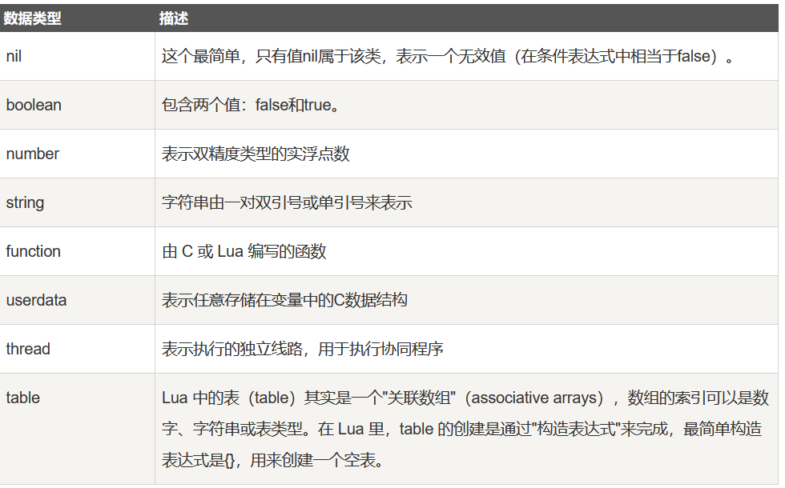

# 数据类型

## 目录

- [nil](#nil)
- [boolean](#boolean)
- [number](#number)
- [string](#string)
- [table](#table)
- [function（函数）](#function函数)
- [function（函数）](#function函数)
- [在 Lua 中，函数是被看作是"第一类值（First-Class Value）"，函数可以存在变量里:](#在-Lua-中函数是被看作是第一类值First-Class-Value函数可以存在变量里)
- [实例](#实例)
- [-- function_test.lua 脚本文件 &#x20;
  function factorial1(n) &#x20;
      if n == 0 then &#x20;
          return 1 &#x20;
      else &#x20;
          return n \* factorial1(n - 1) &#x20;
      end &#x20;
  end &#x20;
  print(factorial1(5)) &#x20;
  factorial2 = factorial1 &#x20;
  print(factorial2(5)) ](#---function_testlua-脚本文件--function-factorial1n----if-n--0-then------return-1----else------return-n--factorial1n---1----end--end--printfactorial15--factorial2--factorial1--printfactorial25--)
- [脚本执行结果为：](#脚本执行结果为)
- [\$ lua function_test.lua 120 120](#-lua-function_testlua-120-120)
- [thread（线程）](#thread线程)
- [userdata（自定义类型）](#userdata自定义类型)

Lua 是动态类型语言，变量不要类型定义,只需要为变量赋值。 值可以存储在变量中，作为参数传递或结果返回。

Lua 中有 8 个基本类型分别为：nil、boolean、number、string、userdata、function、thread 和 table。



```lua
print(type("Hello world"))      --> string
print(type(10.4*3))             --> number
print(type(print))              --> function
print(type(type))               --> function
print(type(true))               --> boolean
print(type(nil))                --> nil
print(type(type(X)))            --> string
```

#### nil

nil 表示一种没有任何有效值，如果打印一个没有赋值的变量，会输出一个 nil

```lua
print(a)
nil
```

对于全局变量和 table，nil 为其赋值，有删除的作用

此外 nil 在类型比较时应该加上双引号

```lua
> type(X)
nil
> type(X)==nil
false
> type(X)=="nil"
true

原文是使用 type(x) ==nil 做比较，这个时候的确是需要添加双引号或单引号才行，但是如果没有使用type(变量)这个形式，就不需要加引号，看下面代码：
print(x == nil) --结果为true
print(x == "nil")--结果为false
```

#### boolean

boolean 类型只有两个可选值：true（真） 和 false（假），Lua 把 false 和 nil 看作是 false，其他的都为 true，数字 0 也是 true:

#### number

Lua 默认只有一种 number 类型 -- double（双精度）类型（默认类型可以修改 luaconf.h 里的定义），以下几种写法都被看作是 number 类型：

#### string

字符串由一对双引号或单引号来表示。

也可以用 2 个方括号 "\[\[]]" 来表示"一块"字符串。

```lua
html = [[
<html>
<head></head>
<body>
    <a href="http://www.runoob.com/">菜鸟教程</a>
</body>
</html>
]]
print(html)

```

结果

```text
<html>
<head></head>
<body>
    <a href="http://www.runoob.com/">菜鸟教程</a>
</body>
</html>
```

**在对一个数字字符串上进行算术操作时，Lua 会尝试将这个数字字符串转成一个数字:**

```lua
> print("2" + 6)
8.0
> print("2" + "6")
8.0
> print("2 + 6")
2 + 6
> print("-2e2" * "6")
-1200.0
```

\*\*字符串连接使用的是 .. \*\*

```lua
> print("a" .. 'b')
ab
> print(157 .. 428)
157428
---
运行时，Lua会自动在string和numbers之间自动进行类型转换，当一个字符串使用算术操作符时， string 就会被转成数字。

print("10"+ 1)     --> 11
print("10 + 1")  --> 10 + 1
print("hello"+ 1)    -- 报错 (无法转换 "hello")

反过来，当 Lua 期望一个 string 而碰到数字时，会将数字转成 string。

print(10 .. 20) --> 1020

.. 在Lua中是字符串连接符，当在一个数字后面写 .. 时，必须加上空格以防止被解释错。
```

**使用 # 来计算字符串的长度，放在字符串前面**，如下实例：

```lua
> len = "www.runoob.com"
> print(#len)
14

当字符串中含有中文字符时，每个中文字符占据两个字节：
print(#"你好世界")

输出结果：
8
```

#### table

在 Lua 里，table 的创建是通过"构造表达式"来完成，最简单构造表达式是{}，用来创建一个空表。也可以在表里添加一些数据，直接初始化表:

```lua
 -- table_test.lua 脚本文件
a = {}
a["key"] = "value"
key = 10
a[key] = 22
a[key] = a[key] + 11
for k, v in pairs(a) do
    print(k .. " : " .. v)
end
---
脚本执行结果为：

$ lua table_test.lua
key : value
10 : 33
```

不同于其他语言的数组把 0 作为数组的初始索引，在 Lua 里表的默认初始索引一般以 1 开始。

```lua
 -- table_test2.lua 脚本文件
local tbl = {"apple", "pear", "orange", "grape"}
for key, val in pairs(tbl) do
    print("Key", key)
end

脚本执行结果为：

$ lua table_test2.lua
Key    1
Key    2
Key    3
Key    4
----
tab = {"Hello","World",a=1,b=2,z=3,x=10,y=20,"Good","Bye"}
for k,v in pairs(tab) do
    print(k.."  "..v)
end

如上代码输出结果存在一定规律，"Hello"、"World"、"Good"、"Bye"是表中的值，在存储时是按照顺序存储的，并且不同于其他脚本语言，Lua是从1开始排序的，因此，使用pairs遍历打印输出时，会先按照顺序输出表的值，然后再按照键值对的键的哈希值打印。

1  Hello
2  World
3  Good
4  Bye
x  10
y  20
z  3
b  2
a  1
```

table 不会固定长度大小，有新数据添加时 table 长度会自动增长，没初始的 table 都是 nil。

```lua
 -- table_test3.lua 脚本文件
a3 = {}
for i = 1, 10 do
    a3[i] = i
end
a3["key"] = "val"
print(a3["key"])
print(a3["none"])

脚本执行结果为：

$ lua table_test3.lua
val
nil


```

#### function（函数）

在 Lua 中，函数是被看作是"第一类值（First-Class Value）"，函数可以存在变量里:

```lua
-- function_test.lua 脚本文件
function factorial1(n)
    if n == 0 then
        return 1
    else
        return n * factorial1(n - 1)
    end
end
print(factorial1(5))
factorial2 = factorial1
print(factorial2(5))
---
脚本执行结果为：
$ lua function_test.lua
120
120
```

\$ lua function_test.lua 120 120

#### function（函数）

#### 在 Lua 中，函数是被看作是"第一类值（First-Class Value）"，函数可以存在变量里:

#### 实例

#### -- function_test.lua 脚本文件 &#xA;function factorial1(n) &#xA;    if n == 0 then &#xA;        return 1 &#xA;    else &#xA;        return n \* factorial1(n - 1) &#xA;    end &#xA;end &#xA;print(factorial1(5)) &#xA;factorial2 = factorial1 &#xA;print(factorial2(5)) &#x20;

#### 脚本执行结果为：

#### \$ lua function_test.lua 120 120

function 可以以匿名函数（anonymous function）的方式通过参数传递:

```lua
 -- function_test2.lua 脚本文件
function testFun(tab,fun)
        for k ,v in pairs(tab) do
                print(fun(k,v));
        end
end


tab={key1="val1",key2="val2"};
testFun(tab,
function(key,val)--匿名函数
        return key.."="..val;
end
);

脚本执行结果为：

$ lua function_test2.lua
key1 = val1
key2 = val2
```

#### thread（线程）

在 Lua 里，最主要的线程是协同程序（coroutine）。它跟线程（thread）差不多，拥有自己独立的栈、局部变量和指令指针，可以跟其他协同程序共享全局变量和其他大部分东西。
线程跟协程的区别：线程可以同时多个运行，而协程任意时刻只能运行一个，并且处于运行状态的协程只有被挂起（suspend）时才会暂停。

#### userdata（自定义类型）

userdata 是一种用户自定义数据，用于表示一种由应用程序或 C/C++ 语言库所创建的类型，可以将任意 C/C++ 的任意数据类型的数据（通常是 struct 和 指针）存储到 Lua 变量中调用。
