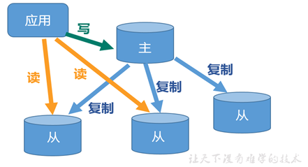
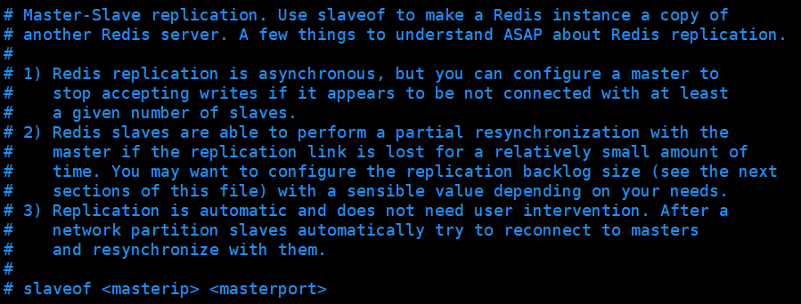
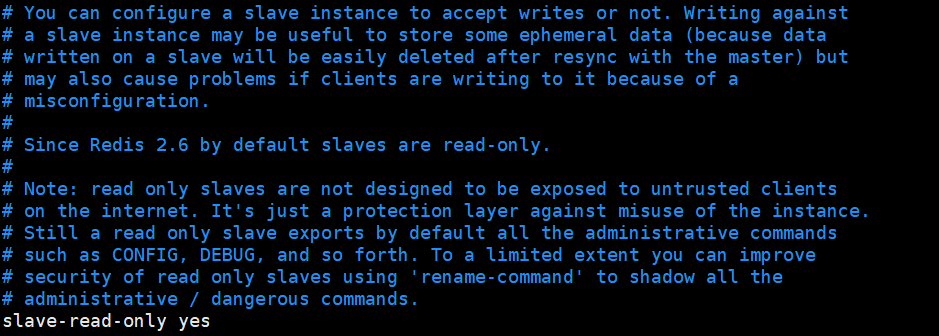
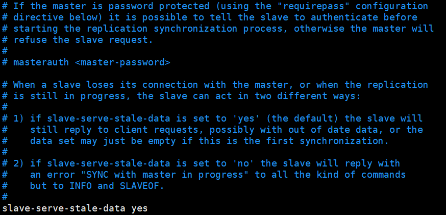
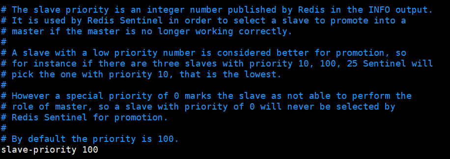

# Redis主从复制

## 目录

- [什么是主从复制](#什么是主从复制)
- [主从复制的目的](#主从复制的目的)
- [主从配置](#主从配置)
- [配置文件](#配置文件)
- [薪火相传模式](#薪火相传模式)

#### 什么是主从复制

主从复制，就是主机数据更新后根据配置和策略，自动同步到备机的master/slaver机制，Master以写为主，Slave以读为主。

#### 主从复制的目的

1\) 读写分离，性能扩展

2\) 容灾快速恢复

#### 主从配置

1\) 原则: 配从不配主

2\) 步骤: 准备三个Redis实例，一主两从

拷贝多个redis.conf文件include

开启daemonize yes

Pid文件名字pidfile

指定端口port

Log文件名字

Dump.rdb名字dbfilename

Appendonly 关掉或者换名字

3\) info replication 打印主从复制的相关信息

4\) slaveof \<ip> \<port> 成为某个实例的从服务器

#### 配置文件

1. 设置从服务

   

   Redis的主从复制是异步的，当出现没有从服务时，可以配置主服务停止写入

   复制是自动的，不需要用户干预。
2. 从服务设置为只读

   
3. 主服务设置密码，配置masterrauth 密码；如果从服务与主服务断开，从服务能否查寻返回消息(有数据和主服务数据不一致的问题)

   
4. 设置主服务器宕机哨兵选择从服务器的优先级

   

### 薪火相传模式

上一个slave可以是下一个slave的Master，slave同样可以接收其他slaves的连接和同步请求，那么该slave作为了链条中下一个的master, 可以有效减轻master的写压力,去中心化降低风险.

中途变更转向:会清除之前的数据，重新建立拷贝最新的

风险是一旦某个slave宕机，后面的slave都没法备份

1. 反客为主(小弟上位)

   当一个master宕机后，后面的slave可以立刻升为master，其后面的slave不用做任何修改。

   用 slaveof no one 将从机变为主机。
2. 哨兵模式 sentinel (推举大哥)

   反客为主的自动版，能够后台监控主机是否故障，如果故障了根据投票数自动将从库转换为主库.
3. 配置哨兵

   调整为一主二从模式

   自定义的/myredis目录下新建sentinel.conf文件

   在配置文件中填写内容

   sentinel monitor mymaster 127.0.0.1 6379 1

   其中mymaster为监控对象起的服务器名称， 1 为 至少有多少个哨兵同意迁移的

   数量。

   启动哨兵

   执行redis-sentinel /myredis/sentinel.conf
