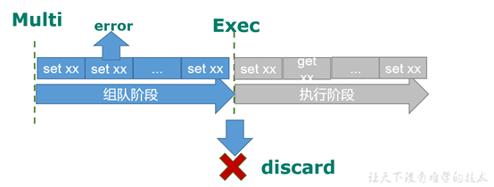
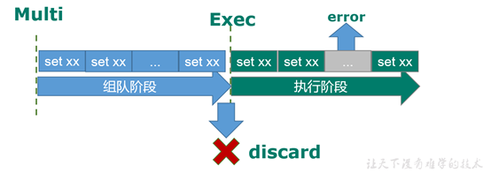
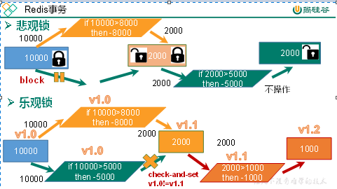

# Redis事务

## 目录

- [Redis中事务的定义](#Redis中事务的定义)
- [Redis事务的取消、执行、声明](#Redis事务的取消执行声明)
- [线程的并发问题和锁的选择](#线程的并发问题和锁的选择)
- [乐观锁在Redis的使用](#乐观锁在Redis的使用)

#### Redis中事务的定义

Redis事务是一个单独的隔离操作：事务中的所有命令都会序列化、按顺序地执行。事务在执行的过程中，不会被其他客户端发送来的命令请求所打断
Redis事务的主要作用就是串联多个命令防止别的命令插队

#### Redis事务的取消、执行、声明

1. Redis事务声明→multi
2. Redis事务取消→discard
3. Redis事务执行→exec

- 注意事项：
  1. Redis声明事务后，遇到指令错误，会直接退出事务

     
  2. Redis声明事务后，指令没有错误，运行指令时发生错误，会直接跳过该命令，执行后面的命令；不具有回滚

     

#### 线程的并发问题和锁的选择

1. 悲观锁

   遇到并发问题时，加悲观锁，一个线程持有该锁对象，其他线程无法查看锁住的内容，其他线程就会进入阻塞状态
2. 乐观锁

   加乐观锁，锁住的内容会加入版本号，所有的线程都可以对锁住的内容进行查看，当线程要对内容进行修改时，会先检查持有的内容版本号和更改内容的版本号有没有改变。未发生改变，说明此线程第一个对内容发生修改；发生改变，会直接放弃该次修改。

   缺点：有时候版本号发生改变，我们也想对内容发生修改，消耗了资源

   此方式应该多用于读取任务

#### 乐观锁在Redis的使用

1. watch key key2 ...  监控key建
2. unwatch    取消监控所有的key键
