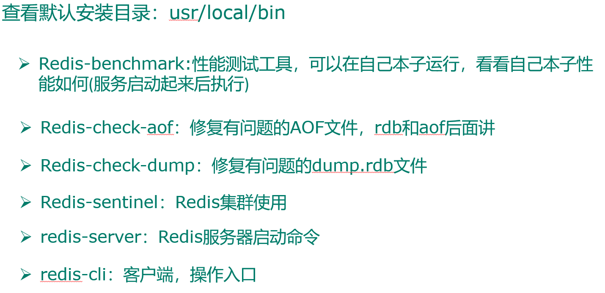

# Redis 安装

## 目录

- [Redis 的相关配置](#Redis的相关配置)

1. yum install gcc
2. yum install gcc-c++
3. 解压 Redis 压缩文件（源码）tat -zxvf Redis 压缩文件名
4. 调用 make 指令编码，如果出现错误 Jemalloc/jemalloc.h:没有那个文件，使用 make distclean 指令
5. 执行 make install
6. 启动服务指令 redis-server 目录/redis.conf
7. Redis-cli -p 6379 启动客户端
8. Redis-cli -p 6379 shutdown

   

### Redis 的相关配置

1\) 计量单位说明,大小写不敏感

2\) include 类似 jsp 中的 include，多实例的情况可以把公用的配置文件提取出来

3\) ip 地址的绑定 bind

&#x20;默认情况 bind=127.0.0.1 只能接受本机的访问请求

&#x20;不写的情况下，无限制接受任何 ip 地址的访问

&#x20;生产环境肯定要写你应用服务器的地址

&#x20;如果开启了 protected-mode，那么在没有设定 bind ip 且没有设密码的情况下，Redis 只允许接受本机的相应

4\) tcp-backlog

&#x20;可以理解是一个请求到达后至到接受进程处理前的队列.

&#x20;backlog 队列总和=未完成三次握手队列 + 已经完成三次握手队列

&#x20;高并发环境 tcp-backlog 设置值跟超时时限内的 Redis 吞吐量决定

5\) timeout

一个空闲的客户端维持多少秒会关闭，0 为永不关闭。

6\) tcp keepalive

对访问客户端的一种心跳检测，每个 n 秒检测一次，官方推荐设置为 60 秒

7\) daemonize

是否为后台进程

8\) pidfile

存放 pid 文件的位置，每个实例会产生一个不同的 pid 文件

9\) log level

四个级别根据使用阶段来选择，生产环境选择 notice 或者 warning

10\) log level

日志文件名称

11\) syslog

是否将 Redis 日志输送到 linux 系统日志服务中

12\) syslog-ident

日志的标志

13\) syslog-facility

输出日志的设备

> 📌14) database 设定库的数量 默认 16

15\) security

在命令行中设置密码

16\) maxclient

最大客户端连接数

17\) maxmemory

设置 Redis 可以使用的内存量。一旦到达内存使用上限，Redis 将会试图移除内部数据，移除规则可以通过 maxmemory-policy 来指定。如果 Redis 无法根据移除规则来移除内存中的数据，或者设置了"不允许移除”，

那么 Redis 则会针对那些需要申请内存的指令返回错误信息，比如 SET、LPUSH 等。

18\) Maxmemory-policy

&#x20;volatile-lru：使用 LRU 算法移除 key，只对设置了过期时间的键

&#x20;allkeys-lru：使用 LRU 算法移除 key

&#x20;volatile-random：在过期集合中移除随机的 key，只对设置了过期时间的键

&#x20;allkeys-random：移除随机的 key

&#x20;volatile-ttl：移除那些 TTL 值最小的 key，即那些最近要过期的 key

&#x20;noeviction：不进行移除。针对写操作，只是返回错误信息

19\) Maxmemory-samples

设置样本数量，LRU 算法和最小 TTL 算法都并非是精确的算法，而是估算值，所以你可以设置样本的大小。

一般设置 3 到 7 的数字，数值越小样本越不准确，但是性能消耗也越小。
