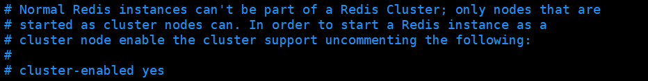
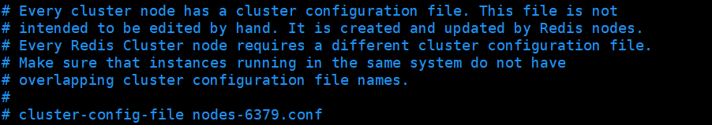
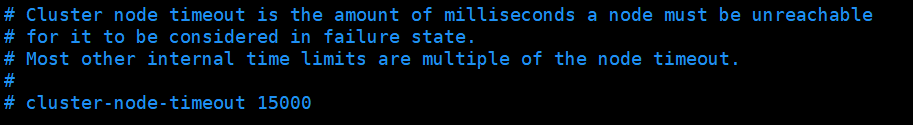

# Redis 集群

## 目录

- [什么是集群](#什么是集群)
- [集群方案](#集群方案)
  - [安装 ruby 环境](#安装ruby环境)
  - [准备 6 个 Redis 实例](#准备6个Redis实例)
  - [合体](#合体)
  - [集群操作](#集群操作)
  - [集群配置](#集群配置)
  - [Redis 集群的优缺点](#Redis集群的优缺点)

#### 什么是集群

1. Redis 集群实现了对 Redis 的水平扩容，即启动 N 个 redis 节点，将整个数据库分布存储在这 N 个节点中，每个节点存储总数据的 1/N。
2. Redis 集群通过分区（partition）来提供一定程度的可用性（availability）： 即使集群中有一部分节点失效或者无法进行通讯， 集群也可以继续处理命令请求

## 集群方案

#### 安装 ruby 环境

执行 yum install ruby

执行 yum install rubygems

#### 准备 6 个 Redis 实例

1. 准备 6 个实例 6379,6380,6381,6389,6390,6391

   拷贝多个 redis.conf 文件

   开启 daemonize yes

   Pid 文件名字

   指定端口

   Log 文件名字

   Dump.rdb 名字

   Appendonly 关掉或者换名字

2. 再加入如下配置

   cluster-enabled yes 打开集群模式

   cluster-config-file nodes-端口号.conf 设定节点配置文件名

   cluster-node-timeout 15000 设定节点失联时间，超过该时间（毫秒），集群自动进行主从切换

#### 合体

1. 将 6 个实例全部启动，nodes-端口号.conf 文件都生成正常
2. 合体

   进入到 cd /opt/redis-3.2.5/src

3. 执行

   ./redis-trib.rb create --replicas 1

   192.168.31.211:6379 192.168.31.211:6380 192.168.31.211:6381

   192.168.31.211:6389 192.168.31.211:6390 192.168.31.211:6391

   注意: IP 地址修改为当前服务器的地址，端口号为每个 Redis 实例对应的端口号.

#### 集群操作

1. 以集群的方式进入客户端

   redis-cli -c -p 端口号

2. 通过 cluster nodes 命令查看集群信息
3. redis cluster 如何分配这六个节点

   一个集群至少要有三个主节点。

   选项 --replicas 1 表示我们希望为集群中的每个主节点创建一个从节点。

   分配原则尽量保证每个主数据库运行在不同的 IP 地址，每个从库和主库不在一个 IP 地址上。

4. 什么是 slots

   一个 Redis 集群包含 16384 个插槽（hash slot）， 数据库中的每个键都属于这 16384 个插槽的其中一个， 集群使用公式 CRC16(key) % 16384 来计算键 key 属于哪个槽， 其中 CRC16(key) 语句用于计算键 key 的 CRC16 校验和 。

   集群中的每个节点负责处理一部分插槽。 举个例子， 如果一个集群可以有主节点， 其中：

   节点 A 负责处理 0 号至 5500 号插槽。

   节点 B 负责处理 5501 号至 11000 号插槽。

   节点 C 负责处理 11001 号至 16383 号插槽

5. 在集群中录入值

   在 redis-cli 每次录入、查询键值，redis 都会计算出该 key 应该送往的插槽，如果不是该客户端对应服务器的插槽，redis 会报错，并告知应前往的 redis 实例地址和端口.

   redis-cli 客户端提供了 –c 参数实现自动重定向。

   如 redis-cli -c –p 6379 登入后，再录入、查询键值对可以自动重定向。

   不在一个 slot 下的键值，是不能使用 mget,mset 等多键操作。

   可以通过{}来定义组的概念，从而使 key 中{}内相同内容的键值对放到一个 slot 中去

6. 查询集群中的值

   CLUSTER KEYSLOT \<key> 计算键 key 应该被放置在哪个槽上。

   CLUSTER COUNTKEYSINSLOT \<slot> 返回槽 slot 目前包含的键值对数量

   CLUSTER GETKEYSINSLOT \<slot> \<count> 返回 count 个 slot 槽中的键

7. 故障恢复

   如果主节点下线？从节点能否自动升为主节点？

   主节点恢复后，主从关系会如何？

   如果所有某一段插槽的主从节点都当掉，redis 服务是否还能继续?

   redis.conf 中的参数 cluster-require-full-coverage

#### 集群配置

1. 打开集群

   

2. 每一个集群节点都要有集群配置文件

   

3. 集群节点的超时时间，超过毫秒值自动主从切换

   

4. cluster-slave-validity-factor 10 &#x20;

   如果设置成０，则无论从节点与主节点失联多久，从节点都会尝试升级成主节点。如果设置成正数，则 cluster-node-timeout 乘以 cluster-slave-validity-factor 得到的时间，是从节点与主节点失联后，此从节点数据有效的最长时间，超过这个时间，从节点不会启动故障迁移。假设 cluster-node-timeout=5，cluster-slave-validity-factor=10，则如果从节点跟主节点失联超过 50 秒，此从节点不能成为主节点。注意，如果此参数配置为非 0，将可能出现由于某主节点失联却没有从节点能顶上的情况，从而导致集群不能正常工作，在这种情况下，只有等到原来的主节点重新回归到集群，集群才恢复运作。 &#x20;

5. cluster-migration-barrier 1 &#x20;

   主节点需要的最小从节点数，只有达到这个数，主节点失败时，它从节点才会进行迁移。

6. cluster-require-full-coverage yes &#x20;

   在部分 key 所在的节点不可用时，如果此参数设置为"yes"(默认值), 则整个集群停止接受操作；如果此参数设置为“no“，则集群依然为可达节点上的 key 提供读操作。

#### Redis 集群的优缺点

优点

实现扩容

分摊压力

无中心配置相对简单

缺点

多键操作是不被支持的

多键的 Redis 事务是不被支持的。lua 脚本不被支持。

由于集群方案出现较晚，很多公司已经采用了其他的集群方案，而代理或者客户端分片的方案想要迁移至 redis cluster，需要整体迁移而不是逐步过渡，复杂度较大。
