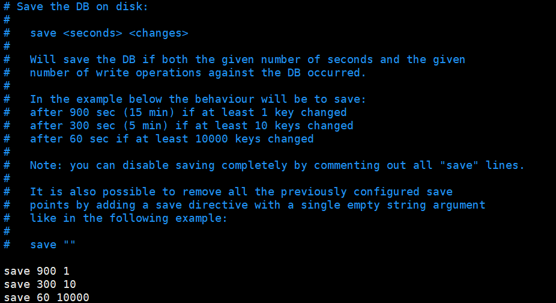
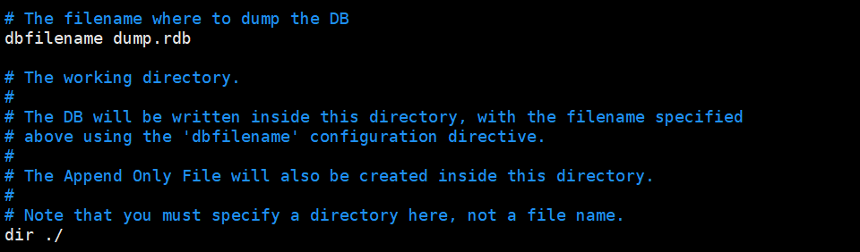
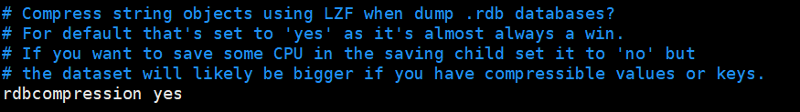
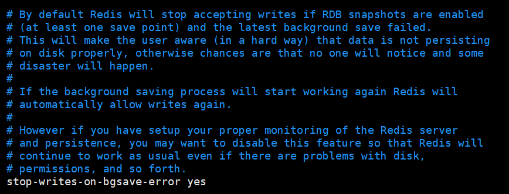
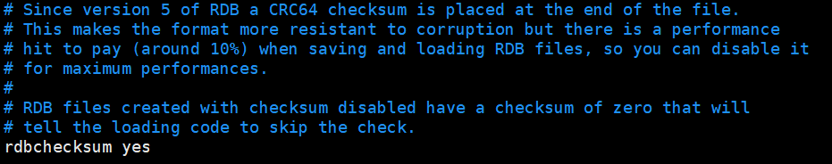
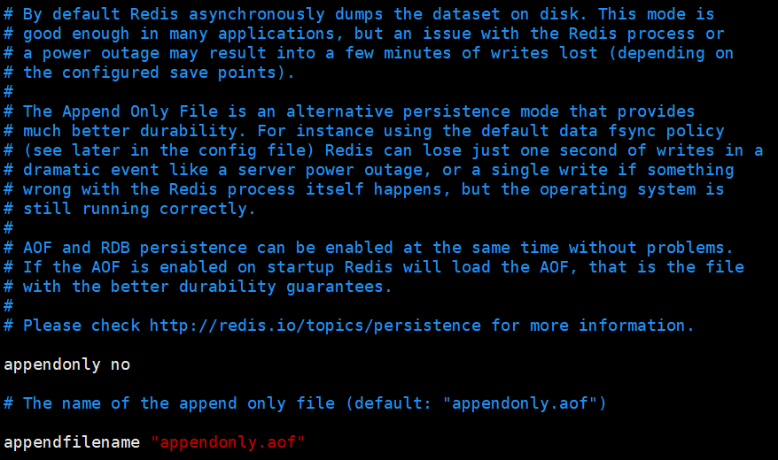
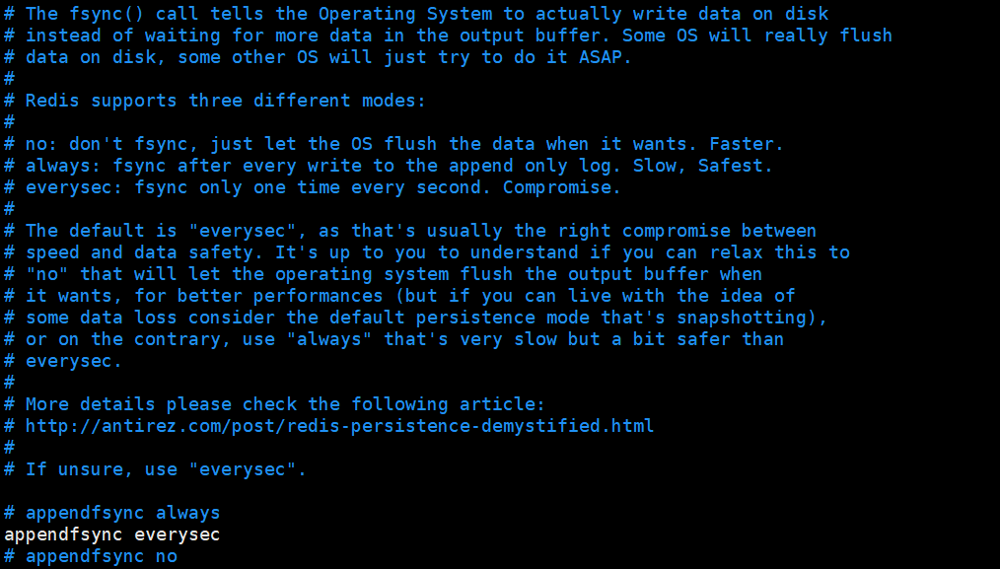
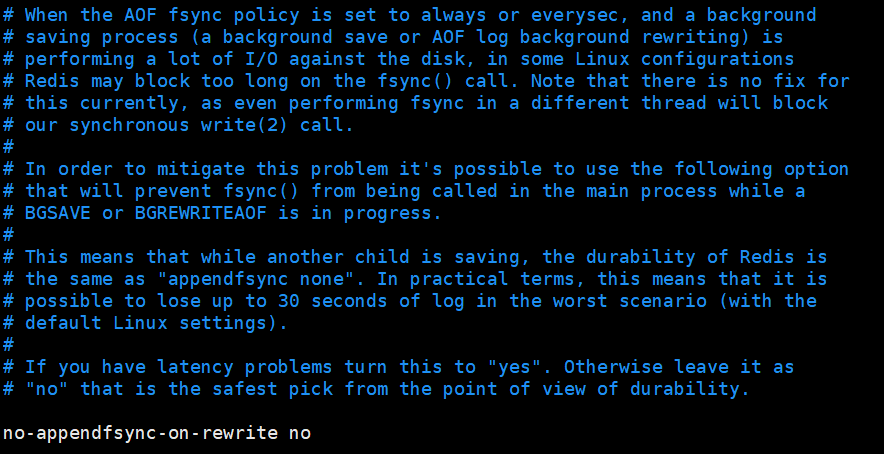
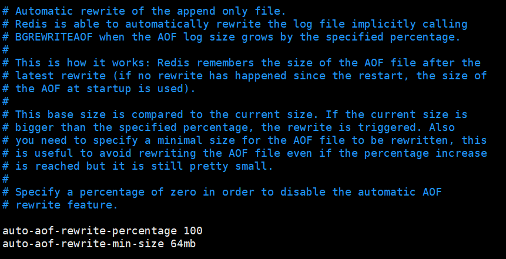
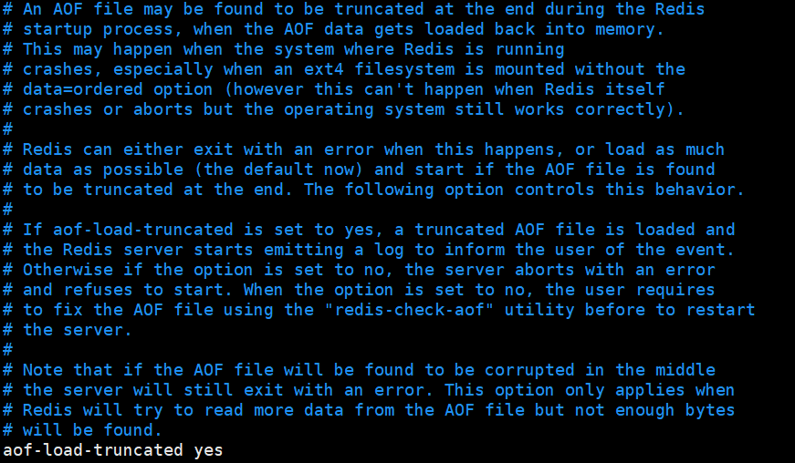

# Reids持久化

## 目录

- [RDB方案](#RDB方案)
  - [RDB方案的配置](#RDB方案的配置)
  - [RDB的备份 与恢复](#RDB的备份-与恢复)
  - [RDB的优缺点](#RDB的优缺点)
- [AOF方案](#AOF方案)
  - [AOF方案的配置](#AOF方案的配置)
  - [AOF的优缺点](#AOF的优缺点)

Redis提供两个持久化方案

1. rdb
2. aof

### RDB方案

RDB就是Redis定期把内存中的数据写到硬盘中

#### RDB方案的配置

1. 存储策略

   

   redis默认存储策略为900s添加修改一个数据，300s添加修改10个数据，60s添加修改10000条数据进行存储
2. 存储文件的地址和文件名

   

   reides默认文件名为dump.rdb，默认的存储地址为服务打开的redis.conf 文件的当前目录如

   在/opt下有一个redis6370.conf的文件通过redis-server redis6370.conf打开redis服务，就会在/opt文件夹下生成一个dump.rdb文件
3. 启用文件压缩

   
4. 当磁盘文件保存错误时只读

   
5. 对rdb文件进行检查，打开此选项会影响10%的性能

注意：

手动保存快照

save: 只管保存，其它不管，全部阻塞

bgsave:按照保存策略自动保存

#### RDB的备份 与恢复

备份:先通过config get dir 查询rdb文件的目录 , 将 \*.rdb的文件拷贝到别的地方

恢复: 关闭Redis，把备份的文件拷贝到工作目录下,启动redis,备份数据会直接加载。

#### RDB的优缺点

优点: 节省磁盘空间,恢复速度快.

缺点: 虽然Redis在fork时使用了写时拷贝技术,但是如果数据庞大时还是比较消耗性能。 在备份周期在一定间隔时间做一次备份，所以如果Redis意外down掉的话，就会丢失最后一次快照后的所有修改

### AOF方案

AOF方案是以以日志的形式来记录每个写操作，将Redis执行过的所有写指令记录下来(读操作不记录)，只许追加文件但不可以改写文件，Redis启动之初会读取该文件重新构建数据，换言之，Redis重启的话就根据日志文件的内容将写指令从前到后执行一次以完成数据的恢复工作。

#### AOF方案的配置

1. AOF方案的开启和储存文件名

   

   Redis默认取消AOF方案的打开，官方推荐AOF和RDB方案同时开启，保持数据的稳健

   默认的AOF格式的文件名为appendonly.aof
2. AOF存储方案

   

   默认每秒储存，可选项 不储存，每一条命令都储存
3. 重写时不保存

   
4. AOF重写

   AOF采用文件追加方式，文件会越来越大为避免出现此种情况，新增了重写机制,当AOF文件的大小超过所设定的阈值时，Redis就会启动AOF文件的内容压缩，只保留可以恢复数据的最小指令集.可以使用命令bgrewriteaof。

   调用bgrewriteaof时需要磁盘操作，可能有线程阻塞的情况，无法忍受使用no-appendfsync-on-rewrite 设置为yes，但是当此时redis宕机，有可能有数据损失；无法接受数据损失，设置no
   - Redis如何实现重写
     AOF文件持续增长而过大时，会fork出一条新进程来将文件重写(也是先写临时文件最后再rename)，遍历新进程的内存中数据，每条记录有一条的Set语句。重写aof文件的操作，并没有读取旧的aof文件，而是将整个内存中的数据库内容用命令的方式重写了一个新的aof文件，这点和快照有点类似。
   - 何时重写
     重写虽然可以节约大量磁盘空间，减少恢复时间。但是每次重写还是有一定的负担的，因此设定Redis要满足一定条件才会进行重写。
   

   系统载入时或者上次重写完毕时，Redis会记录此时AOF大小，设为base\_size,如果Redis的AOF当前大小>= base\_size +base\_size\*100% (默认)且当前大小>=64mb(默认)的情况下，Redis会对AOF进行重写。
5. 是否加载截断的文件

   

   在加载Redis时，AOF文件末尾可能有截断现象，默认设置yes可以读取截断的文件，no服务器终止并报错。

#### AOF的优缺点

优点:

备份机制更稳健，丢失数据概率更低。

可读的日志文本，通过操作AOF稳健，可以处理误操作。

缺点:

比起RDB占用更多的磁盘空间

恢复备份速度要慢

每次读写都同步的话，有一定的性能压力。

- 注意：
  1. 如遇到AOF文件损坏，可通过redis-check-aof --fix appendonly.aof 进行恢复。但此过程可能会删除一部分数据，推荐手动处理
  2.
