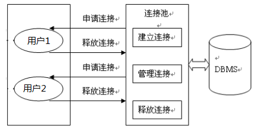

# 使用数据库连接池

## 目录

- [不使用数据库链接池的缺点](#不使用数据库链接池的缺点)
- [数据库连接池的基本思想](#数据库连接池的基本思想)
- [数据库连接池技术的优点：](#数据库连接池技术的优点)
- [各种数据库连接池](#各种数据库连接池)
- [Druid（德鲁伊）数据源](#Druid德鲁伊数据源)
- [ThreadLocal](#ThreadLocal)

#### 不使用数据库链接池的缺点

1.普通的 JDBC 数据库连接使用 DriverManager 来获取，每次向数据库建立连接的时候都要将 Connection 加载到内存中，再验证 IP 地址，用户名和密码(得花费 0.05s ～ 1s 的时间)。需要数据库连接的时候，就向数据库要求一个，执行完成后再断开连接。这样的方式将会消耗大量的资源和时间。**数据库的连接资源并没有得到很好的重复利用**.若同时有几百人甚至几千人在线，频繁的进行数据库连接操作将占用很多的系统资源，严重的甚至会造成服务器的崩溃。

l 对于每一次数据库连接，使用完后都得断开。否则，如果程序出现异常而**未能关闭**，将会导致**数据库系统中的内存泄漏**，最终将导致重启数据库。

l 这种开发不能控制被创建的**连接对象数**，系统资源会被毫无顾及的分配出去，如连接**过多**，也可能导致**内存泄漏，服务器崩溃**。

#### **数据库连接池的基本思想**

**数据库连接池的基本思想**就是为数据库连接建立一个"缓冲池“。预先在缓冲池中放入一定数量的连接，当需要建立数据库连接时，只需从"缓冲池“中取出一个，使用完毕之后再放回去。数据库连接池负责分配、管理和释放数据库连接，它**允许应用程序重复使用一个现有的数据库连接，而不是重新建立一个**。连接池的最大数据库连接数量限定了这个连接池能占有的最大连接数，当应用程序向连接池请求的连接数超过最大连接数量时，这些请求将被加入到等待队列中。



### 数据库连接池技术的优点：

**资源重用：**

由于数据库连接得以重用，避免了频繁创建，释放连接引起的大量性能开销。在减少系统消耗的基础上，另一方面也增加了系统运行环境的平稳性。

**更快的系统反应速度**

数据库连接池在初始化过程中，往往已经创建了若干数据库连接置于连接池中备用。此时连接的初始化工作均已完成。对于业务请求处理而言，直接利用现有可用连接，避免了数据库连接初始化和释放过程的时间开销，从而减少了系统的响应时间

**新的资源分配手段**

对于多应用共享同一数据库的系统而言，可在应用层通过数据库连接池的配置，实现某一应用最大可用数据库连接数的限制，避免某一应用独占所有的数据库资源

**统一的连接管理，避免数据库连接泄露**

在较为完善的数据库连接池实现中，可根据预先的占用超时设定，强制回收被占用连接，从而避免了常规数据库连接操作中可能出现的资源泄露

### 各种数据库连接池

JDBC 的数据库连接池使用 javax.sql.DataSource 来表示，DataSource 只是一个接口，该接口通常由服务器(Weblogic, WebSphere, Tomcat)提供实现，也有一些开源组织提供实现：

DBCP 是 Apache 提供的数据库连接池，速度相对 c3p0 较快，但因自身存在 BUG，Hibernate3 已不再提供支持

C3P0 是一个开源组织提供的一个数据库连接池，速度相对较慢，稳定性还可以

Proxool 是 sourceforge 下的一个开源项目数据库连接池，有监控连接池状态的功能，稳定性较 c3p0 差一点

BoneCP 是一个开源组织提供的数据库连接池，速度快

Druid 是阿里提供的数据库连接池，据说是集 DBCP 、C3P0 、Proxool 优点于一身的数据库连接池，但是速度不知道是否有 BoneCP 快

DataSource 通常被称为数据源，它包含连接池和连接池管理两个部分，习惯上也经常把 DataSource 称为连接池

注意：

数据源和数据库连接不同，数据源无需创建多个，它是产生数据库连接的工厂，因此整个应用只需要一个数据源即可。

当数据库访问结束后，程序还是像以前一样关闭数据库连接：conn.close(); 但 conn.close()并没有关闭数据库的物理连接，它仅仅把数据库连接释放，归还给了数据库连接池。

### Druid（德鲁伊）数据源

[druid-1.1.10.jar](file/druid-1.1.10_CKuh082wIV.jar "/ druid-1.1.10.jar")

Druid 是阿里巴巴开源平台上一个数据库连接池实现，它结合了 C3P0、DBCP、Proxool 等 DB 池的优点，同时加入了日志监控，可以很好的监控 DB 池连接和 SQL 的执行情况，可以说是针对监控而生的 DB 连接池，据说是目前最好的连接池。

```java
public class TestDruid {
  public static void main(String[] args) throws Exception {
    Properties pro = new Properties();
    pro.load(TestDruid.class.getClassLoader().getResourceAsStream("druid.properties"));
    DataSource ds = DruidDataSourceFactory.createDataSource(pro);
    Connection conn = ds.getConnection();
    System.out.println(conn);
         //测试获取超过最大连接数的连接数量（连接关闭、未关闭的情况）
  }
}
prrperties文件内容
url=jdbc:mysql://localhost:3306/test?rewriteBatchedStatements=true
username=root
password=123456
driverClassName=com.mysql.jdbc.Driver
initialSize=10
maxActive=20
maxWait=1000


```

## ThreadLocal

JDK 1.2 的版本中就提供 java.lang.ThreadLocal，为解决多线程程序的并发问题提供了一种新的思路。使用这个工具类可以很简洁地编写出优美的多线程程序。

ThreadLocal 用于保存某个线程共享变量，原因是在 Java 中，每一个线程对象中都有一个 ThreadLocalMap\<ThreadLocal, Object>，其 key 就是一个 ThreadLocal，而 Object 即为该线程的共享变量。而这个 map 是通过 ThreadLocal 的 set 和 get 方法操作的。对于同一个 static ThreadLocal，不同线程只能从中 get，set，remove 自己的变量，而不会影响其他线程的变量。

1、ThreadLocal.get: 获取 ThreadLocal 中当前线程共享变量的值。

2、ThreadLocal.set: 设置 ThreadLocal 中当前线程共享变量的值。

3、ThreadLocal.remove: 移除 ThreadLocal 中当前线程共享变量的值。

发现 ThreadLocal 用于保存每一个线程共享变量，只要不删除 remove，那么该值在该线程的生命周期中一直存在。最常见的 ThreadLocal 使用场景为 用来解决 数据库连接、Session 管理等。

```java
package com.atguigu.threadlocal;

import java.util.Random;

public class Tools {
  private static Random rand = new Random();
  private static ThreadLocal<Integer> threadLocal = new ThreadLocal<>();

  public static Integer getNumber() {
    // 从当前线程中获取数字
    Integer num = threadLocal.get();
    if (num == null) {
      //随机产生一个
      num = rand.nextInt(100);
      // 将数字与当前线程绑定
      threadLocal.set(num);
    }
    return num;
  }

  public static void removeNumber() {
    // 获取当前线程中的数字
    Integer num = threadLocal.get();
    if (num != null) {
      // 将数字从当前线程中移除
      threadLocal.remove();
    }
  }
}

package com.atguigu.threadlocal;

public class TestThreadLocal {
  public static void main(String[] args) {
    MyRunnable my = new MyRunnable();
    new Thread(my,"a").start();
    new Thread(my,"B--").start();
  }
}
class MyRunnable implements Runnable{

  public void run(){
    for (int i = 1; i <=5; i++) {
      System.out.println(Thread.currentThread().getName() + ":" + Tools.getNumber());
      try {
        Thread.sleep(100);
      } catch (InterruptedException e) {
        e.printStackTrace();
      }
      if(i==3){
        Tools.removeNumber();
      }
    }
  }
}

```

[封装 JDBC](封装JDBC/封装JDBC.md "封装JDBC")

[封装 DaoImp](封装DaoImp/封装DaoImp.md "封装DaoImp")
