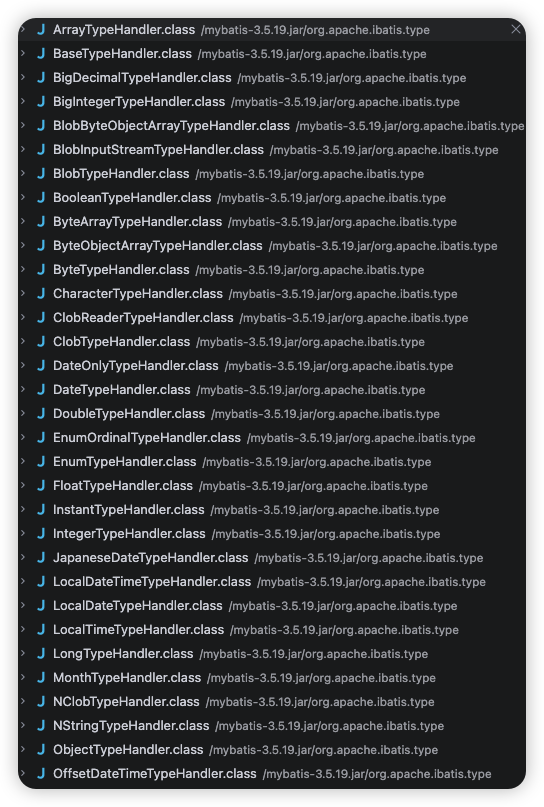
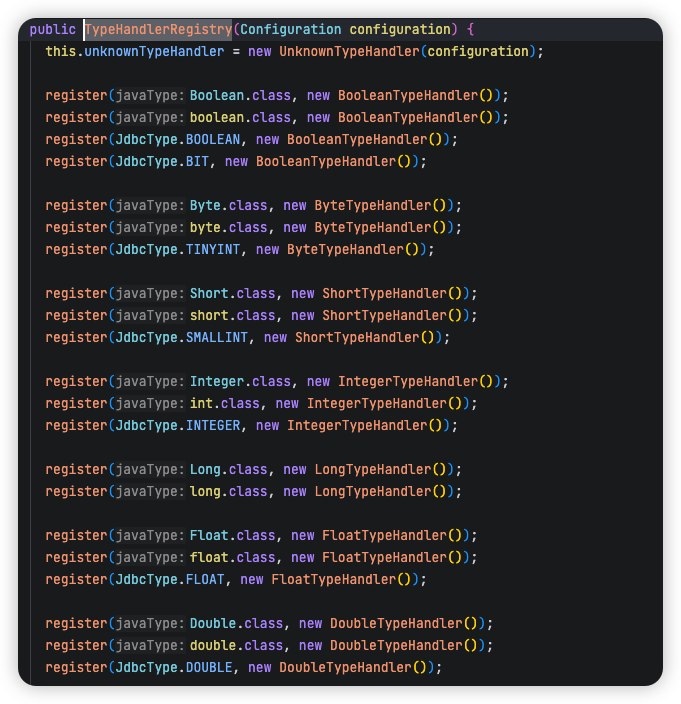
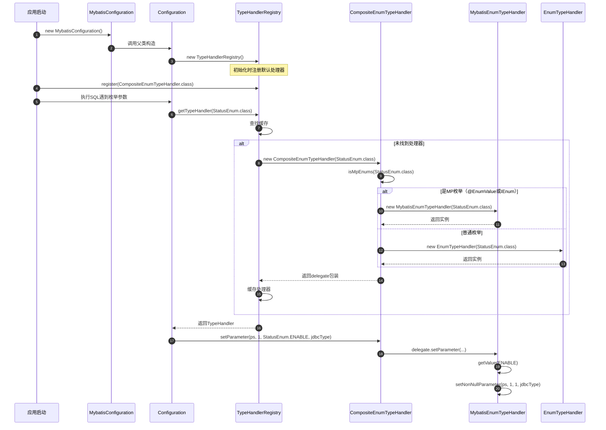

# mybatis-plus 对于枚举类的解析

## 使用

- 使用 `@EnumValue` 注解
  当使用 `@EnumValue` 注解时，mybatis-plus 会根据注解的属性来进行数据库操作。
    ```java
        @TableName("student")
        class Student {
            private Integer id;
            private String name;
            private GradeEnum grade;//数据库grade字段类型为int
        }

        public enum GradeEnum {
            PRIMARY(1,"小学"),
            SECONDORY("2", "中学"),
            HIGH(3, "高中");

            @EnumValue
            private final int code;
            private final String descp;
        }
    ```

- 实现 `IEnum` 接口
  当实现 `IEnum` 接口时，mybatis-plus 会根据接口的方法来进行数据库操作。
    ```java
        public enum Sex implements IEnum<String> {
            MAN("1", "男"),
            WOMAN("2", "女");
        
            private final String code; // 数据库存储的值
            private final String name; // 显示的名称
        
            Sex(String code, String name) {
                this.code = code;
                this.name = name;
            }
        
            @Override
            public String getValue() {
                return code; // 返回数据库存储的编码
            }
        
            public String getName() {
                return name;
            }
        }   
    ```

## 原理

在解释 Mybatis-plus 对于枚举类的解析时,需要先了解 Mytatis 的类型处理器 TypeHandler.

### TypeHandler

这是 MyBatis 类型处理的核心接口，定义了 Java 类型与 JDBC 类型之间的转换规范。

```java
/**
 * MyBatis 类型处理器接口
 * 负责 Java 类型 与 JDBC 类型 之间的双向转换
 *
 * @param <T> 要处理的 Java 类型
 */
public interface TypeHandler<T> {

    /**
     * 设置参数到 PreparedStatement
     * 将 Java 类型转换为 JDBC 类型，设置到 SQL 语句的指定位置
     *
     * @param ps        JDBC PreparedStatement 对象
     * @param i         参数在 SQL 中的索引位置（从 1 开始）
     * @param parameter Java 类型的参数值（可能为 null）
     * @param jdbcType  对应的 JDBC 类型（可能为 null）
     * @throws SQLException 当设置参数失败时抛出
     */
    void setParameter(PreparedStatement ps, int i, T parameter, JdbcType jdbcType) throws SQLException;

    /**
     * 从 ResultSet 按列名获取结果
     * 将 JDBC 类型转换为 Java 类型
     *
     * @param rs         ResultSet 结果集
     * @param columnName 数据库列名
     * @return 转换后的 Java 对象（可能为 null）
     * @throws SQLException 当获取结果失败时抛出
     */
    T getResult(ResultSet rs, String columnName) throws SQLException;

    /**
     * 从 ResultSet 按列索引获取结果
     *
     * @param rs          ResultSet 结果集
     * @param columnIndex 列索引（从 1 开始）
     * @return 转换后的 Java 对象（可能为 null）
     * @throws SQLException 当获取结果失败时抛出
     */
    T getResult(ResultSet rs, int columnIndex) throws SQLException;

    /**
     * 从 CallableStatement（存储过程）获取结果
     *
     * @param cs          CallableStatement 对象
     * @param columnIndex 列索引
     * @return 转换后的 Java 对象（可能为 null）
     * @throws SQLException 当获取结果失败时抛出
     */
    T getResult(CallableStatement cs, int columnIndex) throws SQLException;
}
```

还有一个默认的抽象类 `BaseTypeHandler`，它实现了 `TypeHandler` 接口，提供了空值处理和异常转换的通用逻辑，简化了自定义实现。

```java
public abstract class BaseTypeHandler<T> implements TypeHandler<T> {
       /**
     * 设置参数（实现 TypeHandler 接口）
     * 处理 null 值逻辑，非 null 值委托给子类实现
     */
    @Override
    public void setParameter(PreparedStatement ps, int i, T parameter, JdbcType jdbcType) throws SQLException {
        if (parameter == null) {
            // 处理 null 值情况
            if (jdbcType == null) {
                throw new TypeException(
                    "JDBC requires that the JdbcType must be specified for all nullable parameters."
                );
            }
            try {
                // 设置 null 值，使用指定的 JDBC 类型
                ps.setNull(i, jdbcType.TYPE_CODE);
            } catch (SQLException e) {
                throw new TypeException(
                    "Error setting null for parameter #" + i + " with JdbcType " + jdbcType, e
                );
            }
        } else {
            // 非 null 值，委托给子类实现
            try {
                setNonNullParameter(ps, i, parameter, jdbcType);
            } catch (Exception e) {
                throw new TypeException(
                    "Error setting non null for parameter #" + i + " with JdbcType " + jdbcType, e
                );
            }
        }
    }

    /**
     * 从 ResultSet 按列名获取结果（实现 TypeHandler 接口）
     */
    @Override
    public T getResult(ResultSet rs, String columnName) throws SQLException {
        try {
            return getNullableResult(rs, columnName);
        } catch (Exception e) {
            throw new ResultException(
                "Error attempting to get column '" + columnName + "' from result set.", e
            );
        }
    }
    // ... 其他方法实现（getResult 按列索引、CallableStatement）
    // ==================== 抽象方法：由子类实现具体转换逻辑 ====================

    /**
     * 设置非空参数
     * 子类实现：将 Java 对象转换为 JDBC 类型并设置到 PreparedStatement
     *
     * @param ps        PreparedStatement
     * @param i         参数索引
     * @param parameter 非空的 Java 参数
     * @param jdbcType  JDBC 类型（可能为 null）
     * @throws SQLException 当设置失败时抛出
     */
    public abstract void setNonNullParameter(PreparedStatement ps, int i, T parameter, JdbcType jdbcType)
        throws SQLException;

    /**
     * 从 ResultSet 按列名获取可空结果
     * 子类实现：将 JDBC 类型转换为 Java 对象
     *
     * @param rs         ResultSet
     * @param columnName 列名
     * @return Java 对象（可能为 null）
     * @throws SQLException 当获取失败时抛出
     */
    public abstract T getNullableResult(ResultSet rs, String columnName) throws SQLException;
    public abstract T getNullableResult(ResultSet rs, int columnIndex) throws SQLException;
    public abstract T getNullableResult(CallableStatement cs, int columnIndex) throws SQLException;
}
```
它的实现类有很多，比如 `EnumTypeHandler`、`EnumOrdinalTypeHandler` 等。



在 Mybatis 的 Configuration 类中，有一个 `typeHandlers` 属性，它是一个 `TypeHandlerRegistry` 类型的对象，用于注册和管理自定义的类型处理器。

```java
public class Configuration {
    // ... 其他属性和方法

    /**
     * 类型处理器注册器
     * 用于注册和管理自定义的类型处理器
     */
    protected final TypeHandlerRegistry typeHandlerRegistry = new TypeHandlerRegistry();

    // ... 其他属性和方法
}
```



---

### mybatis-plus 的处理

首先 mybatis-plus 集成了 mybatis 的 配置类,设置了枚举类的默认类型处理器为 `CompositeEnumTypeHandler`

```java
public class MybatisConfiguration extends Configuration {
    public MybatisConfiguration() {
        super();
        this.mapUnderscoreToCamelCase = true;
        typeHandlerRegistry.setDefaultEnumTypeHandler(CompositeEnumTypeHandler.class);
        languageRegistry.setDefaultDriverClass(MybatisXMLLanguageDriver.class);
    }
}
```

之后实现了一个委托代理 CompositeEnumTypeHandler 类.如果枚举类是 mybatis-plus 支持的枚举类,则使用 `MybatisEnumTypeHandler` 类处理,否则使用 mybatis 的 `EnumTypeHandler` 类处理.

```java
public class CompositeEnumTypeHandler<E extends Enum<E>> extends BaseTypeHandler<E> {
    // ... 其他属性和方法
    public CompositeEnumTypeHandler(Class<E> enumClassType) {
        if (enumClassType == null) {
            throw new IllegalArgumentException("Type argument cannot be null");
        }
        if (CollectionUtils.computeIfAbsent(MP_ENUM_CACHE, enumClassType, MybatisEnumTypeHandler::isMpEnums)) {
            delegate = new MybatisEnumTypeHandler<>(enumClassType);
        } else {
            delegate = getInstance(enumClassType, defaultEnumTypeHandler);
        }
    }
}
```

我们查看下面 MybatisEnumTypeHandler 代码可以发现,就是 如果没有使用 `@EnumValue` 注解,则使用反射获得 `value` 属性的 get 方法 `getValue`(注意这里枚举类不需要定义 value 属性,只要有 `getValue` 方法即可).如果添加了 `@EnumValue` 注解,则使用该注解标记的字段的 get 方法.


```java
public class MybatisEnumTypeHandler<E extends Enum<E>> extends BaseTypeHandler<E> {
    // ... 其他属性和方法
    public MybatisEnumTypeHandler(Class<E> enumClassType) {
        if (enumClassType == null) {
            throw new IllegalArgumentException("Type argument cannot be null");
        }
        this.enumClassType = enumClassType;
        MetaClass metaClass = MetaClass.forClass(enumClassType, REFLECTOR_FACTORY);
        String name = "value";
        if (!IEnum.class.isAssignableFrom(enumClassType)) {
            name = findEnumValueFieldName(this.enumClassType).orElseThrow(() -> new IllegalArgumentException(String.format("Could not find @EnumValue in Class: %s.", this.enumClassType.getName())));
        }
        this.propertyType = ReflectionKit.resolvePrimitiveIfNecessary(metaClass.getGetterType(name));
        this.getInvoker = metaClass.getGetInvoker(name);
    }

    /**
     * 查找标记标记EnumValue字段
     *
     * @param clazz class
     * @return EnumValue字段
     * @since 3.3.1
     */
    public static Optional<String> findEnumValueFieldName(Class<?> clazz) {
        if (clazz != null && clazz.isEnum()) {
            String className = clazz.getName();
            return Optional.ofNullable(CollectionUtils.computeIfAbsent(TABLE_METHOD_OF_ENUM_TYPES, className, key -> {
                Optional<Field> fieldOptional = findEnumValueAnnotationField(clazz);
                return fieldOptional.map(Field::getName).orElse(null);
            }));
        }
        return Optional.empty();
    }

    private static Optional<Field> findEnumValueAnnotationField(Class<?> clazz) {
        return Arrays.stream(clazz.getDeclaredFields()).filter(field -> field.isAnnotationPresent(EnumValue.class)).findFirst();
    }

    /**
     * 判断是否为MP枚举处理
     *
     * @param clazz class
     * @return 是否为MP枚举处理
     * @since 3.3.1
     */
    public static boolean isMpEnums(Class<?> clazz) {
        return clazz != null && clazz.isEnum() && (IEnum.class.isAssignableFrom(clazz) || findEnumValueFieldName(clazz).isPresent());
    }
}
```

### 总结

- mybatis-plus 集成了 mybatis 的 配置类,设置了枚举类的默认类型处理器为 `CompositeEnumTypeHandler`
- `CompositeEnumTypeHandler` 类是一个委托代理类,如果枚举类是 mybatis-plus 支持的枚举类,则使用 `MybatisEnumTypeHandler` 类处理,否则使用 mybatis 的 `EnumTypeHandler` 类处理.
- `MybatisEnumTypeHandler` 类是一个自定义的类型处理器类,它的处理逻辑是 如果没有使用 `@EnumValue` 注解,则使用反射获得 `value` 属性的 get 方法 `getValue`(注意这里枚举类不需要定义 value 属性,只要有 `getValue` 方法即可).如果添加了 `@EnumValue` 注解,则使用该注解标记的字段的 get 方法.




