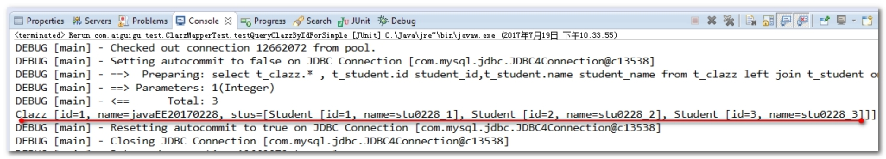

# Mybatis 逆向工程(了解)

## 目录

- [准备数据库表](#准备数据库表)

MyBatis逆向工程，简称MBG。是一个专门为MyBatis框架使用者定制的代码生成器。可以快速的根据表生成对应的映射文件，接口，以及Bean类对象。

在Mybatis中，是一个可以自动对单表生成的增，删，改，查代码的插件。

叫 mybatis-generator-core-1.3.2。

它可以帮我们对比数据库表之后，生成大量的这个基础代码。

这些基础代码有：

1. 数据库表对应的javaBean对象
2. 这些javaBean对象对应的Mapper接口
3. 这些Mapper接口对应的配置文件

```xml
<!-- 去掉全部的注释 -->
<commentGenerator>
  <property name="suppressAllComments" value="true" />
</commentGenerator>
```


## 准备数据库表

```sql
create database mbg character set utf8;
use mbg;
create table t_user(
  `id` int primary key auto_increment,
  `username` varchar(30) not null unique,
  `password` varchar(40) not null,
  `email` varchar(50)
);
insert into t_user(`username`,`password`,`email`) values('admin','admin','admin@atguigu.com');
insert into t_user(`username`,`password`,`email`) values('wzg168','123456','admin@atguigu.com');
insert into t_user(`username`,`password`,`email`) values('admin168','123456','admin@atguigu.com');
insert into t_user(`username`,`password`,`email`) values('lisi','123456','admin@atguigu.com');
insert into t_user(`username`,`password`,`email`) values('wangwu','123456','admin@atguigu.com');
create table t_book(
  `id` int primary key auto_increment,
  `name` varchar(50),
  `author` varchar(50),
  `price`  decimal(11,2),
  `sales`  int,
  `stock` int
);
## 插入初始化测试数据
insert into t_book(`id` , `name` , `author` , `price` , `sales` , `stock` )  values(null , 'java从入门到放弃' , '国哥' , 80 , 9999 , 9);
insert into t_book(`id` , `name` , `author` , `price` , `sales` , `stock` )  values(null , '数据结构与算法' , '严敏君' , 78.5 , 6 , 13);
insert into t_book(`id` , `name` , `author` , `price` , `sales` , `stock` )  values(null , '怎样拐跑别人的媳妇' , '龙伍' , 68, 99999 , 52);
insert into t_book(`id` , `name` , `author` , `price` , `sales` , `stock` )  values(null , '木虚肉盖饭' , '小胖' , 16, 1000 , 50);
insert into t_book(`id` , `name` , `author` , `price` , `sales` , `stock` )  values(null , 'C++编程思想' , '刚哥' , 45.5 , 14 , 95);
insert into t_book(`id` , `name` , `author` , `price` , `sales` , `stock` )  values(null , '蛋炒饭' , '周星星' , 9.9, 12 , 53);
insert into t_book(`id` , `name` , `author` , `price` , `sales` , `stock` )  values(null , '赌神' , '龙伍' , 66.5, 125 , 535);
select * from t_user;
select * from t_book;
```


配置文件:&#x20;

```xml
<?xml version="1.0" encoding="UTF-8"?>
<!DOCTYPE generatorConfiguration
  PUBLIC "-//mybatis.org//DTD MyBatis Generator Configuration 1.0//EN"
  "http://mybatis.org/dtd/mybatis-generator-config_1_0.dtd">
<generatorConfiguration>
  <classPathEntry location="/Program Files/IBM/SQLLIB/java/db2java.zip" />
  <context id="DB2Tables" targetRuntime="MyBatis3">
    <jdbcConnection driverClass="COM.ibm.db2.jdbc.app.DB2Driver"
        connectionURL="jdbc:db2:TEST"
        userId="db2admin"
        password="db2admin">
    </jdbcConnection>
    <javaTypeResolver >
      <property name="forceBigDecimals" value="false" />
    </javaTypeResolver>
    <javaModelGenerator targetPackage="test.model" targetProject="\MBGTestProject\src">
      <property name="enableSubPackages" value="true" />
      <property name="trimStrings" value="true" />
    </javaModelGenerator>
    <sqlMapGenerator targetPackage="test.xml"  targetProject="\MBGTestProject\src">
      <property name="enableSubPackages" value="true" />
    </sqlMapGenerator>
    <javaClientGenerator type="XMLMAPPER" targetPackage="test.dao"  targetProject="\MBGTestProject\src">
      <property name="enableSubPackages" value="true" />
    </javaClientGenerator>
    <table schema="DB2ADMIN" tableName="ALLTYPES" domainObjectName="Customer" >
      <property name="useActualColumnNames" value="true"/>
      <generatedKey column="ID" sqlStatement="DB2" identity="true" />
      <columnOverride column="DATE_FIELD" property="startDate" />
      <ignoreColumn column="FRED" />
      <columnOverride column="LONG_VARCHAR_FIELD" jdbcType="VARCHAR" />
    </table>
  </context>
</generatorConfiguration>
```


修改:

```xml
<?xml version="1.0" encoding="UTF-8"?>
<!DOCTYPE generatorConfiguration
        PUBLIC "-//mybatis.org//DTD MyBatis Generator Configuration 1.0//EN"
        "http://mybatis.org/dtd/mybatis-generator-config_1_0.dtd">
<generatorConfiguration>
    <!--
        配置内容
        targetRuntime:生成的版本,
            标准版:curd              MyBatis3Simple
            豪华版:大量的query      MyBatis3
    -->
    <!-- 配置内容 -->
    <context id="DB2Tables" targetRuntime="MyBatis3">
        <!-- 忽略注释 -->
        <commentGenerator>
            <property name="suppressAllComments" value="true"/>
        </commentGenerator>
        <!-- 连接信息 -->
        <jdbcConnection driverClass="com.mysql.jdbc.Driver"
                        connectionURL="jdbc:mysql://localhost:3306/mbg?characterEncoding=UTF-8"
                        userId="root"
                        password="root">
        </jdbcConnection>
        <!-- 是否使用大类型 -->
        <javaTypeResolver >
            <property name="forceBigDecimals" value="false" />
        </javaTypeResolver>
        <!--
            生成pojo位置
                targetPackage:包位置
                targetProject:路径
        -->
        <javaModelGenerator targetPackage="com.atguigu.pojo"
                            targetProject=".\src">
            <property name="enableSubPackages" value="true" />
            <property name="trimStrings" value="true" />
        </javaModelGenerator>
        <!--
            targetPackage:映射位置
            targetProject:路径
        -->
        <sqlMapGenerator targetPackage="com.atguigu.mapper"
                         targetProject=".\src">
            <property name="enableSubPackages" value="true" />
        </sqlMapGenerator>
        <!--
                    targetPackage:java中接口位置
                    targetProject:路径
                -->
        <javaClientGenerator type="XMLMAPPER"
                             targetPackage="com.atguigu.mapper"
                             targetProject=".\src">
            <property name="enableSubPackages" value="true" />
        </javaClientGenerator>
        <!--
            配置映射
                tableName:表明
                domainObjectName:实体类名称
        -->
        <table tableName="t_user" domainObjectName="User"/>
        <table tableName="t_book" domainObjectName="Book"/>
    </context>
</generatorConfiguration>
```


逆向工程运行的代码:&#x20;

```java
public class MbgRunner {
    public static void main(String[] args) throws IOException, XMLParserException, InvalidConfigurationException, SQLException, InterruptedException {
        List<String> warnings = new ArrayList<String>();
        boolean overwrite = true;
        File configFile = Resources.getResourceAsFile("mgb.xml");
        ConfigurationParser cp = new ConfigurationParser(warnings);
        Configuration config = cp.parseConfiguration(configFile);
        DefaultShellCallback callback = new DefaultShellCallback(overwrite);
        MyBatisGenerator myBatisGenerator = new MyBatisGenerator(config, callback, warnings);
        myBatisGenerator.generate(null);
    }
}
```


生成的豪华版本的查询条件方法使用说明:



豪华版的测试代码

```java
public class BookMapperTest {
    InputStream inputStream = null;
    SqlSessionFactory sessionFactory = null;
    SqlSession sqlSession = null;
    BookMapper bookMapper = null;
    @Before
    public void init() throws IOException {
        inputStream = Resources.getResourceAsStream("mybatis-config.xml");
        sessionFactory = new SqlSessionFactoryBuilder().build(inputStream);
        sqlSession = sessionFactory.openSession(true);
        bookMapper = sqlSession.getMapper(BookMapper.class);
    }
    @After
    public void destory() {
        sqlSession.close();
    }
    @Test
    public void countByExample() {
        //条件封装
        BookExample bookExample = new BookExample();
        //创建查询条件 and
        BookExample.Criteria criteria = bookExample.createCriteria();
        // or 条件
        BookExample.Criteria criteriaOr = bookExample.or();
        //条件 and
        //criteria.andAuthorEqualTo( "刚哥");
        //价格大于100
        criteria.andPriceGreaterThan(new BigDecimal(100));
        //条件 or
        criteriaOr.andIdIn(Arrays.asList(2,5,6));
        //count打头的方法,用于执行count()
        //参数就是查询的条件
        //如果为null则查询全部
        int count = bookMapper.countByExample(bookExample);
        System.err.println(count);
    }
    @Test
    public void deleteByExample() {
        BookExample bookExample = new BookExample();
        BookExample.Criteria criteria = bookExample.createCriteria();
        // 销量大于100 或 库存大于100
        criteria.andSalesGreaterThan(100);
        // or 关系的条件
        BookExample.Criteria or = bookExample.or();
        or.andStockGreaterThan(100);
        // 如果条件是null,表示全部
        int result = bookMapper.deleteByExample(bookExample);
        System.err.println(result);
    }
    @Test
    public void deleteByPrimaryKey() {
        // delete , update ,select , insert 表示操作
        // By 按什么什么条件
        // ByExample 表示按条件操作
        // ByPrimaryKey 按主键
        int result = bookMapper.deleteByPrimaryKey(10);
        System.err.println(result);
    }
    // public Book(String name, String author, BigDecimal price, Integer sales, Integer stock)
    @Test
    public void insert() {
        int result = bookMapper.insert(new Book("小明", "小红", new BigDecimal(100.0), 100, 100));
        System.err.println(result);
    }
    /**
     *  xxxSelective:表示会忽略为null的列,sql语句中不会有null的字段
     *  author为null的时候添加的时候直接略过
     *  insert into t_book ( name, price, sales, stock ) values ( ?, ?, ?, ? )
     */
    @Test
    public void insertSelective() {
        int result = bookMapper.insertSelective(new Book("小明", null, new BigDecimal(100.0), 100, 100));
        System.err.println(result);
    }
    @Test
    public void selectByExample() {
        BookExample bookExample = new BookExample();
        BookExample.Criteria criteria = bookExample.createCriteria();
        //criteria.andIdIn(Arrays.asList(2,5,6));
        criteria.andPriceBetween(new BigDecimal(10),new BigDecimal(100));
        //模糊
        //criteria.andAuthorLike("%敏%");
        //排序
        bookExample.setOrderByClause("price desc");
        List<Book> list = bookMapper.selectByExample(bookExample);
        list.forEach(book -> {
            System.err.println(book);
        });
    }
    @Test
    public void selectByPrimaryKey() {
        Book book = bookMapper.selectByPrimaryKey(5);
        System.err.println(book);
    }
    @Test
    public void updateByExampleSelective() {
        BookMapper mapper = sqlSession.getMapper(BookMapper.class);
        /*
         *第一个参数是, 更新的值 < br / >
         *第二个参数是, 更新的条件 < br / >
         */
        Book book = new Book(4, "红烧肉", null, new BigDecimal(10), 10, 10);
        BookExample bookExample = new BookExample();
        bookExample.createCriteria().andIdEqualTo(4);
        //update t_book set id = ?, name = ?, author = ?, price = ?, sales = ?, stock = ? WHERE ( id = ? )
        mapper.updateByExample(book, bookExample); //不忽略空列
        //update t_book SET id = ?, name = ?, price = ?, sales = ?, stock = ? WHERE ( id = ? )
        mapper.updateByExampleSelective(book, bookExample);//忽略空列的操作,发现未null的字段时底层自动过滤掉
    }
}
```
