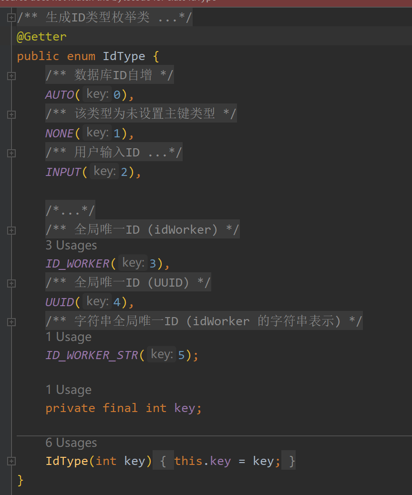
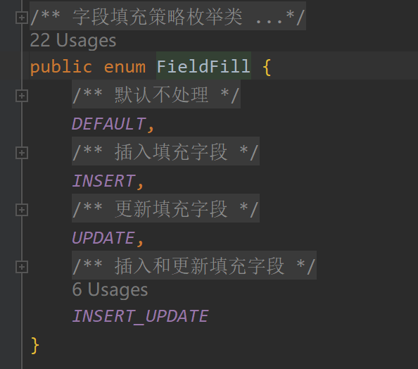
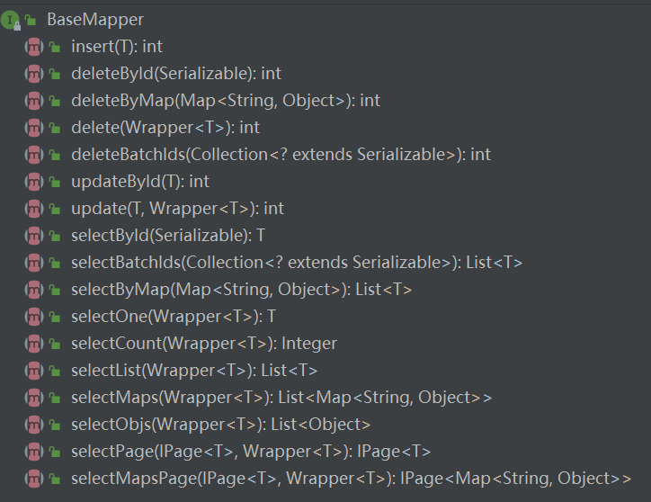
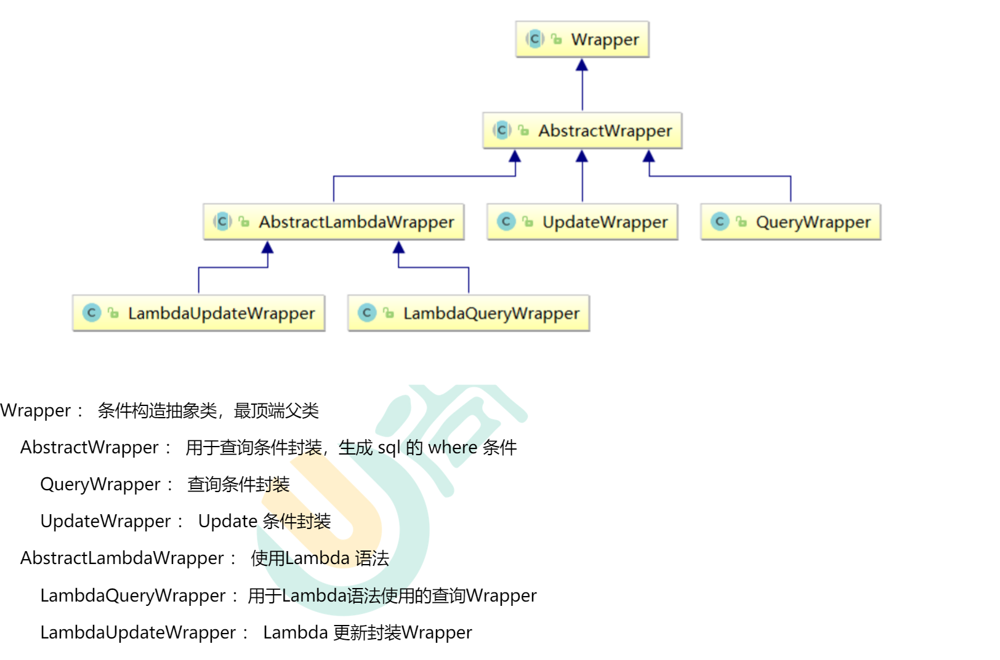

# Mybatis-plus

## 目录

- [主键映射](#主键映射)
- [自动填充](#自动填充)
- [乐观锁](#乐观锁)
- [分页](#分页)
- [返回指定的列](#返回指定的列)
- [逻辑删除](#逻辑删除)
- [自定义 sql 实现分页查询](#自定义sql-实现分页查询)

官网：[http://mp.baomidou.com](http://mp.baomidou.com/guide/ "http://mp.baomidou.com")

参考教程：[http://mp.baomidou.com/guide/](http://mp.baomidou.com/guide/ "http://mp.baomidou.com/guide/")

[MyBatis-Plus](https://github.com/baomidou/mybatis-plus "MyBatis-Plus")（简称 MP）是一个 [MyBatis](http://www.mybatis.org/mybatis-3/ "MyBatis") 的增强工具，在 MyBatis 的基础上只做增强不做改变，为简化开发、提高效率而生。

mybatis-plus 相关依赖

```java
<dependency>
    <groupId>com.baomidou</groupId>
    <artifactId>mybatis-plus-boot-starter</artifactId>
    <version>3.3.1</version>
</dependency>
```

mybatis 相关注解:

@TableName("name") 对应数据库表名

#### 主键映射

@TableId(value="属性"，type=...)&#x20;

其中 type 为生成 id 策略，可以有如图所示



其中**AUTO 自增策略**需要在创建数据表的时候设置主键自增

#### 自动填充

@TableField(value="属性"，fill=...) pojo 类和数据库列的映射

其中 fill 属性可以填写如图所示内容



它可以做到在使用 fill 属性指定的 sql 语句时调用对应的 handle

例如下：

```java
@Component
@Slf4j
public class MyMateObjectHandle implements MetaObjectHandler {
    @Override
    public void insertFill(MetaObject metaObject) {
        log.warn("123");
        this.setFieldValByName("insertCreate", new Date(), metaObject);
        this.setFieldValByName("updateCreate", new Date(), metaObject);
    }

    @Override
    public void updateFill(MetaObject metaObject) {
        log.info("aaa=======================================" );
        this.setFieldValByName("update_create", new Date(), metaObject);
    }
}

```

可以实现在使用 sql 语句时，进行拦截，自动添加 insertCreate 和 updateCreate 记录的增加时间和修改时间，让我们不用每条 sql 都写这两条属性了

我们可以在 application.properties 配置文件里使用，如：

```java
mybatis-plus.global-config.db-config.id-type=id_worker
```

为全局添加 id 生成策略

对应的属性就可只需要加上@TableId 注解即可

---

#### 乐观锁

为表添加乐观锁-版本控制技术

1. 在数据库表中增加一列储存版本号的列，并映射到 pojo 类中
2. 为 pojo 类的关于版本属性添加 @Version 注解

   ```java
   @Version
   private Integer version;
   ```

3. 在配置类里添加乐观锁插件

   ```java
   @Configuration
   @MapperScan(basePackages = {"com.atguigu.mybatisplus.mapper"})
   @EnableTransactionManagement
   public class Myconfig {
       @Bean
       public OptimisticLockerInterceptor optimisticLockerInterceptor(){
           return new OptimisticLockerInterceptor();
       }
   }
   ```

4. 测试乐观锁

   ```java
   @Autowired
   private ProductMapper productMapper;

   @Test
   public void testConcurrentUpdate() {

       //1、小李
       Product p1 = productMapper.selectById(1L);
       System.out.println("小李取出的价格：" + p1.getPrice());

       //2、小王
       Product p2 = productMapper.selectById(1L);
       System.out.println("小王取出的价格：" + p2.getPrice());

       //3、小李将价格加了50元，存入了数据库
       p1.setPrice(p1.getPrice() + 50);
       productMapper.updateById(p1);

       //4、小王将商品减了30元，存入了数据库
       p2.setPrice(p2.getPrice() - 30);
       int result = productMapper.updateById(p2);
       if(result == 0){//更新失败，重试
           //重新获取数据
           p2 = productMapper.selectById(1L);
           //更新
           p2.setPrice(p2.getPrice() - 30);
           productMapper.updateById(p2);
       }

       //最后的结果
       Product p3 = productMapper.selectById(1L);
       System.out.println("最后的结果：" + p3.getPrice());
   }
   ```

#### 分页

1. **添加分页插件** 配置类中添加@Bean 配置

   ```java
   @Configuration
   @MapperScan(basePackages = {"com.atguigu.mybatisplus.mapper"})
   @EnableTransactionManagement
   public class Myconfig {
       @Bean
       public OptimisticLockerInterceptor optimisticLockerInterceptor(){
           return new OptimisticLockerInterceptor();
       }
       @Bean
       public PaginationInterceptor paginationInterceptor(){
           return new PaginationInterceptor();
       }
   }
   ```

2. 测试 selectPage 分页

   ```java
   @Test
   public void testSelectPage() {

           //分页对象：指定查询的页码和每页显示的记录条数
           int pageNum = 1;
           int pageSize = 3;
           Page<User> page = new Page<>(pageNum,pageSize);
           //分页查询的条件对象
           QueryWrapper<User> queryWrapper = new QueryWrapper<>();
           queryWrapper.gt("age",18);//年龄大于18
         //执行查询
           userMapper.selectPage(page , queryWrapper);
         //查询到的分页数据集合
           page.getRecords().forEach(System.out::println);
         //查询到的其他分页信息
           System.out.println(page.getCurrent());
           System.out.println(page.getPages());
           System.out.println(page.getSize());
           System.out.println(page.getTotal());
           System.out.println(page.hasNext());
           System.out.println(page.hasPrevious());
   }
   ```

   注意：&#x20;

   1. mybatis-plus 的分页实现是物理分页，即使用 sql 语句的 limit 关键字来进行分页，不是逻辑分页,通过一次性把数据查出来，在内存存储，使用计算机逻辑代码来进行分页

#### 返回指定的列

```java
@Test
public void testSelectMapsPage() {

    //这种方式返回很多null列
    //Page<User> page = new Page<>(1, 5);
    //QueryWrapper<User> queryWrapper = new QueryWrapper<>();
    //指定查询的列
    //queryWrapper.select("name", "age");
    //Page<User> pageParam = userMapper.selectPage(page, queryWrapper);
    //
    //pageParam.getRecords().forEach(System.out::println);

    Page<Map<String, Object>> page = new Page<>(1, 5);
    QueryWrapper<User> queryWrapper = new QueryWrapper<>();
    //带条件的分页查询
    //queryWrapper.ge("id" , 2).or().like("name","a");
     queryWrapper.select("name", "age");
    Page<Map<String, Object>> pageParam = userMapper.selectMapsPage(page, queryWrapper);

    List<Map<String, Object>> records = pageParam.getRecords();
    records.forEach(System.out::println);
    System.out.println(pageParam.getCurrent());
    System.out.println(pageParam.getPages());
    System.out.println(pageParam.getSize());
    System.out.println(pageParam.getTotal());
    System.out.println(pageParam.hasNext());
    System.out.println(pageParam.hasPrevious());
}
```

#### 逻辑删除

逻辑删除：假删除，将对应数据中代表是否被删除字段的状态修改为"被删除状态”，之后在数据库中仍旧能看到此条数据记录

1. **数据库修改** 添加 deleted 字段

   ```java
   ALTER TABLE `user` ADD COLUMN `deleted` boolean DEFAULT false
   ```

2. 添加 deleted 字段，并加上 @TableLogic 注解&#x20;

   ```java
   @TableLogic
   private Integer deleted;
   ```

3. 配置 bean

   ```text
   @Bean
   public ISqlInjector sqlInjector() {
       return new LogicSqlInjector();
   }
   ```

   mybatis-plus 版本 3.1.0 需要加入配置 bean，mybatis-plus 版本 3.3.1 不需要配置

4. application.properties 加入以下配置，此为默认值，如果你的默认值和 mp 默认的一样,该配置可无

   ```java
   mybatis-plus.global-config.db-config.logic-delete-value=1
   mybatis-plus.global-config.db-config.logic-not-delete-value=0
   ```

   我们默认对于逻辑删除的修改字段内容为 0 时代表该内容存在，内容为 1 时表示该内容已被删除

5. 测试

   ```java
   @Test
   public void testLogicDelete() {

       int result = userMapper.deleteById(1L);
       System.out.println(result);
   }
   ```

6. **测试逻辑删除后的查询** MyBatis Plus 中查询操作也会自动添加逻辑删除字段的判断

   ```java
   @Test
   public void testLogicDeleteSelect() {

       List<User> users = userMapper.selectList(null);
       users.forEach(System.out::println);
   }
   ```

总结：使用 mybatis-plus 逻辑删除可以对数据进行标记删除，不真正的删除数据，只对数据进行标记，只需要指定对应的标记（使用@TableLogic），便可以打开逻辑删除；当我们调用 deleteById（）方法时实际调用 update 的 sql，修改被@TableLogic 修饰的属性值。在查询时我们也不会把已经打上标记的字段查询出来。

---

总结：

使用 mybatis-plus 的亮点在于 mapper 映射

我们只需要继承 BaseMapper\<T>,泛型中填入所需要的的 pojo 类，就可以完成 pojo 和 mapper 的映射

BaseMapper 的具体方法有如下内容



其中 Wrapper 为查询条件，有如下方法

| **查询方式**     | **说明**                         |
| ---------------- | -------------------------------- |
| **setSqlSelect** | 设置 SELECT 查询字段             |
| **where**        | WHERE 语句，拼接+WHERE 条件      |
| **and**          | AND 语句，拼接+AND 字段=值       |
| **andNew**       | AND 语句，拼接+AND(字段=值)      |
| **or**           | OR 语句，拼接+OR 字段=值         |
| **orNew**        | OR 语句，拼接+OR(字段=值)        |
| **eq**           | 等于=                            |
| **allEq**        | 基于 map 内容等于=               |
| **ne**           | 不等于<>                         |
| **gt**           | 大于>                            |
| **ge**           | 大于等于>=                       |
| **lt**           | 小于<                            |
| **le**           | 小于等于<=                       |
| **like**         | 模糊查询 LIKE                    |
| **notLike**      | 模糊查询 NOTLIKE                 |
| **in**           | IN 查询                          |
| **notIn**        | NOTIN 查询                       |
| **isNull**       | NULL 值查询                      |
| **isNotNull**    | ISNOTNULL                        |
| **groupBy**      | 分组 GROUPBY                     |
| **having**       | HAVING 关键词                    |
| **orderBy**      | 排序 ORDERBY                     |
| **orderAsc**     | ASC 排序 ORDERBY                 |
| **orderDesc**    | DESC 排序 ORDERBY                |
| **exists**       | EXISTS 条件语句                  |
| **notExists**    | NOTEXISTS 条件语句               |
| **between**      | BETWEEN 条件语句                 |
| **notBetween**   | NOTBETWEEN 条件语句              |
| **addFilter**    | 自由拼接 SQL                     |
| **last**         | 拼接在最后，例如：last("LIMIT1”) |

它的架构



### 自定义 sql 实现分页查询

[ Mybatis Plus 自定义 sql 多表 带条件 分页 查询\_z331491512 的博客-CSDN 博客 主要需求：1.查询带分页的列表功能 2.使用自己写的 sql 实现 3.sql 中会涉及到多表关联问题，查询多表字段 4.使用 Mybatis Plus 的分页功能和条件构造器废话少说，直接代码！方法 1-通过对象拼接条件参数该方法条件上没有使用 Mybatis Plus 的条件构造器，而是自己在 sql 语句中拼接的。controller@PostMapping("/page"... https://blog.csdn.net/z331491512/article/details/102824078?utm_medium=distribute.pc_relevant_t0.none-task-blog-BlogCommendFromMachineLearnPai2-1.pc_relevant_is_cache\&depth_1-utm_source=distribute.pc_relevant_t0.none-task-blog-BlogCommendFromMachineLearnPai2-1.pc_relevant_is_cache](https://blog.csdn.net/z331491512/article/details/102824078?utm_medium=distribute.pc_relevant_t0.none-task-blog-BlogCommendFromMachineLearnPai2-1.pc_relevant_is_cache&depth_1-utm_source=distribute.pc_relevant_t0.none-task-blog-BlogCommendFromMachineLearnPai2-1.pc_relevant_is_cache ' Mybatis Plus 自定义sql 多表 带条件 分页 查询_z331491512的博客-CSDN博客 主要需求：1.查询带分页的列表功能2.使用自己写的sql实现3.sql中会涉及到多表关联问题，查询多表字段4.使用Mybatis Plus的分页功能和条件构造器废话少说，直接代码！方法1-通过对象拼接条件参数该方法条件上没有使用Mybatis Plus的条件构造器，而是自己在sql语句中拼接的。controller@PostMapping("/page"... https://blog.csdn.net/z331491512/article/details/102824078?utm_medium=distribute.pc_relevant_t0.none-task-blog-BlogCommendFromMachineLearnPai2-1.pc_relevant_is_cache&depth_1-utm_source=distribute.pc_relevant_t0.none-task-blog-BlogCommendFromMachineLearnPai2-1.pc_relevant_is_cache')

在自定义 sql 语句中使用 mybatis 的 QueryWrapper 对象

[mybatis-plus 之自定义 sql、分页 \_(づ￣ 3 ￣)づ xl-CSDN 博客 自定义 sql 也想使用 Wrapper 构建？那这时候就要如下使用，先看定义好的部分常量：这里只挑三个说明一下：ew.customSqlSegment 对应条件构造器里的条件 ew.sqlSetupdate 是所设置的列 ew.sqlSelectquery 时所选的列例子：@Select("SELECT u.\* FROM USER u LEFT JOIN \`role... <https://blog.csdn.net/weixin_37703281/article/details/91410413>](https://blog.csdn.net/weixin_37703281/article/details/91410413 ' mybatis-plus之自定义sql、分页_(づ￣ 3￣)づxl-CSDN博客 自定义sql也想使用Wrapper构建？那这时候就要如下使用，先看定义好的部分常量：这里只挑三个说明一下：ew.customSqlSegment对应条件构造器里的条件ew.sqlSetupdate是所设置的列ew.sqlSelectquery时所选的列例子：@Select("SELECT u.* FROM USER u LEFT JOIN `role... https://blog.csdn.net/weixin_37703281/article/details/91410413')
