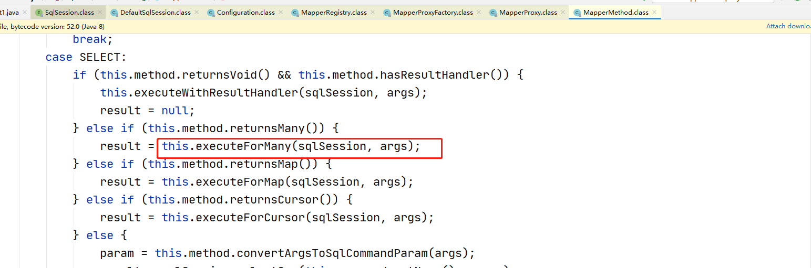
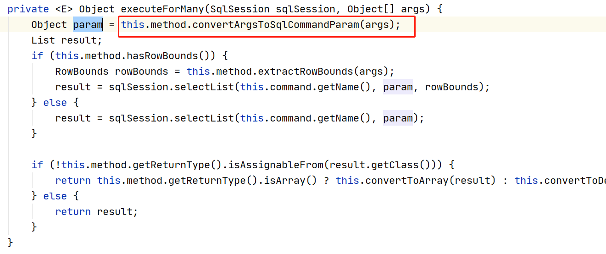
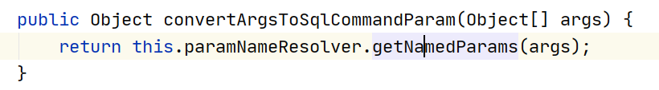
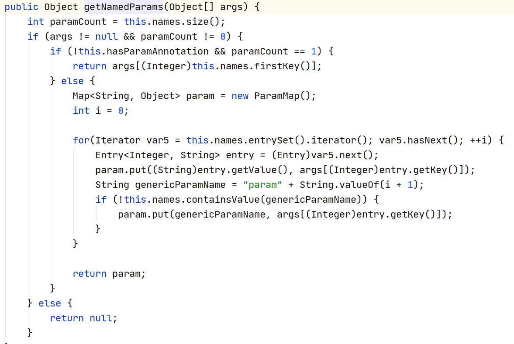

# mybatis的参数传递

## 目录

- [一个普通数据类型](#一个普通数据类型)
- [多个普通数据类型](#多个普通数据类型)
  - [使用param1、param2 …… paramN 占位输出参数  ](#使用param1param2--paramN-占位输出参数--)
  - [或使用arg0,arg1.....arg(N-1)占位输出参数](#或使用arg0arg1argN-1占位输出参数)
  - [使用@Param注解命名参数](#使用Param注解命名参数)
- [Mybatis底层等曾参数封装](#Mybatis底层等曾参数封装)
- [传递一个Map对象作为参数](#传递一个Map对象作为参数)
- [一个Pojo数据类型](#一个Pojo数据类型)
- [多个Pojo数据类型](#多个Pojo数据类型)
- [模糊查询](#模糊查询)
  - [#{} 的实现配置和调用](#-的实现配置和调用)
  - [\${} 的实现配置和调用](#-的实现配置和调用)
  - [#{}和\${}的区别](#和的区别)
  - [MySQL的字符串拼接，concat函数实现。](#MySQL的字符串拼接concat函数实现)

## 一个普通数据类型

当一个方法中只有一个普通数据类型。在mapper配置文件中可以使用#{}占位符来进行占位输出。

\#{} 占位符中，可以写参数的 #{变量名}。  也可以写 #{value}。

方法：

```java
int deleteUserById(int id);
```


\#{变量名}

```xml
<delete id="deleteUserById" parameterType="int">
    delete from t_user where id = #{id}
</delete>
```


\#{value}

```xml
<delete id="deleteUserById" parameterType="int">
    delete from t_user where id = #{value}
</delete>
```


## 多个普通数据类型

多个普通的参数。当我们需要使用 #{} 占位输出的时候，可以使用

param1，param2 …… paramN

也就是 #{param1} …… #{paramN}&#x20;

或者使用@Param命名参数&#x20;

### 使用param1、param2 …… paramN 占位输出参数 &#x20;

方法:

```java
public List<User> findUserByNameAndSex(String username, int sex);
```


使用param1、param2 …… paramN 的方式 占位输出参数

```xml
<select id="selectUserByNameOrSex" resultType="user">
    select id,last_name as lastName,sex from t_user WHERE last_Name = #{param1} or sex = #{param2}
</select>
```


### 或使用arg0,arg1.....arg(N-1)占位输出参数

```xml
<select id="selectUserByNameOrSex" resultType="user">
    select id,last_name as lastName,sex from t_user WHERE last_Name = #{arg0} or sex = #{arg1}
</select>
```


### 使用@Param注解命名参数

方法：

```java
public List<User> findUserByNameAndSex(@Param("lastName") String username, @Param("sex") int sex);
```


使用命名参数输出：

```xml
<select id="findUserByNameAndSex" resultType="com.atguigu.bean.User" >
    select id,last_name lastName,sex from t_user where last_name = #{lastName} and sex = #{sex}
</select>
```


## Mybatis底层等曾参数封装









底层参数最终封装成了map  **@Param使用居多**

1:注解queryUserByNameOrSex(@Param("lastName") String lastName,@Param("sex")&#x20;

map{"lastName":"老虎","sex":0,"param1":"老虎","parm2":0}

2:使用#{arg0}  or #{parm1}

map{"arg0":"老虎","arg1":0,"param1":"老虎","parm2":0}

## 传递一个Map对象作为参数

当我们的参数为map对象的时候。我们可以使用 map对象的key来做为占位符，输出数据。

\#{map的key} 来做为占位符的输出

使用示例如下：

方法：

```java
List<User> findUserByMap(Map<String, Object> map);
```


调用的代码：

```java
@Test
public void findUserByMap() {
    Map<String, Object> map = new HashMap<>();
    map.put("lastName","bbj168");
    map.put("sex",1);
    UserMapper userMapper = sqlSession.getMapper(UserMapper.class);
    List<User> list = userMapper.findUserByMap(map);
    System.err.println(list);
}
```


配置如下：

注意:map的key必须与#{}的名称一致

```xml
<select id="findUserByMap" resultType="user" >
    select id,last_name lastName,sex from t_user where last_name = #{lastName} and sex = #{sex}
</select>
```


## 一个Pojo数据类型

当方法的参数是一个复杂类型的对象的时候。我们可以使用 对象的属性名。当成占位符的名称。比如：#{ 属性名 },根据对象的getter方法取值

示例：

```java
int insertUser(User user);
```


mapper中的配置：

```xml
<insert id="insertUser" parameterType="user">
    insert into t_user(`last_name`,`sex`) values(#{lastName},#{sex})
</insert>
```


通过getter取值

## 多个Pojo数据类型

当有多个复杂pojo对象做为参数传递给方法使用时候。我们要取出数据做为sql的参数。可以使用如下方式：

\#{param1.属性名}

……

\#{paramN.属性名}

也可以使用@Param命名参数。给每个pojo对象起一个别名。然后再通过 #{别名.属性名} 的方式取出数据值做为参数使用。

使用示例：

默认param1、param2、paramN形式取对象属性。配置如下：

方法：

```java
List<User> findUserByTwoUser(User user1, User user2);
```


配置如下：

```xml
<select id="findUserByTwoUser" resultType="User">
    select id,last_name lastName,sex from t_user where last_name = #{param1.lastName} and sex = #{param2.sex}
</select>
<select id="findUserByTwoUser" resultType="User">
    select id,last_name lastName,sex from t_user where last_name = #{arg0.lastName} and sex = #{arg1.sex}
</select>
```


@Param注解命名参数的形式：

方法：

```java
List<User> findUserByTwoUser(@Param("user1")User user1, (@Param("user2")User user2);
```


配置如下：

```xml
<select id="findUserByTwoUser" resultType="com.atguigu.bean.User" >
select id,last_name lastName,sex from t_user where last_name = #{user1.lastName} and sex = #{user2.sex}
</select>
```


## 模糊查询

现在要根据用户名查询用户对象。 也就是希望查询如下：  select \* from t\_user where last\_name like '%b%'

方法：

```java
List<User> findUserLikeName(String name);
```


### #{} 的实现配置和调用

调用代码：

```java
@Test
public void findUserLikeName() {
    UserMapper userMapper = sqlSession.getMapper(UserMapper.class);
    List<User> list = userMapper.findUserLikeName("%"+"b"+"%");
    System.err.println(list);
}
```


配置如下：

```xml
<select id="findUserLikeName" resultType="User">
    select id,last_name lastName,sex from t_user where last_name like #{name}
</select>
```


### \${} 的实现配置和调用

\${} 的实现，只是原样的输出参数的值。然后做字符串的拼接操作。

```java
@Test
public void findUserLikeName() {
    UserMapper userMapper = sqlSession.getMapper(UserMapper.class);
    List<User> list = userMapper.findUserLikeName("b");
    System.err.println(list);
}
```


配置如下:

```xml
${value} 必须写value
<select id="findUserLikeName" resultType="User">
    select id,last_name lastName,sex from t_user where last_name like '%${value}%'
</select>
```


### #{}和\${}的区别

\#{} 在mapper的配置文件的sql语句中，它是占位符， 相当于 ? 号。

\${} 在 mapper 的配置文件的 sql 语句中，它是原样输出变量的值，然后以字符串拼接的功能进行操作。

\${} 中只能写value，或者是@Param命名参数后的参数名称

在输出参数的时候，我们并不推荐使用 \${} 来输出。因为可能会导至 sql 注入问题的存在&#x20;

比如：

select \* form t\_user where id = #{id}

相当于：

select \* from t\_user where id = ?

而

select \* from t\_user where id = \${value}

相当于

select \* from t\_user where id = 原样输出变量的值

### MySQL的字符串拼接，concat函数实现。

在mysql中，有一个字符串拼接操作的函数。叫concat函数。当我们需要做类似于like 这种查询的时候。我们可以使用 #{} 组合 concat来解决参数输入，以及不需要在传递参数的时候，加两个%%的情况。还可以解决sql注入问题。使用如下：

```sql
select concat('a','b','c');  abc
```


配置如下：

```xml
<select id="findUserLikeName" resultType="User">
select id,last_name lastName,sex from t_user where last_name like concat('%',#{name},'%')
</select>
```
