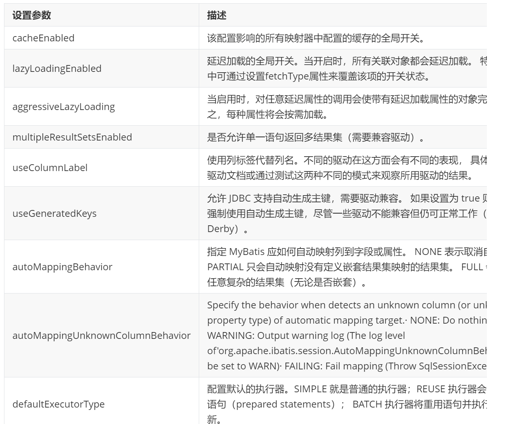
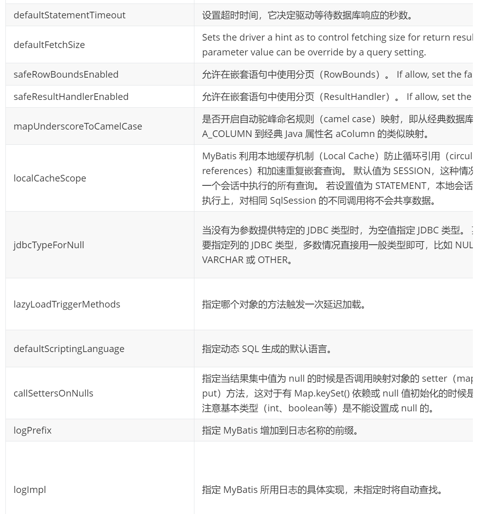
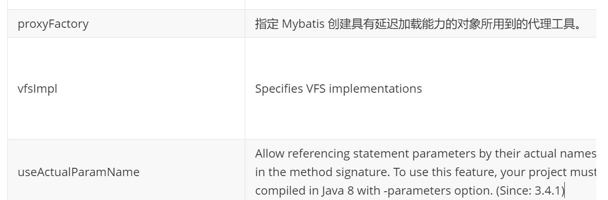
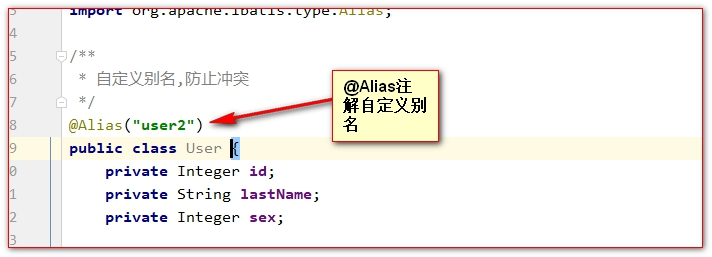
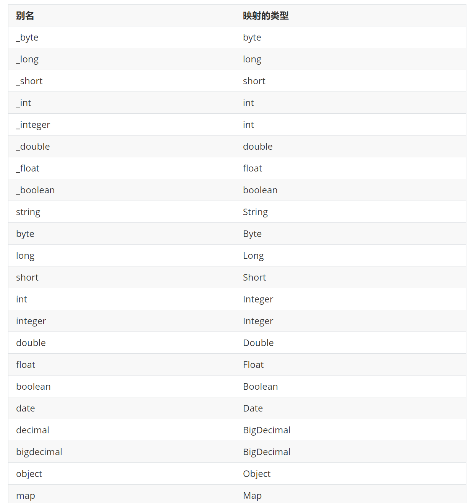
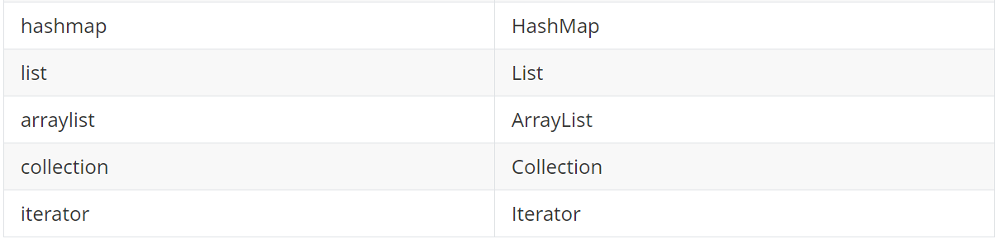
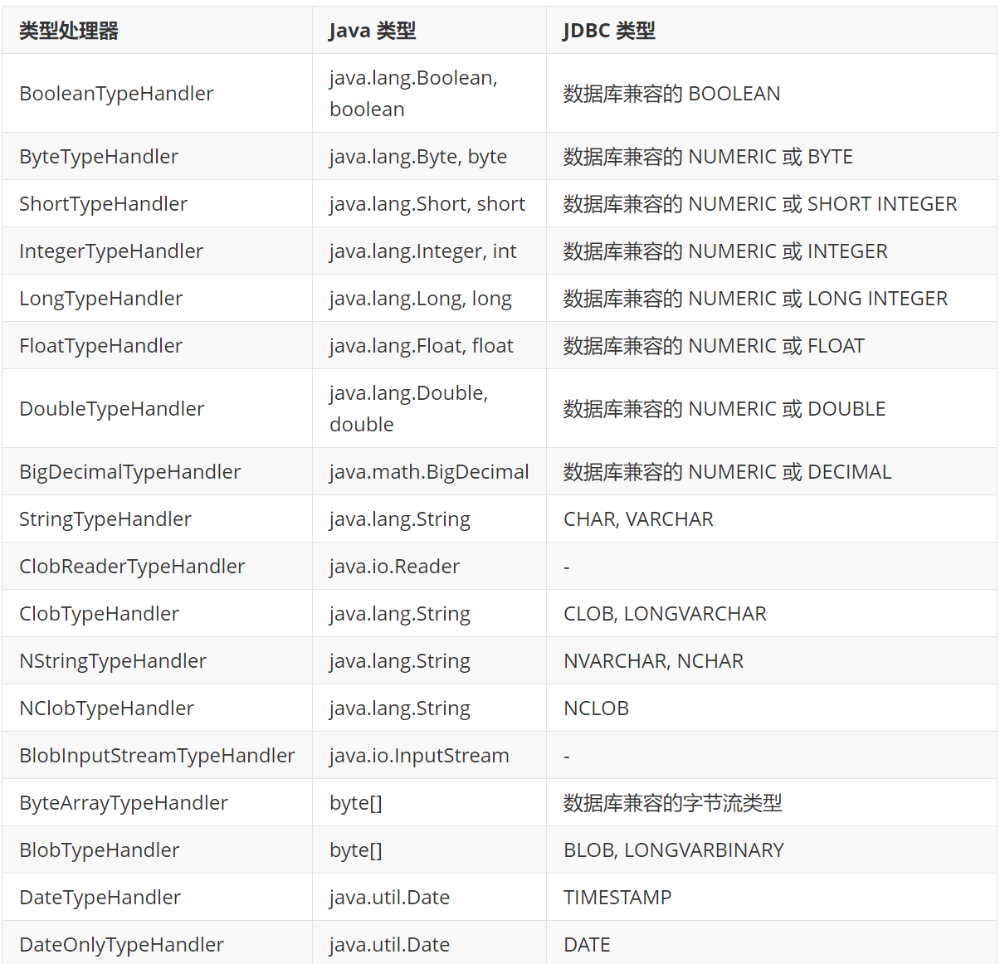
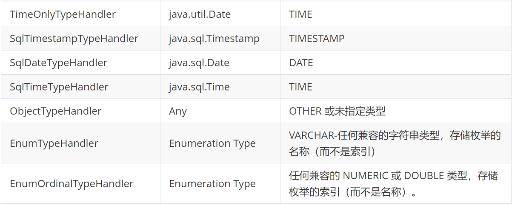
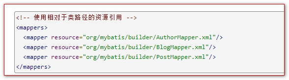
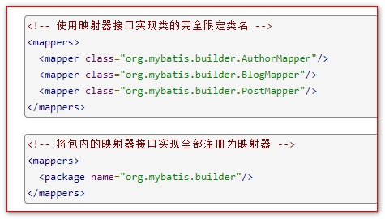

# mybatis 配置

## 目录

- [编写 Mybatis 需要的步骤](#编写Mybatis需要的步骤)
- [Mapper 接口的增删改查](#Mapper接口的增删改查)
  - [返回自增的主键](#返回自增的主键)
  - [标签的使用](#标签的使用)
  - [注解@MapKey 的使用。](#注解MapKey的使用)
- [Mybatis 在核心配置文件的设置](#Mybatis在核心配置文件的设置)
  - [properties](#properties)
  - [settings 设置](#settings设置)
  - [typeAliases](#typeAliases)
  - [系统提示的预定义别名](#系统提示的预定义别名)
  - [mybatis 的核心配置之 typeHandlers](#mybatis的核心配置之typeHandlers)
  - [environments](#environments)
  - [Mappers](#Mappers)

#### 编写 Mybatis 需要的步骤

1. 导入需要的 jar 包:

   junit_4.12.jar、log4j-1.2.17.jar、mybatis-3.5.1.jar、mysql-connector-java-5.1.7-bin.jar、org.hamcrest.core_1.3.0.jar

2. 创建 Mybatis 的核心配置
3. 创建与数据库对应的 javaBean
4. 编写 Mapper 接口
5. 编写 sql 的配置文件
6. 测试

**Mybatis 框架 Mapper 接口开发时的注意事项有:**

```text
1:接口需要和sql映射配置文件同包同名
2:接口内的方法要与sql标签id一致
3:方法的返回值要与RestType的值一致
4:方法的入参需要与ParampterType一致,(可省略)
```

### Mapper 接口的增删改查

Dao 层的接口方法

```java
/**
 * UserMapper它的实现类是由Mybatis底层源码进行了实现( jdk动态代理 )
 */
public interface UserMapper {

  /**
   * 根据id查询用户信息
   *
   * @param id 用户的id
   * @return
   */
  public User selectUserById(Integer id);

  /**
   * 查询全部
   *
   * @return
   */
  public List<User> selectAll();

  /**
   * 更新用户
   *
   * @param user
   * @return
   */
  public int updateUser(User user);

  /**
   * 删除用户
   *
   * @param id
   * @return
   */
  public int deleteUserById(Integer id);

  /**
   * 插入用户
   *
   * @param user
   * @return
   */
  public int insertUser(User user);

}
```

使用 XML，省略实现接口

```xml
<?xml version="1.0" encoding="UTF-8" ?>
        <!DOCTYPE mapper
                PUBLIC "-//mybatis.org//DTD Mapper 3.0//EN"
                "http://mybatis.org/dtd/mybatis-3-mapper.dtd">
        <!--
        namespace是名称空间,它的取值必须是对应的接口的全类名
        -->
<mapper namespace="com.atguigu.mapper.UserMapper">
    <!--
      select 标签用来配置select查询语句
        id 属性配置一个唯一的标识
        resultType 是查询后每一行记录封装的对象类型
         #{id} 它是占位符 ?
    -->
    <select id="SelectByUserId" resultType="com.atguigu.pojo.User">
        select id,last_name as lastName,sex from t_user WHERE id = 1
    </select>


    <!--
      查询全部
      @return
      public List<User> selectAll();
      resultType 是表示查询回来之后每一行记录转换为什么类型的对象
    -->
    <select id="selectAll" resultType="com.atguigu.pojo.User">
        select `id`,`last_name` lastName,`sex` from t_user
    </select>

    <!--
      更新用户
       @param user
      @return
      public int updateUser(User user);
      parameterType 和 resultType 都是在JavaBean类型的时候才写.
  -->
    <update id="updateUser" parameterType="com.atguigu.pojo.User">
        update
        t_user
        set
        `last_name` = #{lastName} ,
        `sex` = #{sex}
        where
        id = #{id}
    </update>

    <!--
    删除用户
    @param id
    @return
    public int deleteUserById(Integer id);-->
    <delete id="deleteUserById">
        delete from t_user where id = #{id}
    </delete>

    <!--
     插入用户
     @param user
     @return
    public int insertUser(User user);-->
    <insert id="insertUser" parameterType="com.atguigu.pojo.User">
        insert into
        t_user(`last_name`,`sex`)
        values
        (#{lastName},#{sex})
    </insert>

</mapper>
```

测试的代码:

```java
/**
 * Copyright (C), 2015-2020, XXX有限公司
 * FileName: UserMapperTest2
 * Author:   niuniuisbest
 * Date:     2020/7/6 12:49
 * Description: 测试
 * History:
 * <author>          <time>          <version>          <desc>
 * 作者姓名           修改时间           版本号              描述
 */
package com.atguigu.test;
import com.atguigu.mapper.UserMapper;
import com.atguigu.pojo.User;
import org.apache.ibatis.io.Resources;
import org.apache.ibatis.session.SqlSession;
import org.apache.ibatis.session.SqlSessionFactory;
import org.apache.ibatis.session.SqlSessionFactoryBuilder;
import org.junit.After;
import org.junit.Before;
import org.junit.Test;
import java.io.IOException;
import java.util.List;
/**
 * 〈一句话功能简述〉<br>
 * 〈测试〉
 *
 * @author niuniuisbest
 * @create 2020/7/6
 * @since 1.0.0
 */
public class UserMapperTest2 {
    SqlSessionFactory sqlSessionFactory = null;
    SqlSession sqlSession = null;
    @Before
    public void init() throws IOException {
        System.err.println("初始化===============");
        sqlSessionFactory = new SqlSessionFactoryBuilder().build(Resources.getResourceAsStream("mybatis-config.xml"));
        sqlSession = sqlSessionFactory.openSession();
    }
    @Test
    public void test1() {
        UserMapper userMapper = sqlSession.getMapper(UserMapper.class);
        List<User> userList = userMapper.selectAll();
        userList.forEach(user -> {
            System.err.println(user);
        });
    }
    @Test
    public void updateUser() {
        UserMapper userMapper = sqlSession.getMapper(UserMapper.class);
        userMapper.updateUser(new User(1, "bbj", 1));
        sqlSession.commit();
    }
    @Test
    public void deleteUserById() {
        UserMapper mapper = sqlSession.getMapper(UserMapper.class);
        mapper.deleteUserById(2);
        sqlSession.commit();
    }
    @Test
    public void insertUser() {
        UserMapper mapper = sqlSession.getMapper(UserMapper.class);
        mapper.insertUser(new User(6, "bbj168", 1));
        sqlSession.commit();
    }
    @After
    public void destory() {
        System.err.println("over==============");
        sqlSession.close();
    }
}
```

#### 返回自增的主键

```xml
<!--
     插入用户
     @param user
     useGeneratedKeys="true" 数据库自增主键
     keyProperty="id"        主键值映射到id中
     @return
    public int insertUser(User user);-->
<insert id="insertUser" useGeneratedKeys="true"
        keyProperty="id" parameterType="com.atguigu.pojo.User">
    insert into
    t_user(`last_name`,`sex`)
    values
    (#{lastName},#{sex})
</insert>
```

#### 标签的使用

```xml
selectKey是一个标签,常用于在insert标签里配置一个查询操作. 也是经常用来查询插入后生成的主键值.
<insert id="insertUser" parameterType="com.atguigu.pojo.User">
    <!--
           select  select查询
           Key   主键
           last_insert_id() 是一个函数.它会返回最后一次生成的主键值
           order 设置selectKey的语句是先执行,还是后执行.
             BEFORE  selectKey先执行
             AFTER   selectKey后执行
          keyProperty="id" 表示将返回的主键值注入到id属性中
           resultType 设置返回的主键的类型 Integer
         -->
    <selectKey order="AFTER" keyProperty="id" resultType="integer">
        select last_insert_id()
    </selectKey>
    insert into
    t_user(`last_name`,`sex`)
    values
    (#{lastName},#{sex})
</insert>
```

#### 注解@MapKey 的使用。

@MapKey 可以将查询回来的 JavaBean 以注解给定的属性做为 key,封装为一个 Map 对象返回.&#x20;

Mapper 接口

```java
/**
* 查询用户,结果返回一个map,key:序号  v:user
* @return
*/
@MapKey("id")
Map<Integer,User> selectAllForMap();
```

XML 映射:

```xml
<select id="selectAllForMap" resultType="com.atguigu.pojo.User">
    select `id`,`last_name` lastName,`sex` from t_user
</select>
```

测试:

```java
@Test
public void selectForAllMap() {
    UserMapper mapper = sqlSession.getMapper(UserMapper.class);
    Map<Integer, User> map = mapper.selectAllForMap();
    System.err.println(map);
}
```

### Mybatis 在核心配置文件的设置

#### properties

```xml
<?xml version="1.0" encoding="UTF-8" ?>
<!DOCTYPE configuration
        PUBLIC "-//mybatis.org//DTD Config 3.0//EN"
        "http://mybatis.org/dtd/mybatis-3-config.dtd">
<configuration>
    <!--properties 表示复数(多组键值对);
    resource属性表示读取(引用)
    指定properties属性配置文件的键值对-->
    <properties resource="jdbc.properties"></properties>
    <!--environments 表示配置数据库环境-->
    <environments default="development">
        <environment id="development">
            <transactionManager type="JDBC"></transactionManager>
            <!-- 数据库驱动 -->
            <dataSource type="POOLED">
                <property name="driver" value="${driverClassName}"/>
                <property name="url" value="${url}"/>
                <property name="username" value="${username}"/>
                <property name="password" value="${password}"/>
            </dataSource>
        </environment>
    </environments>
    <!--mybatis 是把sql配置到xml配置文件中,下面的配置是告诉Mybatis到哪里加载sql的配置文件 -->
    <mappers>
        <mapper resource="com/atguigu/mapper/UserMapper.xml"/>
    </mappers>

</configuration>
```

#### settings 设置

这是 MyBatis 中极为重要的调整设置，它们会改变 MyBatis 的运行时行为。下表描述了设置中各项的意图、默认值等。







#### typeAliases

```xml
<typeAliases>
    <!--
            typeAlias标签给一个具体类型起别名
            type是具体的类型
            alias是别名
         -->
    <!--<typeAlias type="com.atguigu.pojo.User" alias="u"/>-->
    <!--给包中所有的类起别名,默认当前类名,并且忽略大小写-->
    <package name="com.atguigu.pojo"/>
</typeAliases>
```



#### 系统提示的预定义别名

已经为许多常见的 Java 类型内建了相应的类型别名。它们都是大小写不敏感的，需要注意的是由基本类型名称重复导致的特殊处理。





#### mybatis 的核心配置之 typeHandlers

类型处理器主要就是用来设置 sql 语句中的占位符的参数值.以及获取查询结果集中的值.





#### environments

配置环境变量，把所有的环境变量写入 default 属性表示开启使用的环境，有利于多环境开发

**transactionManager 标签说明**

表示使用哪种类型的事务

· JDBC – 这个配置直接使用了 JDBC 的提交和回滚设施，它依赖从数据源获得的连接来管理事务作用域。

· MANAGED – 这个配置几乎没做什么。它从不提交或回滚一个连接，而是让容器来管理事务的整个生命周期（比如 JEE 应用服务器的上下文）。 默认情况下它会关闭连接。然而一些容器并不希望连接被关闭，因此需要将 closeConnection 属性设置为 false 来阻止默认的关闭行为

**dataSource 标签说明**

type 属性的值有三种： UNPOOLED 、 POOLED 、 JNDI。自定义（实现 DataSourceFactory 接口）

UNPOOLED– 不使用数据库连接池,每次使用才打开一个,用完关闭

POOLED 使用数据库连接池

#### Mappers

按照类路径加载



按照接口,或给定包名加载


