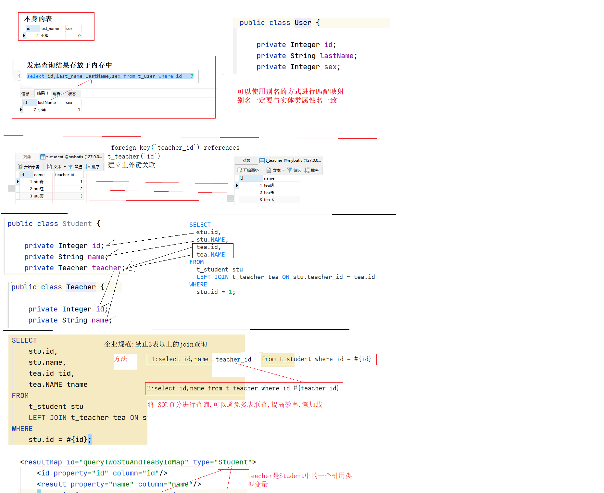
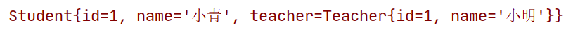
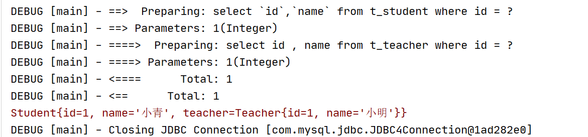
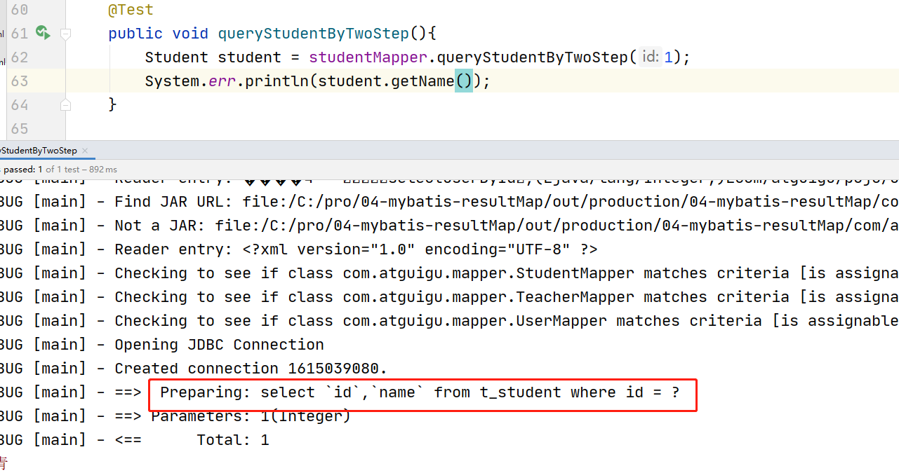
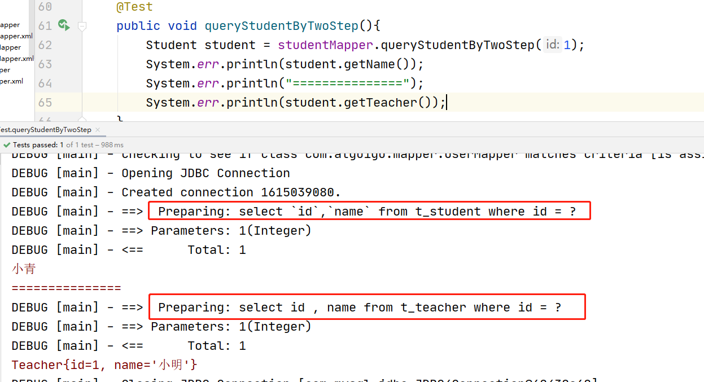
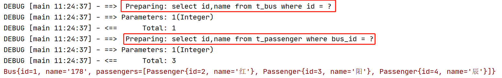
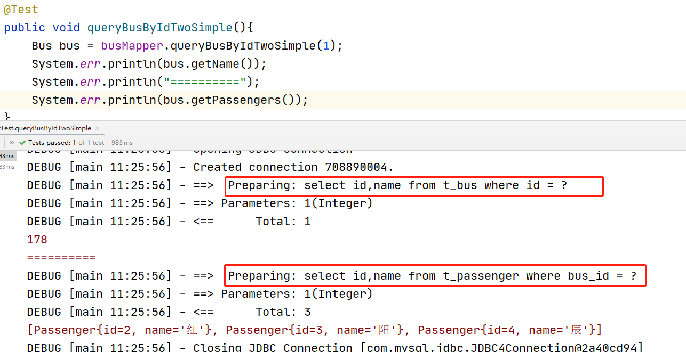
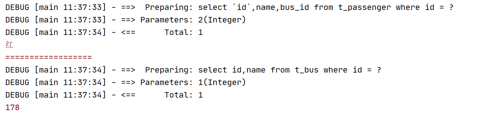

# 自定义结果集

## 目录

- [自定义结果集介绍](#自定义结果集介绍)
- [创建一对一数据库表](#创建一对一数据库表)
- [一对一数据表](#一对一数据表)
- [创建实体对象](#创建实体对象)
- [一对一的使用示例](#一对一的使用示例)
  - [创建 StudentMapper接口](#创建-StudentMapper接口)
  - [级联属性的映射配置](#级联属性的映射配置)
  - [\<association/> 嵌套结果集映射配置](#association-嵌套结果集映射配置)
  - [KeyMapper的测试代码](#KeyMapper的测试代码)
  - [\<association/> 定义分步查询](#association-定义分步查询)
- [延迟加载](#延迟加载)
- [多对一、一对多的使用示例](#多对一一对多的使用示例)
  - [创建一对多数据库](#创建一对多数据库)
  - [\<collection/> 一对多，立即加载关联查询](#collection-一对多立即加载关联查询)
  - [一对多，赖加载](#一对多赖加载)
  - [双向关联](#双向关联)
- [多值传参](#多值传参)

## 自定义结果集介绍



当数据库表字段名称与javaBean中属性不一致时,我们可以使用resultMap进行手动映射

```xml
<?xml version="1.0" encoding="UTF-8" ?>
<!DOCTYPE mapper
        PUBLIC "-//mybatis.org//DTD Mapper 3.0//EN"
        "http://mybatis.org/dtd/mybatis-3-mapper.dtd">
<mapper namespace="com.atguigu.mapper.UserMapper">
<!-- 使用resultMap解决数据库字段与实体类属性名称不一致的问题 -->
    <resultMap id="selectUserMap" type="User">
        <id property="id" column="id"/>
        <result property="lastName" column="last_name"/>
        <result property="sex" column="sex"/>
    </resultMap>
    <select id="selectUserById" parameterType="int" resultMap="selectUserMap">
        select `id`,last_name,sex from t_user where id = #{id}
    </select>
</mapper>
```


自定义结果集，可以给复杂的对象使用。也就是对象内又嵌套一个对象。或者一个集合。

在这种情况下。前面学过的知识点，已经无法直接获取出对象内对象的信息。

这个时候就需要使用resultMap自定义结果集来返回需要的数据。

## 创建一对一数据库表

## 一对一数据表

创建学生表

```sql
create table t_student(
   `id` int primary key auto_increment,
   `name` varchar(50),
    `teacher_id` int ,
   foreign key(`teacher_id`) references t_teacher(`id`)
);
```


创建老师表

```sql
create table t_teacher(
  `id` int primary key auto_increment,
  `name` varchar(50)
);
```


插入初始化数据

```sql
insert into t_student(`name`,teacher_id) values('stu青',1);
insert into t_student(`name`,teacher_id) values('stu红',2);
insert into t_student(`name`,teacher_id) values('stu丽',3);
insert into t_teacher(`name`) values('tea明');
insert into t_teacher(`name`) values('tea强');
insert into t_teacher(`name`) values('tea飞');
```


## 创建实体对象

学生对象

```java
public class Student {
  private int id;
  private String name;
  private Teacher teacher;
}
```


老师对象

```java
public class Teacher {
  private int id;
  private String name;
}
```


## 一对一的使用示例

### 创建 StudentMapper接口

```java
public interface StudentMapper {
   Student queryStudentMapper(Integer id);
}
```


### 级联属性的映射配置

```xml
<?xml version="1.0" encoding="UTF-8" ?>
<!DOCTYPE mapper
        PUBLIC "-//mybatis.org//DTD Mapper 3.0//EN"
        "http://mybatis.org/dtd/mybatis-3-mapper.dtd">
<mapper namespace="com.atguigu.mapper.StudentMapper">
    <!--
    resultMap标签专门用来定义自定义的结果集数据。
      type属性设置返回的数据类型
      id属性定义一个唯一标识
   -->
    <resultMap type="Student" id="queryKeyForSimple_resultMap">
        <!-- id定义主键列 -->
        <id column="id" property="id"/>
        <!-- result 定义一个列和属性的映射 -->
        <result column="name" property="name"/>
        <!-- teacher.id 和  teacher.name 叫级联属性映射 -->
        <result column="tname" property="teacher.name"/>
        <result column="sid" property="teacher.id"/>
    </resultMap>
    <!--
        select 标签用于定义一个select语句
            id属性设置一个statement标识
            parameterType设置参数的类型
            resultMap 设置返回的结果类型
     -->
     <select id="queryStudentMapper" resultMap="queryStudentForSimple_resultMap">
        select
            t_student.*,
            t_teacher.`name` as tname,
            t_teacher.`stu_id` as sid
        from t_student
        LEFT JOIN t_teacher
        on t_student.id = t_teacher.stu_id
        where t_student.id = #{id}
    </select>
</mapper>
```


### \<association/> 嵌套结果集映射配置

\<association /> 标签可以给返回结果中对象的属性是子对象的情况，进行映射。

比如：Student对象中有一个子对象Teacher。就可以使用\<association /> 来进行映射返&#x20;

```xml
<?xml version="1.0" encoding="UTF-8" ?>
<!DOCTYPE mapper
        PUBLIC "-//mybatis.org//DTD Mapper 3.0//EN"
        "http://mybatis.org/dtd/mybatis-3-mapper.dtd">
<mapper namespace="com.atguigu.mapper.StudentMapper">
    <resultMap id="queryStudentForSimple_resultMap" type="Student">
        <id column="id" property="id"/>
        <result column="name" property="name"/>
     <!--   <result column="tname" property="teacher.name"/>
        <result column="sid" property="teacher.id"/>-->
        <!--
           association 标签可以给一个子对象定义列的映射。
               property 属性设置 子对象的属性名 teacher
               javaType 属性设置子对象的全类名
        -->
        <association property="teacher" javaType="Teacher">
            <!-- id 属性定义主键 -->
            <id column="sid" property="id"/>
            <!-- result 标签定义列和对象属性的映射 -->
           <result column="tname" property="name"/>
        </association>
    </resultMap>
    <select id="queryStudentMapper" resultMap="queryStudentForSimple_resultMap">
       select
          stu.id,
            stu.name,
            tea.name tname,
            tea.id tid
        from t_student stu
        left join t_teacher tea
        on stu.teacher_id = tea.id
        where stu.id = #{id}
    </select>
</mapper>
```


### KeyMapper的测试代码

```java
@Test
public void test1(){
    KeyMapper keyMapper = sqlSession.getMapper(KeyMapper.class);
    Key key = keyMapper.queryKeyForSimple(1);
    System.err.println(key);
}
```


运行的结果：



### \<association/> 定义分步查询

添加一个 TeacherMapper 接口

```java
public interface TeacherMapper {
  Teacher queryTeacherById(int stuId);
}
```


添加 TeacherMapper接口对应的配置文件

```xml
<?xml version="1.0" encoding="UTF-8" ?>
<!DOCTYPE mapper
        PUBLIC "-//mybatis.org//DTD Mapper 3.0//EN"
        "http://mybatis.org/dtd/mybatis-3-mapper.dtd">
<mapper namespace="com.atguigu.mapper.TeacherMapper">
    <!-- 定义一个根据id查询锁的select -->
    <select id="queryTeacherById" parameterType="int" resultType="Teacher">
    select id , name from t_teacher where stu_id = #{stuId}
  </select>
</mapper>
```


在StudentMapper接口中，添加另一个方法分步查询：

```java
public interface StudentMapper {
  Student queryStudentMapper(Integer id);
  Student queryStudentByTwoStep(int id);
}
```


修改StudentMapper中的配置

```xml
<?xml version="1.0" encoding="UTF-8" ?>
<!DOCTYPE mapper
        PUBLIC "-//mybatis.org//DTD Mapper 3.0//EN"
        "http://mybatis.org/dtd/mybatis-3-mapper.dtd">
<mapper namespace="com.atguigu.mapper.StudentMapper">
    <resultMap id="queryStudentByTwoStep_resultMap" type="Student">
        <id property="id" column="id"/>
        <result property="name" column="name"/>
        <!--
            association:用于多表
                property:映射
                javaType:映射的类型
                select:引用的第二个查询id
                column:取出查询出数据的列
         -->
        <association property="teacher" javaType="Teacher"
                     select="com.atguigu.mapper.TeacherMapper.queryTeacherById"
                     column="id"/>
    </resultMap>
    <select id="queryStudentByTwoStep" resultMap="queryStudentByTwoStep_resultMap">
        select `id`,`name` from t_student where id = #{id}
    </select>
</mapper>
```


分步查询的测试代码：

```java
@Test
public void queryStudentByTwoStep(){
    Student student = studentMapper.queryStudentByTwoStep(1);
    System.err.println(student);
}
```


运行结果：



## 延迟加载

延迟加载在一定程序上可以减少很多没有必要的查询。给数据库服务器提升性能上的优化。

要启用延迟加载，需要在mybatis-config.xml配置文件中，添加如下两个全局的settings配置。

```xml
<!-- 打开延迟加载的开关 --> 
<setting name="lazyLoadingEnabled" value="true" /> 
<!-- 将积极加载改为消极加载 按需加载 --> 
<setting name="aggressiveLazyLoading" value="false"/> 
```


修改mybatis-config.xml配置文件，添加全局的设置

```xml
<!-- 配置全局mybatis的配置 -->
<settings>
    <!-- 启用驼峰标识 -->
    <setting name="mapUnderscoreToCamelCase" value="true" />
    <!-- 打开延迟加载的开关 -->
    <setting name="lazyLoadingEnabled" value="true" />
    <!-- 将积极加载改为消息加载即按需加载 -->
    <setting name="aggressiveLazyLoading" value="false" />
</settings>
```


测试:使用第一个表中数据但是未使用第二个表中数据&#x20;



测试:全部使用



## 多对一、一对多的使用示例

### 创建一对多数据库

一对多数据表

创建公交车表

```sql
create table t_bus(
  `id` int primary key auto_increment,
  `name` varchar(50)
);
#插入公交车信息
insert into t_bus(`name`) values('178');
insert into t_bus(`name`) values('189');
insert into t_bus(`name`) values('998');
insert into t_bus(`name`) values('320');
```


创建乘客表

```sql
create table t_passenger(
  `id` int primary key auto_increment,
  `name` varchar(50),
  `bus_id` int,
   foreign key(`bus_id`) references t_bus(`id`)
);
##插入乘客信息
insert into t_passenger(`name`,`bus_id`) values('红',1);
insert into t_passenger(`name`,`bus_id`) values('阳',1);
insert into t_passenger(`name`,`bus_id`) values('辰',1);
insert into t_passenger(`name`,`bus_id`) values('霖',2);
insert into t_passenger(`name`,`bus_id`) values('森',2);
insert into t_passenger(`name`,`bus_id`) values('武',3);
```


### \<collection/> 一对多，立即加载关联查询

创建实体对象

公交车对象

```java
public class Bus {
    private Integer id;
    private String name;
    private List<Passenger>passengers;
}
```


乘客对象

```java
public class Passenger {
  private int id;
  private String name;
 }
```


创建BusMapper接口类：

```java
public interface BusMapper {
    Bus queryBusByIdForSimple(Integer id);
}
```


编写BusMapper.xml配置文件

```xml
<?xml version="1.0" encoding="UTF-8" ?>
<!DOCTYPE mapper
        PUBLIC "-//mybatis.org//DTD Mapper 3.0//EN"
        "http://mybatis.org/dtd/mybatis-3-mapper.dtd">
<mapper namespace="com.atguigu.mapper.BusMapper">
    <resultMap id="queryBusByIdForSimple_resultMap" type="Bus">
        <id column="id" property="id"/>
        <result column="name" property="name"/>
        <!--
           collection定义一个子集合对象返回
        -->
        <collection property="passengers" ofType="Passenger">
            <id column="pid" property="id"/>
            <result column="pname" property="name"/>
        </collection>
    </resultMap>
    <!-- 定义一个立即加载的查询Bus对象 -->
    <select id="queryBusByIdForSimple" resultMap="queryBusByIdForSimple_resultMap">
        select
          t_bus.*,
          t_passenger.id as pid,
          t_passenger.name as pname
        from t_bus
        LEFT JOIN t_passenger
        on t_bus.id = t_passenger.bus_id
        where t_bus.id = #{id}
    </select>
</mapper>
```


测试代码：

```java
@Test
public void queryBusByIdForSimple(){
    Bus bus = busMapper.queryBusByIdForSimple(1);
    System.err.println(bus);
}
```


运行效果：

<!--  -->

### 一对多，赖加载

1:select id,name from t\_bus where id = 1 公交车

2:拿到公交车id去查询乘客

select id,name from t\_passenger where bus\_id = id

创建一个PassengerMapper接口

```java
public interface PassengerMapper {
    /**
     * 通过busId查询乘客
     * @param passengerId
     * @return
     */
    List<Passenger> queryPassengersByBusId(int passengerId);
}
```


创建PassengerMapper.xml配置文件

```xml
<?xml version="1.0" encoding="UTF-8" ?>
<!DOCTYPE mapper
        PUBLIC "-//mybatis.org//DTD Mapper 3.0//EN"
        "http://mybatis.org/dtd/mybatis-3-mapper.dtd">
<mapper namespace="com.atguigu.mapper.PassengerMapper">
    <select id="queryPassengersByBusId" resultType="Passenger">
        select id,name from t_passenger where bus_id = #{passengerId}
    </select>
</mapper>
```


测试

```java
@Test
public void queryPassengersByBusId(){
    List<Passenger> list = passengerMapper.queryPassengersByBusId(1);
    list.forEach(passenger -> {
        System.err.println(passenger);
    });
}
```


在Bus接口中添加一个分步查询延迟加载的方法

```java
public interface BusMapper {
    /**
     * 功能描述: <br>
     * 〈查询公交车并得到乘客〉
     *
     * @param id
     * @return:
     * @since: 1.0.0
     * @Author:niuniuisbest
     * @Date: 2020/7/10 10:59
     */
    Bus queryBusByIdForSimple(Integer id);
    /**
     * 功能描述: <br>
     * 〈分两步查询公交车信息,及乘客〉
     *
     * @param id
     * @return:
     * @since: 1.0.0
     * @Author:niuniuisbest
     * @Date: 2020/7/10 11:21
     */
    Bus queryBusByIdTwoSimple(Integer id);
}
```


修改ClazzMapper.xml配置文件内容：

```xml
<?xml version="1.0" encoding="UTF-8" ?>
<!DOCTYPE mapper
        PUBLIC "-//mybatis.org//DTD Mapper 3.0//EN"
        "http://mybatis.org/dtd/mybatis-3-mapper.dtd">
<mapper namespace="com.atguigu.mapper.BusMapper">
    <resultMap id="queryBusByIdTwoSimple_resultMap" type="Bus">
        <id column="id" property="id"/>
        <result column="name" property="name"/>
        <collection property="passengers" ofType="Passenger"
                    select="com.atguigu.mapper.PassengerMapper.queryPassengersByBusId"
                    column="id"/>
    </resultMap>
    <select id="queryBusByIdTwoSimple" resultMap="queryBusByIdTwoSimple_resultMap">
         select id,name from t_bus where id = #{id}
    </select>
</mapper>
```


修改log4j日记配置文件如下：

```xml
log4j.rootLogger=DEBUG, stdout
log4j.appender.stdout=org.apache.log4j.ConsoleAppender
log4j.appender.stdout.layout=org.apache.log4j.PatternLayout
log4j.appender.stdout.layout.ConversionPattern=%5p [%t %d{HH:mm:ss}] - %m%n
```


上面日记中标黄的部分，是给日记添加当前时间的输出

测试立即加载的代码

```java
@Test
public void queryBusByIdTwoSimple(){
    Bus bus = busMapper.queryBusByIdTwoSimple(1);
    System.err.println(bus);
}
```


运行效果：



测试延迟加载



### 双向关联

修改乘客对象

```java
public class Passenger {
    private Integer id;
    private String name;
    private Bus bus;
}
```


PassengerMapper

```java
public interface PassengerMapper {
    /**
     * 通过id查询乘客并携带公交车信息
     * @param id
     * @return
     */
    Passenger queryPassengersById(int id);
}
```


修改PassengerMapper配置文件     &#x20;

```xml
<resultMap id="queryPassengersById_resultMap" type="Passenger">
    <id column="id" property="id"/>
    <result column="name" property="name"/>
    <association property="bus" javaType="Bus"
                 select="com.atguigu.mapper.BusMapper.queryBusByIdTwoSimple"
                 column="bus_id"/>
</resultMap>
<select id="queryPassengersById" resultMap="queryPassengersById_resultMap">
    select `id`,name,bus_id from t_passenger where id = #{id}
</select>
```


注意：双向关联，要小心进入死循环，

1、防止死循环就是不要调用toString方法

2、最后一次查询返回resultType.

修改测试的代码如下：

```java
@Test
public void queryPassengersById(){
    Passenger passengers = this.passengerMapper.queryPassengersById(2);
    System.err.println(passengers.getName());
    System.err.println("==================");
    System.err.println(passengers.getBus().getName());
}
```




## 多值传参

PassengerMapper接口:

根据指定公交车id查询乘客,并且乘客名称还要做模糊查询

```java
/**
     * 根据指定公交车id查询乘客,并且乘客名称还要做模糊查询
     * @param bid
     * @param name
     * @return
     */
    List<Passenger> queryPassengerByBidOrLikeName(@Param("bid") Integer bid, @Param("name") String name);
```


PassengerMapper.xml配置文件:

```xml
<select id="queryPassengerByBidOrLikeName" resultType="Passenger">
         select id,name from t_passenger where bus_id = #{bid} or name like concat('%',#{name},'%')
    </select>
```


BusMapper接口:

```java
Bus queryBusByIdTwoArgs(Integer id);
```


BusMapper.xml配置文件

```xml
<resultMap id="queryBusByIdTwoArgsMap" type="Bus">
        <id property="id" column="id"/>
        <result property="name" column="name"/>
        <!--
            1:N延迟加载关联映射
            注意:bid要与传递的参数一致
        -->
        <collection property="passengers"
                    column="{bid=id,name=name}"
                    select="com.atguigu.mapper.PassengerMapper.queryPassengerByBidOrLikeName"/>
    </resultMap>
    <select id="queryBusByIdTwoArgs" resultMap="queryBusByIdTwoArgsMap">
        select `id`,name from t_bus where id = #{id}
    </select>
```
