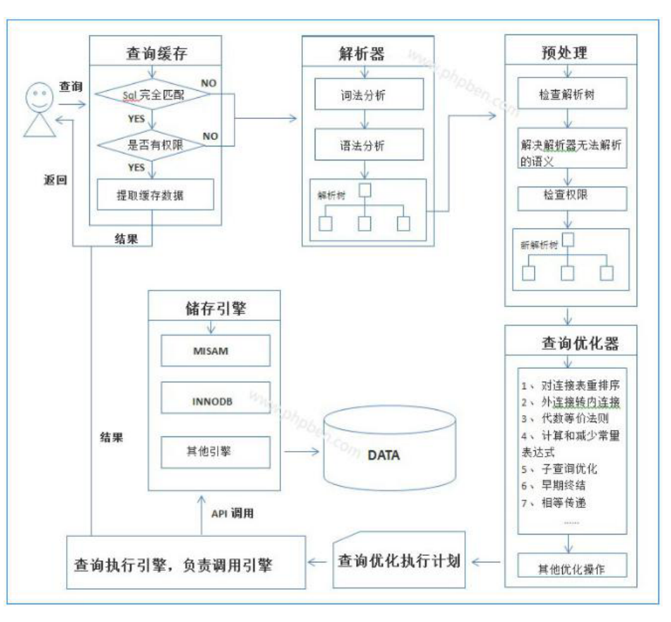
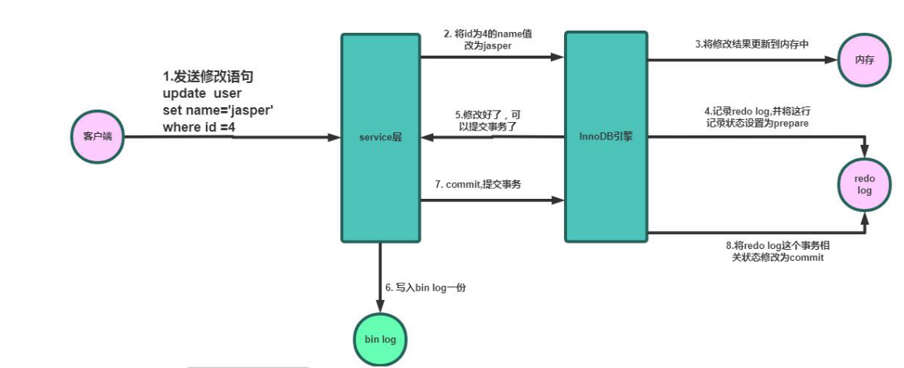
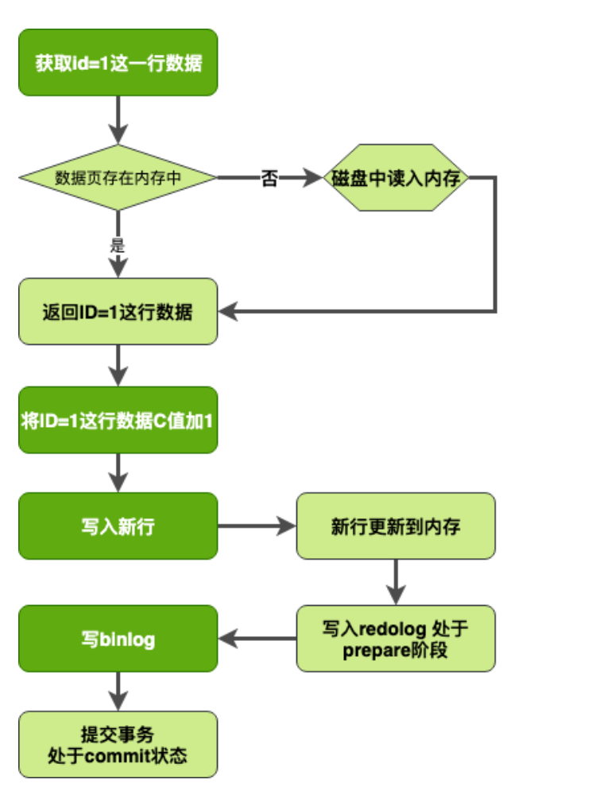
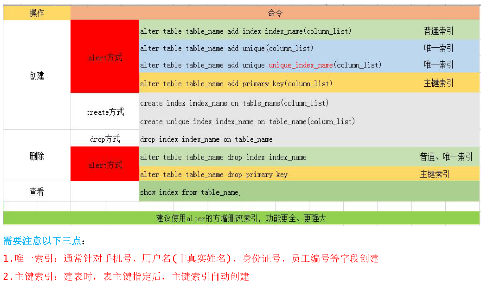
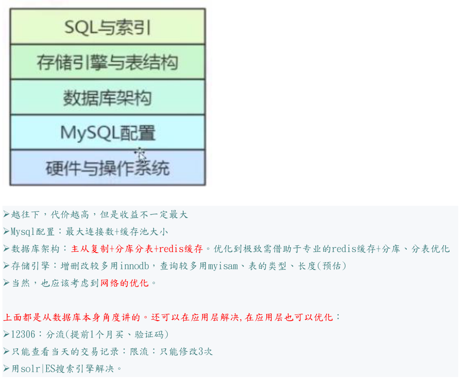

# sql 高级

## 目录

- [安装](#安装)
- [常用的 mysql 命令](#常用的mysql命令)
- [ mysql 架构](#-mysql架构)
- [mysql 查询执行步骤：](#mysql查询执行步骤)
- [mysql 关于增删改的流程：](#mysql关于增删改的流程)
- [索引](#索引)
- [优化](#优化)

#### 安装

[mysql 安装](https://www.runoob.com/mysql/mysql-install.html "mysql安装")-菜鸟教程

mysql 字符集问题

```text
解决方案：
第一步：修改 my.cnf 文件并在 mysqld 字节最后添加编码设置
vim /etc/my.cnf
在[mysqld]节点最后加上中文字符集配置：
character_set_server=utf8
第二步：重启 mysql 服务器
systemctl restart mysqld： 完成后创建新库、新表即可【支持中文】。

修改以前数据库的字符集 alter database test character set 'utf8';
修改以前数据表的字符集 alter table book convert to character set 'utf8';
```

#### 常用的 mysql 命令

```text
查询字符集
show variables like 'character%';
show variables like '%char%';

查看用户
select host,user,authentication_string,select_priv,insert_priv,drop_priv from mysql.user;#后面接/G可以按列输出

权限操作 需要（调用flush privileges;）
grant 权限1,权限2,…权限n on 数据库名称.表名称 to 用户名@用户地址 identified by '口令'; 该权限如果发现没有该用户，则会直接新建一个用户
grant select,insert,delete,drop on atguigudb.* to li4@localhost ;
#给li4用户用本地命令行方式下，授予atguigudb这个库下的所有表的插删改查的权限。
grant all privileges on *.* to joe@'%' identified by '123';
#授予通过网络方式登录的的joe用户 ，对所有库所有表的全部权限，密码设为123.

查看当前用户权限
show grants;

收回权限命令：
revoke 权限1,权限2,…权限n on 数据库名称.表名称 from 用户名@用户地址 ;
REVOKE ALL PRIVILEGES ON mysql.* FROM joe@localhost;
#收回全库全表的所有权限
REVOKE select,insert,update,delete ON mysql.* FROM joe@localhost;
#收回mysql库下的所有表的插删改查权限

查看最大链接数
show variables like 'max_connections';

查看一次连接，最多可以向服务端发送的数据包大小,默认值：1048576 字节[1M 大小]
show variables like 'max_allow%' ;

查看用户连接信息
show processlist;
root 用户可以查看所有用户的连接 普通用户可以查看自己的连接 .

```

global 与 session

Session 只对当前窗口生效,但是 global 对于所有的 session 都生效。需要注意 global 全局参数的设置是对已 经开启的 session 不生效，但是对于新开启的 session 才是有效的。
虽然设置了 global 变量、session 变量，但是在 mysql 服务重启之后，数据库的配置又会重新初始化，一切 按照 my.ini 的配置进行初始化，所以永久修改需要在: my.cnf|my.ini 文件中修改。

```text
show variables like 'max_connections'; 对应的修改： set xxx=1
show session variables like 'max_connections'; 对应的修改： set xxx=1
show global variables like 'max_connections'; 对应的修改： set global xxx=1
```

sql_mode

show variables like 'sql_mode';

去了公司要设置自己的 mysql 库和测试库的环境保持一致，包括该值,保证 sql 本地没问题,上测试也没问题,使用严格模式


#### &#x20;mysql 架构

mysql 对查询和增删改进行分别的优化

#### mysql 查询执行步骤：



1.mysql 客户端通过协议与 mysql 服务器建连接，发送查询语句，先检查查询缓存，如果命中，直接返回结 果，否则进行语句解析,也就是说，在解析查询之前，服务器会先访问查询缓存(query cache)——它存储 SELECT 语句以及相应的查询结果集。如果某个查询结果已经位于缓存中，服务器就不会再对查询进行解析、 优化、以及执行。它仅仅将缓存中的结果返回给用户即可，这将大大提高系统的性能。&#x20;

2.语法解析器和预处理：首先 mysql 通过关键字将 SQL 语句进行解析，并生成一颗对应的"解析树“。mysql 解析器将使用 mysql 语法规则验证和解析查询；预处理器则根据一些 mysql 规则进一步检查解析数是否合法。&#x20;

3.查询优化器当解析树被认为是合法的了，并且由优化器将其转化成执行计划。一条查询可以有很多种执 行方式，最后都返回相同的结果。优化器的作用就是找到这其中最好的执行计划。&#x20;

4.然后，mysql 查询执行引擎调用统一的 API 接口，调用存储引擎，将数据从磁盘的文件系统中查询出来， 放到缓存中一份，同时返回给客户端一份。

**mysql 的关于内部变量的查看和设置**

查询缓存设置

```text
查看查询缓存
show variables like 'query_cache%';
查看 sql 具体消耗及是否命中缓存
show profile;
```


优化器设置

```text
查看优化器是否开启
show variables like 'optimizer_trace%';

默认优化器追踪是关闭的。需要我们开启。
set optimizer_trace='enabled=on';

查看该 SQL 的执行计划追踪,
select * from information_schema.optimizer_trace \G;

注意：这里我们要明白，我们得到的这个执行计划，不一定是最优的执行计划,是因为它在生成执行计划的时候， 也有可能覆盖不了所有的执行路径。那么我们怎么看 mysql 到底采用的是哪个执行计划呢？我们可以使用 explain + SQL 语句 查看最终采用了哪个执行计划。
```

存储引擎设置

```text
查看 mysql 存储数据库和表的本地目录:
show variables like 'datadir';

show table status from test;
#test 是数据库名，查看一个库里面，每张表使用的数据库引擎
alter table dd engine = 'myisam';
#修改某个表的引擎
SHOW ENGINES;
查看当前 mysql 支持哪些数据库引擎，
```

#### mysql 关于增删改的流程：

1. 查询流程不一样的是，更新流程主要在引擎层面有差异，它还涉及两个重要的日志模块，它们正是我们今天要讨论的主角：redo log（重做日志）和 binlog（归档日志）。

   **redo log：**

   redo log 通常是物理日志，记录的是数据页的物理修改，而不是某一行或某几行修改成怎样怎样，它用来恢复提交后的物理数据页(恢复数据页，且只能恢复到最后一次提交的位置)。

   类似一个临时记事本：
   一遍更新会有如下做法：

   直接查询原始数据，立马更新；

   先找个临时记事本，做下记录，等不忙的时候/结算时候进行核算更新。

   第一种做法在高并发 IO 的情况下非常的不容乐观。所以一般都会采用第二种方式。

   同样在 MySQL 里存在这样的一个问题，如果每一次的更新操作都需要写进磁盘，然后磁盘也要找到对应的那条记录，然后再更新，整个过程 IO 成本、查找成本都很高。为了解决这个问题，MySQL 的设计者就用了 redo log 的思路来提升更新效率。

   临时记事本和原始数据进行操作的整个过程，也是对应 MySQL 里经常说到的 WAL 技术，WAL 的全称是 Write-Ahead Logging，它的关键点就是先写日志，再写磁盘。具体来说，当有一条记录需要更新的时候，InnoDB 引擎就会先把记录写到 redo log（记事本）里面，并更新内存，这个时候更新就算完成了。同时，InnoDB 引擎会在适当的时候，将这个操作记录更新到磁盘里面，而这个更新往往是在系统比较空闲的时候做。

   **bin log：**

   MySQL 整体来看，其实就有两块：一块是 Server 层，它主要做的是 MySQL 功能层面的事情；还有一块是引擎层，负责存储相关的具体事宜。上面 redo log 是 InnoDB 引擎特有的日志，而 Server 层也有自己的日志，称为 binlog（归档日志）。

   为什么会有两份日志呢？

   最开始 MySQL 里并没有 InnoDB 引擎。MySQL 自带的引擎是 MyISAM，但是 MyISAM 没有 crash-safe 的能力，binlog 日志只能用于归档。而 InnoDB 是另一个公司以插件形式引入 MySQL 的，既然只依靠 binlog 是没有 crash-safe 能力的，所以 InnoDB 使用另外一套日志系统——也就是 redo log 来实现 crash-safe 能力。

   这两种日志有以下三点不同。

   redo log 是 InnoDB 引擎特有的；binlog 是 MySQL 的 Server 层实现的，所有引擎都可以使用。

   redo log 是物理日志，记录的是"在某个数据页上做了什么修改“；binlog 是逻辑日志，记录的是这个语句的原始逻辑，比如"给 ID=2 这一行的 c 字段加 1 “。

   redo log 是循环写的，空间固定会用完；binlog 是可以追加写入的。"追加写“是指 binlog 文件写到一定大小后会切换到下一个，并不会覆盖以前的日志。

我们再来看执行器和 InnoDB 引擎在执行这个简单的 update 语句时的内部流程。

`update T set c=c+1 where ID=1;`



执行器先找引擎取 ID=1 这一行。ID 是主键，引擎直接用树搜索找到这一行。如果 ID=1 这一行所在的数据页本来就在内存中，就直接返回给执行器；否则，需要先从磁盘读入内存，然后再返回。

执行器拿到引擎给的行数据，把这个值加上 1，比如原来是 N，现在就是 N+1，得到新的一行数据，再调用引擎接口写入这行新数据。

引擎将这行新数据更新到内存中，同时将这个更新操作记录到 redo log 里面，此时 redo log 处于 prepare 状态。然后告知执行器执行完成了，随时可以提交事务。

执行器生成这个操作的 binlog，并把 binlog 写入磁盘。

执行器调用引擎的提交事务接口，引擎把刚刚写入的 redo log 改成提交（commit）状态，更新完成。



---

为什么必须有"两阶段提交“呢？这是为了让两份日志之间的逻辑一致。

binlog 会记录所有的逻辑操作，并且是采用"追加写“的形式。如果你的 DBA 承诺说半个月内可以恢复，那么备份系统中一定会保存最近半个月的所有 binlog，同时系统会定期做整库备份。这里的"定期“取决于系统的重要性，可以是一天一备，也可以是一周一备。

当需要恢复到指定的某一秒时，比如某天下午两点发现中午十二点有一次误删表，需要找回数据，那你可以这么做：

首先，找到最近的一次全量备份，如果你运气好，可能就是昨天晚上的一个备份，从这个备份恢复到临时库；

然后，从备份的时间点开始，将备份的 binlog 依次取出来，重放到中午误删表之前的那个时刻。

这样你的临时库就跟误删之前的线上库一样了，然后你可以把表数据从临时库取出来，按需要恢复到线上库去。

好了，说完了数据恢复过程，我们回来说说，为什么日志需要"两阶段提交“。这里不妨用反证法来进行解释。

问题：
由于 redo log 和 binlog 是两个独立的逻辑，如果不用两阶段提交，要么就是先写完 redo log 再写 binlog，或者采用反过来的顺序。我们看看这两种方式会有什么问题。

仍然用前面的 update 语句来做例子。假设当前 ID=1 的行，字段 c 的值是 0，再假设执行 update 语句过程中在写完第一个日志后，第二个日志还没有写完期间发生了 crash，会出现什么情况呢？

先写 redo log 后写 binlog。

假设在 redo log 写完，binlog 还没有写完的时候，MySQL 进程异常重启。由于我们前面说过的，redo log 写完之后，系统即使崩溃，仍然能够把数据恢复回来，所以恢复后这一行 c 的值是 1。但是由于 binlog 没写完就 crash 了，这时候 binlog 里面就没有记录这个语句。因此，之后备份日志的时候，存起来的 binlog 里面就没有这条语句。然后你会发现，如果需要用这个 binlog 来恢复临时库的话，由于这个语句的 binlog 丢失，这个临时库就会少了这一次更新，恢复出来的这一行 c 的值就是 0，与原库的值不同。

先写 binlog 后写 redo log。

如果在 binlog 写完之后 crash，由于 redo log 还没写，崩溃恢复以后这个事务无效，所以这一行 c 的值是 0。但是 binlog 里面已经记录了"把 c 从 0 改成 1“这个日志。所以，在之后用 binlog 来恢复的时候就多了一个事务出来，恢复出来的这一行 c 的值就是 1，与原库的值不同。

可以看到，如果不使用"两阶段提交“，那么数据库的状态就有可能和用它的日志恢复出来的库的状态不一致。

其实不只是误操作后需要用这个过程来恢复数据。当需要扩容的时候，也就是需要再多搭建一些备库来增加系统的读能力的时候，现在常见的做法也是用全量备份加上应用 binlog 来实现的，这个"不一致“就会导致你的线上出现主从数据库不一致的情况。

简单说，redo log 和 binlog 都可以用于表示事务的提交状态，而两阶段提交就是让这两个状态保持逻辑上的一致。

---

redo log 用于保证 crash-safe 能力。innodb_flush_log_at_trx_commit 这个参数设置成 1 的时候，表示每次事务的 redo log 都直接持久化到磁盘。这个参数我建议你设置成 1，这样可以保证 MySQL 异常重启之后数据不丢失。

sync_binlog 这个参数设置成 1 的时候，表示每次事务的 binlog 都持久化到磁盘。这个参数我也建议你设置成 1，这样可以保证 MySQL 异常重启之后 binlog 不丢失。

总结：

binlog:在服务层面，记录的是 DML、DDL 操作，主要做：主从复制、数据恢复&#x20;

undo log:可以进行回滚、撤销，保证事务原子性等操作。&#x20;

Redo log:崩溃恢复 Redo log 和 undo log 这两个都是在引擎层面的

额外介绍：

innodb 缓冲池：

通过如下命令可以查看 innodb 缓冲池大小，默认大小可以根据自己机器性能调节,对于读写性能还是有很大帮 助的：` show variables like '%innodb_buffer_pool%'`

change_buffer ：

`show variables like '%change_buffer%';`

注意：mysql 并不是将每次的更新都直接由 change buffer 写到磁盘上，而是根据由后台线程每隔多长时间 去拉取内存数据到磁盘上，或者当我们停止 mysql 服务的时候，也会写到磁盘上。 Change buffer 越大，增删改效果越好。

Log Buffer：
注意：上面的 log buffer 主要是记录写命令的,对应着 redo log 在内存中的空间，万一当机子宕机的时候， change buffer 中的数据还没都同步到磁盘上，我们可以借助于 redo log 来实现数据的恢复,redo log 文 件所在的目录是：` show variables like '%datadir%'`;

#### 索引

索引的类别：

1. 主键索引：设定为主键后数据库会自动建立索引，innodb 为聚簇索引&#x20;
2. 单值索引：即一个索引只包含单个列，一个表可以有多个单列索引&#x20;
3. 唯一索引：索引列的值必须唯一，但允许有空值&#x20;
4. 复合索引：即一个索引包含多个列

索引的创建

1. 直接创建

   ```java
   CREATE TABLE customer (
   id INT (10) UNSIGNED AUTO_INCREMENT,
   customer_no VARCHAR (200),
   customer_name VARCHAR (200),
   PRIMARY KEY (id),
   # 主键索引
   KEY (customer_name),
   # 单值索引 ,可自己指定索引名
   UNIQUE (customer_name),
   # 唯一索引,可自己指定索引名
   KEY (customer_no, customer_name)
   # 复合索引/组合索引,可自己指定索引名
   );
   ```

2. 后期添加

   

   第三点：一个表一旦建立主键之后后期几乎不会改动,如果要删除一个表的主键，必须保证该主键不能是自增的主键，

3. 全文搜索
   ```java
   create table fulltext_test (
   id int(11) NOT NULL AUTO_INCREMENT,
   content text NOT NULL,
   tag varchar(255),
   PRIMARY KEY (id),
   FULLTEXT KEY content_tag_fulltext(content,tag)
   ) ENGINE=MyISAM DEFAULT CHARSET=utf8;
   后期增加全文索引
   alter table fulltext_test add fulltext index content_tag_fulltext(content,tag);
   ```

有四种分别为

什么情况下需要建立索引：

1. 经常作为查询条件的
2. 在连表操作时在 on 条件后面的
3. 需要对某个字段进行排序分组的
4. 能选择组合索引选择组合索引，性价比更高；组合索引区分大的放在前面

#### 优化

影响 sql 性能的常见情况：

```java
数据过多： 分库分表
关联了太多的表，太多join：SQL优化
没有充分利用到索引： 索引建立
服务器调优及各个参数设置：调整my.cnf

在上面四种方案中，第四种索引建立、成本最低、效果最好.
```


