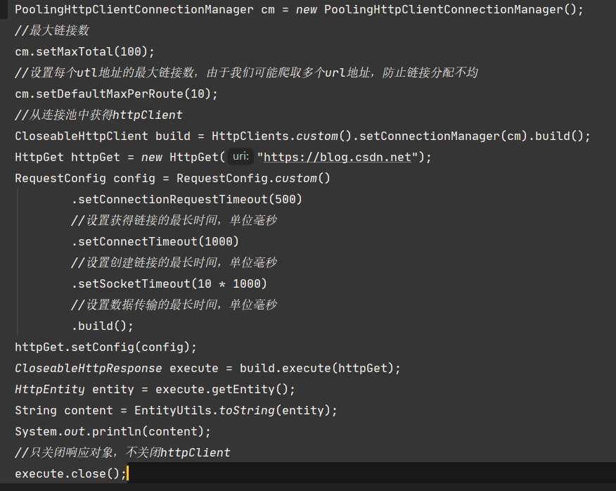

# 设置请求信息

```java
HttpGet httpGet = new HttpGet("https://blog.csdn.net");
RequestConfig config = RequestConfig.custom()
        .setConnectionRequestTimeout(500) 
        //设置获得链接的最长时间，单位毫秒
        .setConnectTimeout(1000) 
        //设置创建链接的最长时间，单位毫秒
        .setSocketTimeout(10 * 1000)
        //设置数据传输的最长时间，单位毫秒
        .build();
httpGet.setConfig(config);
```



