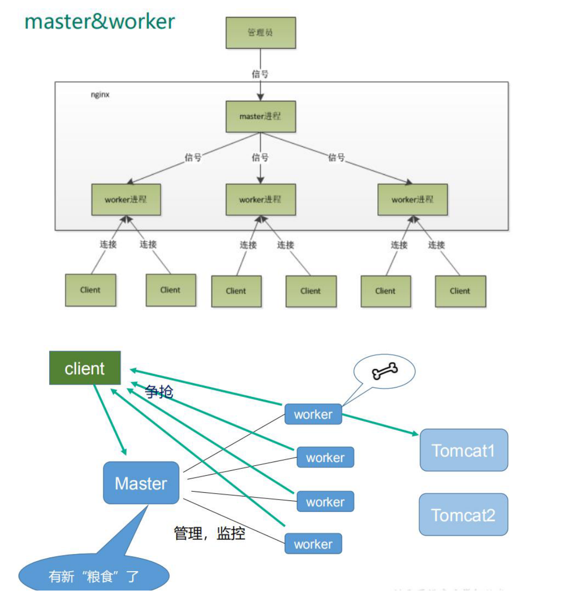

# Nginx 原理及优化配置

## 目录

- [master-workers 的机制的好处](#master-workers-的机制的好处)
- [设置 worker 数量 ](#设置worker-数量-)
- [连接数 worker\_](#连接数-worker_)



#### master-workers 的机制的好处

首先，对于每个 worker 进程来说，独立的进程，不需要加锁，所以省掉了锁带来的开销，同时在编程以及问题 查找时，也会方便很多。

其次，采用独立的进程，可以让互相之间不会影响，一个进程退出后，其它进程还在工 作，服务不会中断，master 进程则很快启动新的 worker 进程。当然，worker 进程的异常退出，肯定是程序有 bug 了，异常退出，会导致当前 worker 上的所有请求失败，不过不会影响到所有请求，所以降低了风险。&#x20;

需要设置多少个 worker&#x20;

Nginx 同 redis 类似都采用了 io 多路复用机制，每个 worker 都是一个独立的进程，但每个进程里只有一个主 线程，通过异步非阻塞的方式来处理请求， 即使是千上万个请求也不在话下。每个 worker 的线程可以把一个 cpu 的性能发挥到极致。所以 worker 数和服务器的（cpu 个数\*核数）相等是最为适宜的。设少了会浪费 cpu， 设多了会造成 cpu 频繁切换上下文带来的损耗。

#### 设置 worker 数量&#x20;

worker_processes 4&#x20;

\#work 绑定 cpu 个数\*核数(4 work 绑定 4cpu 核数)。

` worker_cpu_affinity 0001 0010 0100 1000`

&#x20;\#work 绑定 cpu (4 work 绑定 8cpu 中的 4 个) 。&#x20;

`worker_cpu_affinity 00000001 00000010 00000100 00001000 00010000 00100000 01000000 10000000`

#### 连接数 worker\_

connections 1024 这个值是表示每个 worker 进程所能建立连接的最大值，所以，一个 nginx 能建立的最大连接数，应该是 worker_connections \* worker_processes。当然，这里说的是最大连接数，对于 HTTP 请求本地资源来说，能 够支持的最大并发数量是 worker_connections \* worker_processes，如果是支持 http1.1 的浏览器每次访问要 占两个连接，所以普通的静态访问最大并发数是：worker_connections \* worker_processes /2，而如果是 HTTP 作为反向代理来说，最大并发数量应该是 worker_connections \* worker_processes/4。 因为作为反向代理服务器，每个并发会建立与客户端的连接和与后端服务的连接，会占用两个连接。

配置文件

```bash
        #安全问题，建议用 nobody,不要用 root.
        #user nobody;
        #worker 数和服务器的 cpu数相等是最为适宜
        worker_processes 2;
        #work 绑定 cpu(4 work 绑定 4cpu)
        worker_cpu_affinity 0001 0010 0100 1000
        #work 绑定 cpu (4 work 绑定 8cpu 中的 4 个) 。
        worker_cpu_affinity 0000001 00000010 00000100 00001000
        #error_log path(存放路径) level(日志等级) path 表示日志路径，level 表示日志等级， #具体如下：[ debug | info | notice | warn | error | crit ] #从左至右，日志详细程度逐级递减，即 debug 最详细，crit 最少，默认为 crit。
        #error_log logs/error.log;
        #error_log logs/error.log notice;
        #error_log logs/error.log info;
        #pid  logs/nginx.pid;
        events {
        #这个值是表示每个worker 进程所能建立连接的最大值，所以，一个 nginx 能建立的最大连接数，应该是worker_connections * worker_processes。
        #当然，这里说的是最大连接数，对于 HTTP 请求本地资源来说，能够支持的最大并发数量是worker_connections * worker_processes，
        #如果是支持 http1.1 的浏览器每次访问要占两个连接，
        #所以普通的静态访问最大并发数是： worker_connections * worker_processes /2，
        # 而如 果是 HTTP 作为 反向代 理来说 ，最大 并发 数量应 该是 worker_connections *worker_processes/4。
        #因为作为反向代理服务器，每个并发会建立与客户端的连接和与后端服务的连接，会占用两个连接。
        worker_connections 1024;
        #这个值是表示 nginx 要支持哪种多路 io 复用。
        #一般的 Linux 选择 epoll, 如果是(*BSD)系列的 Linux 使用 kquene。
        #windows 版本的 nginx 不支持多路 IO复用，这个值不用配。
        use epoll;
        # 当一个worker 抢占到一个链接时，是否尽可能的让其获得更多的连接,默认是 off 。
        multi_accept on; //并发量大时缓解客户端等待时间。
        # 默认是 on ,开启 nginx 的抢占锁机制。
        accept_mutex on; //master 指派worker 抢占锁
        }
        http {
        #当web服务器收到静态的资源文件请求时，依据请求文件的后缀名在服务器的MIME 配置文件中找到对应的MIME Type，再根据MIME Type 设置 HTTP Response 的 Content-Type，然后浏览器根据Content-Type 的值处理文件。
        include mime.types; #/usr/local/nginx/conf/mime.types
        #如果 不能从mime.types 找到映射的话，用以下作为默认值-二进制
        default_type application/octet-stream;
        #日志位置
        access_log logs/host.access.log main;
        #一条典型的 accesslog：
        #101.226.166.254 - - [21/Oct/2013:20:34:28 +0800] "GET /movie_cat.php?year=2013 HTTP/1.1" 200 5209 "http://www.baidu.com" "Mozilla/4.0 (compatible; MSIE 8.0; Windows NT6.1; Trident/4.0; SLCC2; .NET CLR 2.0.50727; .NET CLR 3.5.30729; .NET CLR 3.0.30729; Media Center PC 6.0; MDDR; .NET4.0C; .NET4.0E; .NET CLR 1.1.4322; Tablet PC 2.0); 360Spider"
        #1）101.226.166.254:(用户 IP)
        #2）[21/Oct/2013:20:34:28 +0800]：(访问时间)
        #3）GET：http 请求方式，有GET 和 POST 两种
        #4）/movie_cat.php?year=2013：当前访问的网页是动态网页，movie_cat.php 即请求的后台接口，year=2013 为具体接口的参数
        #5）200：服务状态，200 表示正常，常见的还有，301 永久重定向、4XX 表示请求出错、5XX 服务器内部错误
        #6）5209：传送字节数为 5209，单位为byte
        #7）"http://www.baidu.com"：refer:即当前页面的上一个网页
        #8） "Mozilla/4.0 (compatible; MSIE 8.0; Windows NT 6.1; Trident/4.0; SLCC2; .NET CLR.NET CLR 3.5.30729; #.NET CLR 3.0.30729; Media Center PC 6.0;2.0.50727;MDDR; .NET4.0C; .NET4.0E; .NET CLR 1.1.4322; Tablet PC 2.0); 360Spider"： agent 字段：通常用来记录操作系统、浏览器版本、浏览器内核等信息
        log_format main '$remote_addr - $remote_user [$time_local] "$request" '
        '$status $body_bytes_sent "$http_referer" '
        '"$http_user_agent" "$http_x_forwarded_for"';
        #开启从磁盘直接到网络的文件传输，适用于有大文件上传下载的情况，提高 IO效率。
        sendfile on; //大文件传递优化，提高效率
        #一个请求完成之后还要保持连接多久, 默认为 0，表示完成请求后直接关闭连接。
        #keepalive_timeout 0;
        keepalive_timeout 65;
        #开启或者关闭 gzip 模块
        #gzip on ; //文件压缩，再传输，提高效率
        #设置允许压缩的页面最小字节数，页面字节数从 header 头中的Content-Length 中进行获取。
        #gzip_min_lenth 1k;//超过该大小开始压缩，否则不用压缩
        # gzip压缩比，1 压缩比最小处理速度最快，9 压缩比最大但处理最慢（传输快但比较消耗 cpu）
        #gzip_comp_level 4;
        #匹配MIME 类型进行压缩，（无论是否指定）"text/html"类型总是会被压缩的。
        #gzip_types types text/plain text/css application/json application/x-javascript text/xml
        #动静分离
        #服务器端静态资源缓存，最大缓存到内存中的文件，不活跃期限open_file_cache max=655350 inactive=20s;
        #活跃期限内最少使用的次数，否则视为不活跃。
        open_file_cache_min_uses 2;
        #验证缓存是否活跃的时间间隔
        open_file_cache_valid 30s;
        upstream myserver{
        # 1、轮询（默认）
        # 每个请求按时间顺序逐一分配到不同的后端服务器，如果后端服务器 down 掉，能自动剔除。
        # 2、指定权重
        # 指定轮询几率，weight 和访问比率成正比，用于后端服务器性能不均的情况。
        #3、IP 绑定 ip_hash
        # 每个请求按访问 ip的 hash 结果分配，这样每个访客固定访问一个后端服务器，可以解决 session的问题。
        #4、备机方式 backup
        # 正常情况不访问设定为 backup的备机，只有当所有非备机全都宕机的情况下，服务才会进备机。当非备机启动后，自动切换到非备机
        # ip_hash;
        server 192.168.161.132:8080 weight=1;
        server 192.168.161.132:8081 weight=1 backup;
        #5、fair（第三方）公平，需要安装插件才能用
        #按后端服务器的响应时间来分配请求，响应时间短的优先分配。
        #6、url_hash（第三方）
        #按访问 url 的 hash 结果来分配请求，使每个 url 定向到同一个后端服务器，后端服务器为缓存时比较有效。
        # ip_hash;
        server 192.168.161.132:8080 weight=1;
        server 192.168.161.132:8081 weight=1;
        #fair
        #hash $request_uri
        #hash_method crc32
        }
        server {
        #监听端口号
        listen 80;
        #服务名
        server_name 192.168.161.130;
        #字符集
        #charset utf-8;
        #location [=|~|~*|^~] /uri/ { … }
        # = 精确匹配
        # ~ 正则匹配，区分大小写
        # ~* 正则匹配，不区分大小写
        # ^~ 关闭正则匹配
        #匹配原则：
        # 1、所有匹配分两个阶段，第一个叫普通匹配，第二个叫正则匹配。
        # 2、普通匹配，首先通过"=”来匹配完全精确的 location
        # 2.1、 如果没有精确匹配到， 那么按照最大前缀匹配的原则，来匹配 location
        # 2.2、 如果匹配到的 location 有^~,则以此 location 为匹配最终结果，如果没有那么会把匹
        配的结果暂存，继续进行正则匹配。
        # 3、正则匹配，依次从上到下匹配前缀是~或~*的 location, 一旦匹配成功一次，则立刻以此
        location为准，不再向下继续进行正则匹配。
        # 4、如果正则匹配都不成功，则继续使用之前暂存的普通匹配成功的 location.
        #不是以波浪线开头的都是普通匹配。
        location / { # 匹配任何查询，因为所有请求都以 / 开头。但是正则表达式规则和长的块规则将被优先和查询匹配。
        #定义服务器的默认网站根目录位置
        root html;//相对路径，省略了./
        #默认访问首页索引文件的名称
        index index.html index.htm;
        #反向代理路径
        proxy_pass http://myserver;
        #反向代理的超时时间
        proxy_connect_timeout 10;
        proxy_redirect default;
}
        #普通匹配
        location /images/ {
        root images ;
        }
        # 反正则匹配
        location ^~ /images/jpg/ { # 匹配任何以 /images/jpg/ 开头的任何查询并且停止搜索。任何正则表达式将不会被测试。
        root images/jpg/ ;
        }
        #正则匹配
        location ~*.(gif|jpg|jpeg)$ {
        /user/local/nginx/html 路径#所有静态文件直接读取硬盘 root pic ;
        #expires 定义用户浏览器缓存的时间为 3 天，如果静态页面不常更新，可以设置更长，这样可以节省带宽和缓解服务器的压力
        expires 3d; #缓存 3 天
        }
        # error_page 404 /404.html;
        # redirect server error pages to the static page /50x.html #
        error_page 500 502 503 504 /50x.html;
        location = /50x.html {
        root html;
        }
        }
 }
```
