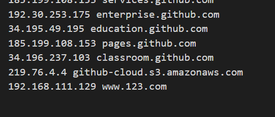
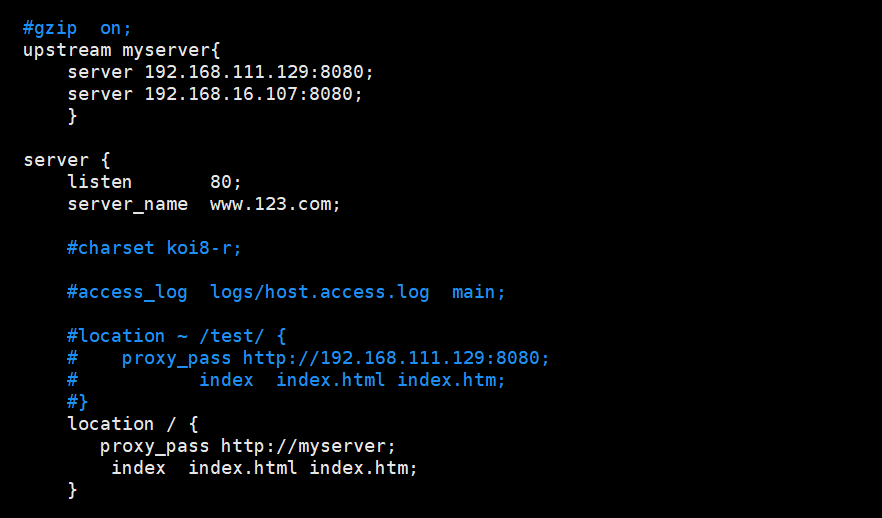

# nginx反向代理，负载均衡，动静分离

## 目录

- [反向代理，负载均衡](#反向代理负载均衡)
- [动静分离](#动静分离)

反向代理可以帮助服务器接收来自客户端的请求，帮助服务器 做请求转发，负载均衡等。 反向代理对服务端是透明的，对我们是非透明的，即我们并不知道自己访问的是代理服务器， 而服务器知道反向代理在为他服务。

#### 反向代理，负载均衡

nginx的反向代理就是用户访问nginx再由nginx发送请求到不同的tomcat，使之让用户访问一个地址就可以达到访问多个tomcat的效果

1. 如果没有域名需要在本地电脑添加ip和域名地址

   到C:\Windows\System32\drivers\etc\HOSTS 地址添加ip和域名映射，注意ip只能由多个，域名可以和一个IP进行映射

   
2. nginx.conf 配置文件中增加如下配置

   
   ```bash
   #使用upstream对需要进行负载均衡的tomcat进行声明，如果没有写策略，默认是轮询
   upstream myserver{
           server 192.168.111.129:8080;
           server 192.168.16.107:8080;
   }   
   #加权轮询15次访问10次访问192.168.111.129:8080 5次访问192.168.16.107:8080
   upstream myserver{
           server 192.168.111.129:8080 weight=10;
           server 192.168.16.107:8080 weight=5;
   }  
   #ip 哈希
   upstream myserver{
           ip_hash;
           server 192.168.111.129:8080;
           server 192.168.16.107:8080;
   } 
   #最短响应时间
   upstream myserver{
           server 192.168.111.129:8080;
           server 192.168.16.107:8080;
           fair;
   } 
   其它参数:
   down: 不参与负载
   backup: 表示备机

   ```

   nginx代理的配置
   ```bash
   #表示所有请求都会被代理，且代理给myserver的映射ip值
   location / {
              proxy_pass http://myserver;
               index  index.html index.htm;
   }
   #也可以这样写
   location / {
              proxy_pass http://192.168.111.129:8080;
               index  index.html index.htm;
   }

   ```

   location后可以使用绝对路径，也可以使用正则表达式对路径进行匹配

   具体的匹配原理如下：
   ```bash
   location = /uri
   =开头表示精确匹配，只有完全匹配上才能生效,匹配成功后立即停止其他匹配。
   location ^~ /uri
    ^~ 开头对URL路径进行前缀匹配，并且在正则之前,匹配成功后立即停止其他匹配。 
   location ~ pattern 
   ~开头表示区分大小写的正则匹配。 
   location ~* pattern ~*开头表示不区分大小写的正则匹配。 location /uri
   location /
   不带任何修饰符也表示前缀匹配,但在正则匹配之后,而且nginx会根据配置的长短来 进行匹配,记忆最长匹配，但不会停止匹配。
   通用匹配，任何未匹配到其它location的请求都会匹配到，相当于switch中的default。 注意：上述只有正则表达式的匹配和配置顺序有关，普通字符串和配置顺序无关。
   ```

   

#### 动静分离

由于tomcat对动态资源处理较好，静态资源浪费性能，通过nginx对于页面有静态资源资源的请求可以分配给nginx进行处理。如一个页面有如下资源：

`</img>`

我们可以通过配置nginx.config配置文件让静态资源有nginx进行处理

```bash
location / { 
proxy_pass http://myserver; index index.html index.htm;
} 
location ~ \.(gif|jpg|jpeg|png|bmp|swf)$ { 
root /usr/share/nginx/html;
}
location ~ \.(jsp|do|action)$ { 
proxy_pass http://myserver;
}
```


之后我们只需把静态资源放到nginx服务器的`/usr/share/nginx/html`目录下就可以了
