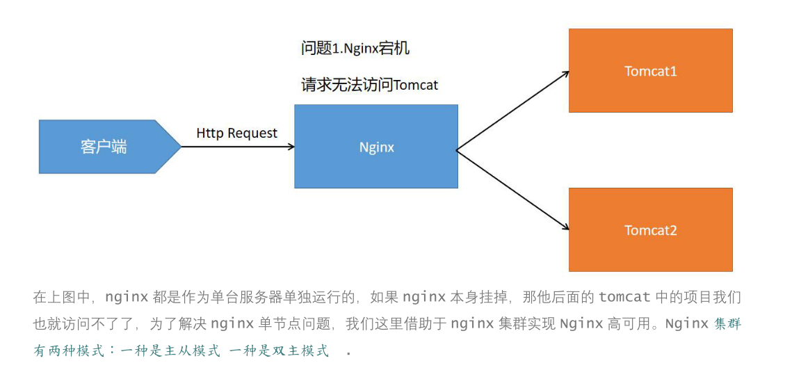
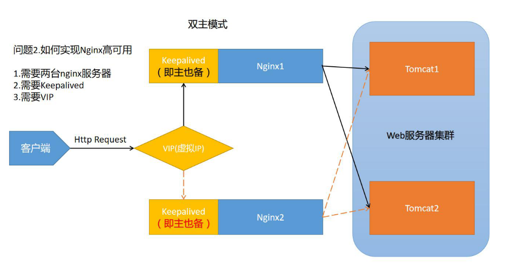
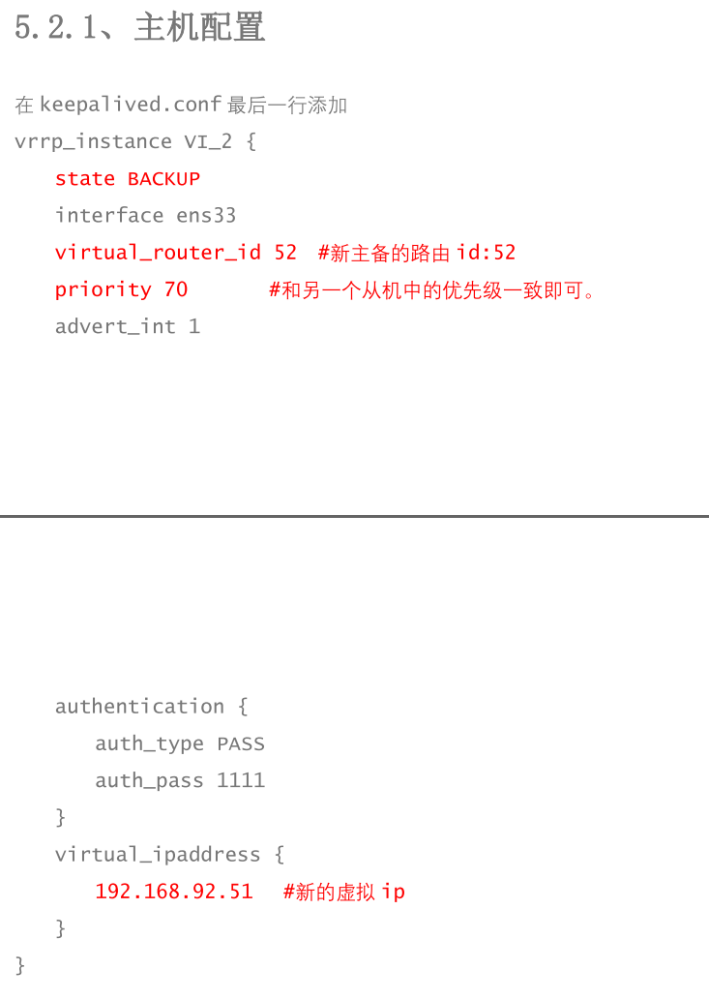
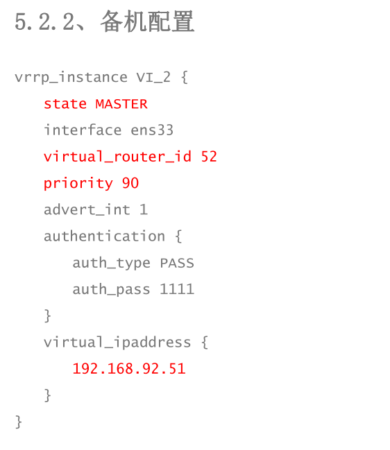

# nginx集群

## 目录

- [第一种：keepalived+Nginx 高可用集群(主从模式)](#第一种keepalivedNginx-高可用集群主从模式)
- [keepalived+Nginx 高可用集群(双主模式)](#keepalivedNginx-高可用集群双主模式)



nginx的集群这里是由keepalived完成的所以要先完成keepalived的安装，`yum install -y keepalived`

使用keepalived进行集群设置需要配置keepalived的虚拟ip,再通过脚本监控nginx是否活着

> 通过克隆虚拟机
> 第一步:克隆：&#x20;
> 第二步:修改网络: vi /etc/sysconfig/network-scripts/ifcfg-ens33 去掉 UUID 修改 ip:介于 3-254 之间，并且不能和其它虚拟机 ip 冲突
> 第三步:修改主机名 vi /etc/hostname
> 第四步:编辑主机名和 ip 的映射 vi /etc/hosts
> 第五步:重启 reboot 第六步:检测 ping \[[www.baidu.com\](http://www.baidu.com)](]\(http://www.baidu.com\)) ip a

#### 第一种：keepalived+Nginx 高可用集群(主从模式)

修改/etc/keepalived/keepalivec.conf 配置文件

```bash
global_defs { 
  notification_email { 
    acassen@firewall.loc 
    failover@firewall.loc 
    sysadmin@firewall.loc
  } 
  notification_email_from Alexandre.Cassen@firewall.loc 
  smtp_server 192.168.17.129 
  smtp_connect_timeout 30 
  router_id LVS_DEVEL
  } 
  vrrp_script chk_http_port { 
    script "/usr/local/src/nginx_check.sh" interval 2 #（检测脚本执行的间隔） weight 2
  } 
  vrrp_instance VI_1 { 
  state MASTER # 备份服务器上将 MASTER 改为 BACKUP interface ens33 //网卡
  virtual_router_id 51 # 主、备机的 virtual_router_id 必须相同 
  priority 90 # 主、备机取不同的优先级，主机值较大，备份机值较小 
  advert_int 1 
  authentication {
    auth_type PASS 
    auth_pass 1111
  }
  virtual_ipaddress { 
    192.168.92.50 // VRRP H 虚拟地址
  }
}
```


在/usr/local/src 中添加检测脚本

```bash
#!/bin/bash 
A=`ps -C nginx –no-header |wc -l` 
if [ $A -eq 0 ];then
  /usr/local/nginx/sbin/nginx 
  sleep 2 
  if [ `ps -C nginx --no-header |wc -l` -eq 0 ];then 
    killall keepalived
  fi
Fi
```


把两台服务器上 nginx 和 和 keepalived 先启动两台服务器上的 tomcat（每个服务器有两个 tomcat,共 4 个 tomcat 都启动）

&#x20;启动 nginx: `  ./nginx  `

启动 keepalived: `systemctl start keepalived.service`

#### keepalived+Nginx 高可用集群(双主模式)






