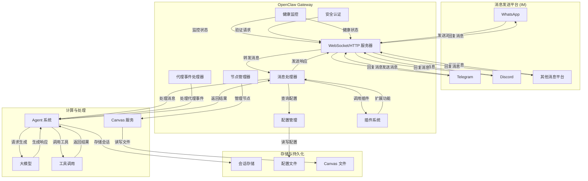
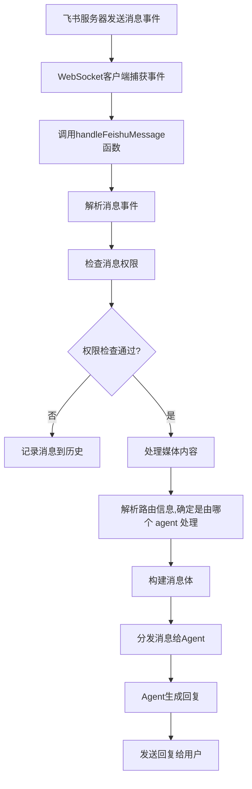
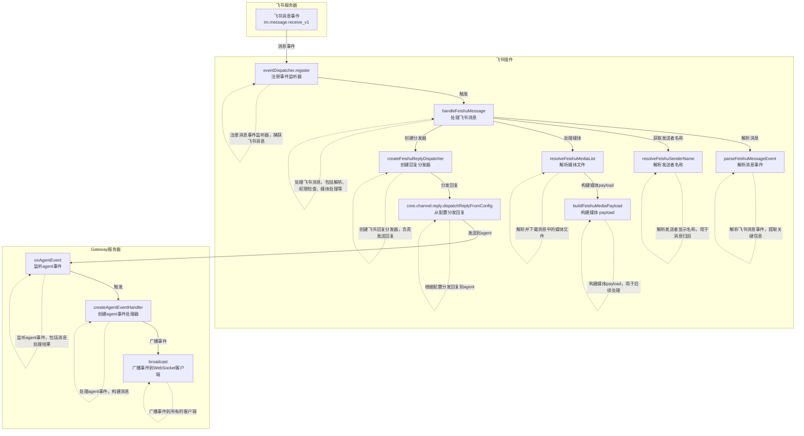

# openclaw 使用文档

首先这个文档只讨论在 macos 上遇到的问题,如果遇到其他问题可能是系统不一致的原因.

## 快速开始

### 安装

linux | mac

```bash
curl -fsSL https://openclaw.ai/install.sh | bash
```

---

运行辅助安装程序

```bash
openclaw onboard --install-daemon
```

## 这里选择 ai 模型时,推荐选择 qwen. 完全免费.配额为 每分钟 60 次请求 和 每天 1,000 次请求.

运行

```bash
openclaw gateway start
openclaw dashboard
```

---

### 配置通道

#### 飞书

在本机中使用下面命令安装飞书插件:

```bash
openclaw plugins install @m1heng-clawd/feishu
```

填写 appId 和 appSecret

---

在飞书上创建机器人,具体流程查看链接内容: https://cloud.tencent.com/developer/article/2626160

机器人权限,可以开通以 "im:" 开头的所有权限

#### whatsapp

在 whatsapp business 注册账号

添加配置到 ~/.openclaw/openclaw.json

```json
{
  "channels": {
    "whatsapp": {
      "dmPolicy": "allowlist",
      "allowFrom": ["+15551234567"] // 你的手机号
    }
  }
}
```

运行命令

```bash
openclaw channels login
```

会出来一个二维码,使用 whatsapp 扫码就完成了基础的配置.

---

配置群组回复

```json
{
  "groupPolicy": "allowlist",
  "groups": {
    "*": {
      "requireMention": false
    }
  }
}
```

更多的配置如安全策略: https://docs.openclaw.ai/concepts/groups#imessage-specifics

---

回复时添加表情.

```json
{
  "ackReaction": {
    "emoji": "👀",
    "direct": true,
    "group": "always"
  }
}
```

注意: 如果配置完成后,不生效,可以退出账号,再登录.

#### imessage(推荐)

iMessage 不需要在国内开发平台配置,也不需要 vpn ,在本机配置完毕后即可接收消息.

下载 imsg

```bash
brew install steipete/tap/imsg
```

注意: 
可能需要更新 codex 和命令行工具.并且需要给予 imsg 磁盘访问权限.
在设置中隐私余安全性中的允许应用程序访问所有用户文件中,打开 node 和 终端权限.

最小配置:

```json
		"imessage": {
			"enabled": true,
			"cliPath": "imsg",
			"dmPolicy": "pairing",
			"allowFrom": [
				"+861234567890"
			],
    }
```

在第一次给 iMessage 发送消息后, openclaw 会发送设备匹配验证码.在终端执行 openclaw pairing approve imessage <CODE>.

##### 使用openclaw 发送消息

whatsapp

```bash
openclaw message send --target +861234567890 --message "你好，OpenClaw！" --channel whatsapp
```

飞书: 如果用户 id 找不到,可以在聊天中索要

```bash
openclaw message send --channel feishu --target <user_id_or_chat_id> --message "Your message here"
```

### 使用

#### 定时任务测试

openclaw 作为一个个人助力,最重要的事情之一就是定时任务,测试如下:

发送一下信息

```text
以后每天开机都给我发送两份新闻速递,每一份都要收集今天热度最火的10条新闻,一份收集国外信息,一份收集国内信息.要求搜集的信息准确且即时.

格式要求如下:
[新闻标题]:总结这条新闻消息和影响;

注意:
你需要从各个大的新闻网站上去爬取信息而不是使用 api 接口;
新闻标题需要附带连接,而且连接需要准确指向爬取的对应页面;
你的所有回复都应该使用中文;
```

---

使用后,生成的都是假数据.
原因是 OpenClaw 的安全机制会将所有外部内容标记为"外部不受信任内容"，因此无法直接抓取新闻。

解决方案给出了两个可行方案:

1. 配置使用web_search工具配置Brave Search API密钥. 免费提供 2000/ 月
2. 修改OpenClaw的web_fetch安全策略，允许从可信新闻源获取内容.

这两个是 openclaw 自带的网络工具,这里选择的第二种,进行以下配置

```json
{
  "tools": {
    "web": {
      "fetch": {
        "enabled": true,
        "timeoutSeconds": 30,
        "cacheTtlMinutes": 15,
        "maxRedirects": 3,
        "userAgent": "Mozilla/5.0 (Macintosh; Intel Mac OS X 14_7_2) AppleWebKit/537.36 (KHTML, like Gecko) Chrome/122.0.0.0 Safari/537.36"
      }
    }
  }
}
```

更新后的提示词

```txt
任务：每天上午9:00上生成两份今日新闻速递（国内+国际）,在iMessage 中发给我

【任务拆分】
1. 国内新闻速递（10条）
2. 国际新闻速递（10条）

【指定信源】

国内新闻（仅限以下网站）：
- 求是网 https://www.qstheory.cn
- 新华网 https://www.xinhuanet.com
- 光明网 https://www.gmw.cn
- 央广网 https://www.cnr.cn
- 人民网 http://www.people.com.cn
- 新京报 https://www.bjnews.com.cn
- 观察者网 https://www.guancha.cn
- 新浪新闻 https://news.sina.com.cn
- 今日头条 https://www.toutiao.com

国际新闻（仅限以下网站）：
- BBC新闻 https://www.bbc.com/news
- 卫报 https://www.theguardian.com/world
- 纽约时报中文网 https://cn.nytimes.com
- 联合早报 https://www.zaobao.com.sg

【技术要求】
- 使用 web_fetch 工具直接访问上述网站抓取内容
- 禁止使用 API 接口或浏览器插件
- 禁止从指定列表外的来源获取信息

【输出格式】
每条新闻必须严格遵循：
新闻标题(新闻来源): 一句话总结新闻核心内容及其影响;

【质量要求】
- 信息准确：标题与内容匹配，无夸大或曲解
- 即时有效：确保新闻为今日发布或今日热点
- 链接有效：新闻标题需要附带连接,URL必须精确指向原文页面
- 来源有效: 确保新闻链接的链接和新闻来源有关联
- 全中文输出

【执行步骤】
1. 依次访问国内9个指定网站，抓取今日热门新闻
2. 筛选热度最高的10条，按格式输出
3. 依次访问国际4个指定网站，抓取今日热门新闻
4. 筛选热度最高的10条，按格式输出
5. 合并为完整的新闻速递回复
```

---

生成定时任务时,openclaw 会生成对应**Cron**‌表达式,并给这个定时任务起个名字,以 json 形式保存到 ~/.openclaw/cron/jobs.json 中.

> 详细配置: https://docs.openclaw.ai/tools/web#web_fetch

### 本地文件作用

#### .openclaw/workspace

1. **`AGENTS.md`**: 这是一份"家园指南"，包含了workspace的基本结构说明，如何使用记忆系统（MEMORY.md和daily memory文件），以及一些基本操作原则。

2. **`SOUL.md`**: 这是openclaw的"灵魂文件"，定义了我的核心性格、价值观和行为风格。它告诉openclaw要"真诚有用"、"有自己的观点"、"尊重隐私"等，塑造了openclaw的"人格"。

3. **`USER.md`**: 这里记录着关于您的信息，比如您的姓名、称呼、偏好等，帮助我了解并个性化地协助您。

4. **`IDENTITY.md`**: 定义了我的身份信息，比如我的名字、类型、个性特点和标志性的emoji等。

5. **`TOOLS.md`**: 这是本地工具配置文件，用于记录特定于您环境的工具信息，比如摄像头名称、SSH主机等，不涉及通用技能。

6. **`HEARTBEAT.md`**: 这个文件控制我的心跳检查机制。当系统定期询问我是否有待办事项时，它会参考这个文件的内容。目前它是空的，所以我只会回复`HEARTBEAT_OK`。

7. **`BOOTSTRAP.md`**: 这是一个一次性初始化文件，用于首次启动时的引导设置。根据内容，我现在应该删除它（如果还存在的话），因为我已经完成了初始化。

   workspace主要用于：
   1. **临时存储抓取的数据**：当我从各个新闻网站抓取内容时，可能会将原始数据临时存放在workspace中进行处理。
   2. **生成过程文件**：在整理和筛选新闻的过程中，可能会生成一些中间文件或草稿。
   3. **日志记录**：执行任务时的日志和调试信息可能会写入workspace中的日志文件。
   4. **与您共享的工作成果**：如果需要向您展示某个执行步骤的中间产物，也会放在workspace中。
   
这些 markdown 文件会每次对话自动注入.shill 文件不会每次消息中发送,但会发送 skill 名称 和简短描述.再决定使用某的 skill 时,才会读取 skill 文件.


#### 会话储存

会话存储位于状态目录下（默认 `~/.openclaw`）：

- `~/.openclaw/agents/<agentId>/sessions/sessions.json`
- JSONL 记录文件与存储位于同一目录

### 发送一条信息,openclaw 发生了什么?

首先发送 `查看当前电脑的内存使用情况` 这句话给大模型
大模型判断需要使用 skill 需要执行 top -l 1 | head -n 20,从而调用内置的 exec 函数
openclaw 把执行结果发送给大模型
大模型拿着执行结果输出结果.

### 架构

#### gateway

Gateway 是 OpenClaw 项目的核心服务，它主要做了以下工作:
1. 消息系统集成 
    channels,管理 im 链接,处理消息的发送和接收,提供统一的消息接口给系统其他部分.
2. 代理 agent 
    管理大模型,维护多个 agent的运行和状态(如 对话、后台任务),隔离每个 agent 环境以多开并行工作.
    存储记忆
    管理 skill
3. 系统管理
    维持系统组件的链接
    定时任务
    监控系统状态.
    


#### channels 频道

每一个channel 实际上就是一个 plugin .主要由三个文件组成: index.ts,runtime.ts,channel.ts.
作用是负责对接 各个 IM 平台的适配层,把不同消息格式统一成gateway 能理解的格式.

最主要的是实现 channel.ts,这里面每个 plugin 有大量的模版代码,考虑直接使用 ai 生成.

主要文件是 channel.ts,它来导出插件对象,以飞书为例,它的结构是:

```json
{
  id, // 插件的唯一标识符
  meta: { // 插件的元信息
    id, // 元信息 ID
    label, // 插件的显示标签
    selectionLabel, // 选择界面中的显示标签
    docsPath, // 文档路径
    docsLabel, // 文档标签
    blurb, // 插件简介
    aliases, // 插件别名数组
    order // 排序顺序
  },
  pairing: { // 配对相关配置
    idLabel, // 配对 ID 的标签名称
    normalizeAllowEntry, // 规范化允许条目函数，参数：entry (字符串)，返回：规范化后的字符串
    notifyApproval // 配对批准通知函数，参数：{ cfg, id, accountId }，返回：Promise<void>
  },
  capabilities: { // 插件的功能能力
    chatTypes, // 支持的聊天类型数组，如 ["direct", "group"]
    media, // 是否支持媒体消息
    reactions, // 是否支持消息反应
    threads, // 是否支持线程消息
    polls, // 是否支持投票
    nativeCommands, // 是否支持原生命令
    blockStreaming // 是否阻塞流式传输
  },
  agentPrompt: { // 代理提示相关配置
    messageToolHints // 消息工具提示函数，参数：无，返回：字符串数组
  },
  groups: { // 群组相关配置
    resolveToolPolicy // 解析群组工具策略函数，参数：{ cfg, accountId, account }，返回：策略对象
  },
  reload: { // 配置重载相关设置
    configPrefixes // 配置前缀数组，当这些前缀的配置发生变化时，插件会重新加载
  },
  configSchema: { // 配置模式，定义了插件的配置结构 这个更多是自己设置内容,显示到中控 gateway 方便用户配置
    schema: {
      type, // 配置类型
      additionalProperties, // 是否允许额外的属性
      properties: { // 配置属性
        enabled, // 是否启用
        appId, // 应用 ID
        appSecret, // 应用密钥
        encryptKey, // 加密密钥
        verificationToken, // 验证令牌
        domain: { // 域名配置
          oneOf // 多种可能的配置选项
        },
        connectionMode, // 连接模式
        webhookPath, // Webhook 路径
        webhookPort, // Webhook 端口
        dmPolicy, // 直接消息策略
        allowFrom, // 允许的发送者列表
        groupPolicy, // 群组策略
        groupAllowFrom, // 群组允许的发送者列表
        requireMention, // 是否需要提及
        historyLimit, // 历史记录限制
        dmHistoryLimit, // 直接消息历史记录限制
        textChunkLimit, // 文本分块限制
        chunkMode, // 分块模式
        mediaMaxMb, // 媒体文件最大大小（MB）
        renderMode, // 渲染模式
        accounts: { // 账户配置
          type, // 类型
          additionalProperties: { // 额外属性
            type, // 类型
            properties: { // 属性
              enabled, // 是否启用
              name, // 账户名称
              appId, // 应用 ID
              appSecret, // 应用密钥
              encryptKey, // 加密密钥
              verificationToken, // 验证令牌
              domain, // 域名
              connectionMode // 连接模式
            }
          }
        }
      }
    }
  },
  config: { // 账户配置相关函数
    listAccountIds, // 列出所有飞书账户 ID 函数，参数：cfg (配置对象)，返回：字符串数组
    resolveAccount, // 解析指定的飞书账户函数，参数：{ cfg, accountId }，返回：解析后的账户对象
    defaultAccountId, // 解析默认的飞书账户 ID 函数，参数：cfg (配置对象)，返回：字符串
    setAccountEnabled, // 设置账户启用状态函数，参数：{ cfg, accountId, enabled }，返回：更新后的配置对象
    deleteAccount, // 删除指定账户函数，参数：{ cfg, accountId }，返回：更新后的配置对象
    isConfigured, // 检查账户是否已配置函数，参数：account (账户对象)，返回：布尔值
    describeAccount, // 描述账户信息函数，参数：account (账户对象)，返回：账户信息对象
    resolveAllowFrom, // 解析允许的发送者列表函数，参数：{ cfg, accountId }，返回：字符串数组
    formatAllowFrom // 格式化允许的发送者列表函数，参数：{ allowFrom }，返回：格式化后的字符串数组
  },
  security: { // 安全策略相关配置
    collectWarnings // 收集安全警告信息函数，参数：{ cfg, accountId }，返回：警告信息数组
  },
  setup: { // 设置相关配置
    resolveAccountId, // 解析账户 ID 函数，参数：无，返回：默认账户 ID
    applyAccountConfig // 应用账户配置函数，参数：{ cfg, accountId }，返回：更新后的配置对象
  },
  onboarding, // 引导流程适配器
  messaging: { // 消息处理相关配置
    normalizeTarget, // 规范化飞书目标函数，参数：target (字符串)，返回：规范化后的目标
    targetResolver: { // 目标解析器
      looksLikeId, // 判断字符串是否看起来像飞书 ID 函数，参数：id (字符串)，返回：布尔值
      hint // 目标格式提示
    }
  },
  directory: { // 目录服务相关配置
    self, // 获取自身信息函数，参数：无，返回：Promise<null>
    listPeers, // 列出对等方函数，参数：{ cfg, query, limit, accountId }，返回：Promise<对等方数组>
    listGroups, // 列出群组函数，参数：{ cfg, query, limit, accountId }，返回：Promise<群组数组>
    listPeersLive, // 实时列出对等方函数，参数：{ cfg, query, limit, accountId }，返回：Promise<对等方数组>
    listGroupsLive // 实时列出群组函数，参数：{ cfg, query, limit, accountId }，返回：Promise<群组数组>
  },
  outbound, // 出站消息相关配置
  status: { // 状态管理相关配置
    defaultRuntime: { // 默认运行时状态
      accountId, // 账户 ID
      running, // 是否运行中
      lastStartAt, // 上次启动时间
      lastStopAt, // 上次停止时间
      lastError, // 上次错误信息
      port // 端口
    },
    buildChannelSummary, // 构建通道摘要函数，参数：{ snapshot }，返回：通道摘要对象
    probeAccount, // 探测账户状态函数，参数：{ cfg, accountId }，返回：Promise<探测结果>
    buildAccountSnapshot // 构建账户快照函数，参数：{ account, runtime, probe }，返回：账户快照对象
  },
  gateway: { // 网关集成相关配置
    startAccount // 启动账户函数，参数：ctx (上下文对象)，返回：Promise<监控函数>
  }
}
```

gateway 处理 im 发送过来的数据大致流程:



开头处理逻辑:


### 使用的感受

完成短任务,响应时间比较长,这一点可能是由于使用免费的 qwen 模型导致的.
在完成长任务时, openclaw 对于长任务的状态处理很不明显,且长时间卡在一段消息中不变化.
对于收集新闻的对话,一共需要 20 条新闻,ai 真的是一条一条执行的.所以会来回对话知道生成满20条.最少也要来回 5、6次.导致大量的世界浪费.
在运行代码生成任务时,在生成完毕时,文件内容才写入磁盘中.
由于是调用云端大模型,初次启动 openclaw 都会发送 workspace 文件夹中的内容(包括设定信息,记忆信息,skill等等),导致输入 token 会特别大.而且会随着 openclaw 的使用,消耗会越来越大.
