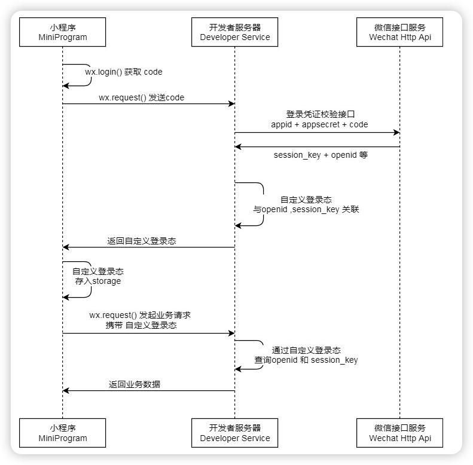
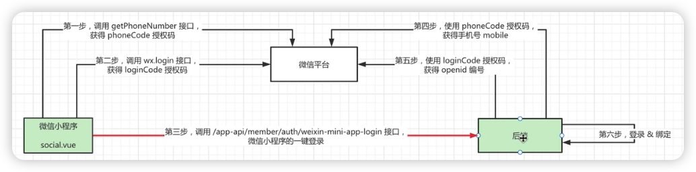

# 微信集成

## 小程序登录



1. 调用 wx.login() 获取 临时登录凭证code ，并回传到开发者服务器。
2. 调用 auth.code2Session 接口，换取 用户唯一标识 OpenID 、 用户在微信开放平台账号下的唯一标识UnionID（若当前小程序已绑定到微信开放平台账号） 和 会话密钥 session_key。
3. code 的有效期五分钟.
4. OpenID 在 App, 公众号,小程序等等平台都是不一致的,但 UnionID 是唯一的,使用 UnionID 来同步这些平台.
5. 小程序平台不允许使用其他请求工具,只能通过 wx.request 来发送请求.
6. 如果在小程序上进行开发时,需要发送业务请求时,服务器需要使用 域名和 https.
7. 如果是在测试号上开发,可以在开发者工具中不校验合法域名,来使用localhost.
8. 后端通过 get 请求 `https://api.weixin.qq.com/sns/jscode2session?appid={appid}&secret={secret}&js_code={js_code}&grant_type=authorization_code` 获得上面第二条的内容.

## 获得手机号

1. 通过设置 `open-type` 为 `getPhoneNumber`, 监听 `getPhoneNumber` 事件,来获得获取手机号的权限.
2. 由于我在获得手机号的同时需要检测用户是否同意了 **用户须知** 的内容,在此做了一个判断如果不同意就睡简单的点击时间.如果同意进入登录流程.

`<button :open-type="agreed ? 'getPhoneNumber' : ''" :loading="wechatLoading"  @getPhoneNumber="onWechatLogin" @tap="handleButtonClick"></button>`

调用的方法会返回一个 code 值,我们需要把它传到后段

```ts
    interface WechatLoginDetail {
        code: string
        encryptedData: string
        iv: string
        errMsg: string
    }
    const onWechatLogin = throttle(
        (e: TaroEvent<HTMLButtonElement, WechatLoginDetail>) => {
            if (e.detail.errMsg === 'getPhoneNumber:ok') {
                emit('wechatLogin', e.detail)
            } else {
                Taro.showToast({
                    title: '授权已取消',
                    icon: 'none',
                })
                emit('wechatLoginCancel')
            }
        },
        1000,
    ) // 1000毫秒内只能点击一次
```

后端:

需要先使用 get 请求 `https://api.weixin.qq.com/cgi-bin/token?grant_type=client_credential&appid={appid}&secret={secret}` 获得 `access_token` 调用凭据.
再使用 post 请求 `https://api.weixin.qq.com/wxa/business/getuserphonenumber?access_token=ACCESS_TOKEN`并且携带前端 code 码作为请求体,最后返回手机号.

## 微信一键登录代码

前端:

```js
// 调用服务的登录接口
// loginCode 通过使用 wx.login 获得 ———— 登录功能,只返回 openid 
function toLogin(loginCode: string, phoneCode: string) {
    return post<LoginResponse>('http://localhost:8080/login/wechat', {
        loginCode,
        phoneCode,
    }).then(({ token, ...user }) => {
        Taro.setStorageSync('token', token)
        Taro.setStorageSync('user', user)
        return { token, ...user }
    })
}

export async function loginByWechat(phoneCode: string) {
    return new Promise<string>((resolve, reject) => {
        Taro.login({
            success: res => resolve(res.code),
            fail: () => {
                return reject('登录失败')
            },
        })
    }).then(loginCode => toLogin(loginCode, phoneCode))
}
```

通过 `Promise` 把两个请求分离开来.

```js
    async function onWechatLogin(detail: WechatLoginDetail) {
        wechatLoading.value = true

        await loginByWechat(detail.code)
            .then(() => {
                Taro.switchTab({ url: '/pages/SsDevices/SsDevices' })
            })
            .catch(message => {
                console.log('test')
                showToast(message, 'error')
            })
            .finally(() => {
                wechatLoading.value = false
            })
    }
```




到这里完成了上图中的 1、2、3 步.

---
后段:

```java
    private final RestTemplate restTemplate = new RestTemplate();

    public Map<String, String> code2Session(String code) throws Exception {
        ResponseEntity<String> response = restTemplate.getForEntity(wechatProperties.getLoginUrl(), String.class,
                wechatProperties.getAppId(), wechatProperties.getSecret(), code);
        JsonNode json = objectMapper.readTree(response.getBody());

        if (json.has("errcode") && json.get("errcode").asInt() != 0) {
            String errmsg = json.has("errmsg") ? json.get("errmsg").asText() : "未知错误";
            throw new RuntimeException("微信登录失败，errcode=" + json.get("errcode") + ", errmsg=" + errmsg);
        }

        Map<String, String> result = new HashMap<>();
        result.put("openid", json.get("openid").asText());
        result.put("session_key", json.get("session_key").asText());
        return result;
    }

    /**
     * 通过 phoneCode 获取手机号
     */
    public String getPhoneNumber(String phoneCode) throws Exception {
        // 1. 获取 access_token
        ResponseEntity<String> accessResponse = restTemplate.getForEntity(wechatProperties.getAccessTokenUrl(),
                String.class, wechatProperties.getAppId(), wechatProperties.getSecret());
        JsonNode accessJson = objectMapper.readTree(accessResponse.getBody());
        String accessToken = accessJson.get("access_token").asText();

        // 3. ✅ 关键：手动将 Map 转为 JSON 字符串
        Map<String, String> requestBody = new HashMap<>();
        requestBody.put("code", phoneCode);
        String jsonBody = objectMapper.writeValueAsString(requestBody); // 显式序列化

        // 4. 设置请求头
        HttpHeaders headers = new HttpHeaders();
        headers.setContentType(MediaType.APPLICATION_JSON);

        // 5. ✅ 使用 String 作为 body，而不是 Map
        HttpEntity<String> entity = new HttpEntity<>(jsonBody, headers);

        // 6. 发送请求
        ResponseEntity<String> response = restTemplate.postForEntity(wechatProperties.getPhoneUrl(), entity,
                String.class, accessToken);
        JsonNode json = objectMapper.readTree(response.getBody());

        if (json.has("errcode") && json.get("errcode").asInt() != 0) {
            String errmsg = json.has("errmsg") ? json.get("errmsg").asText() : "未知错误";
            throw new RuntimeException("获取手机号失败，errcode=" + json.get("errcode") + ", errmsg=" + errmsg);
        }

        JsonNode phoneInfo = json.get("phone_info");
        return phoneInfo.get("phoneNumber").asText();
    }
```

### jwt 

最后根据获得 openId 和 session_key 来生成密钥,并携带手机号和用户id进行 jwt,来让用户自动登录.