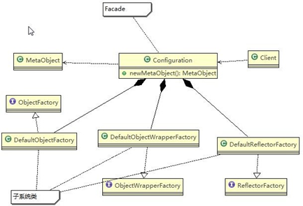

# Facade Pattern

## 目录

- [外观模式](#外观模式)
  - [介绍](#介绍)
    - [尚硅谷例子](#尚硅谷例子)
  - [外观模式的注意事项和细节](#外观模式的注意事项和细节)

[浏览](https://www.runoob.com/w3cnote/facade-pattern-3.html "浏览")

# 外观模式

外观模式（Facade Pattern）隐藏系统的复杂性，并向客户端提供了一个客户端可以访问系统的接口。这种类型的设计模式属于结构型模式，它向现有的系统添加一个接口，来隐藏系统的复杂性。

这种模式涉及到一个单一的类，该类提供了客户端请求的简化方法和对现有系统类方法的委托调用。

## 介绍

**意图：** 为子系统中的一组接口提供一个一致的界面，外观模式定义了一个高层接口，这个接口使得这一子系统更加容易使用。

**主要解决：** 降低访问复杂系统的内部子系统时的复杂度，简化客户端与之的接口。

**何时使用：** 1、客户端不需要知道系统内部的复杂联系，整个系统只需提供一个"接待员"即可。 2、定义系统的入口。

**如何解决：** 客户端不与系统耦合，外观类与系统耦合。

**关键代码：** 在客户端和复杂系统之间再加一层，这一层将调用顺序、依赖关系等处理好。

**应用实例：** 1、去医院看病，可能要去挂号、门诊、划价、取药，让患者或患者家属觉得很复杂，如果有提供接待人员，只让接待人员来处理，就很方便。 2、JAVA 的三层开发模式。

**优点：** 1、减少系统相互依赖。 2、提高灵活性。 3、提高了安全性。

**缺点：** 不符合开闭原则，如果要改东西很麻烦，继承重写都不合适。

**使用场景：** 1、为复杂的模块或子系统提供外界访问的模块。 2、子系统相对独立。 3、预防低水平人员带来的风险。

**注意事项：** 在层次化结构中，可以使用外观模式定义系统中每一层的入口。

#### 尚硅谷例子

外观模式（Facade），也叫"过程模式：外观模式为子系统中的一组接口提供一个一致的界面，此模式定义了一个高层接口，这个接口使得这一子系统更加容易使用

外观模式通过定义一个一致的接口，用以屏蔽内部子系统的细节，使得调用端只需跟这个接口发生调用，而无需关心这个子系统的内部细节

## 外观模式的注意事项和细节

外观模式对外屏蔽了子系统的细节，因此外观模式降低了客户端对子系统使用的复杂性

外观模式对客户端与子系统的耦合关系 - 解耦，让子系统内部的模块更易维护和扩展

通过合理的使用外观模式，可以帮我们更好的划分访问的层次

当系统需要进行分层设计时，可以考虑使用 Facade 模式

在维护一个遗留的大型系统时，可能这个系统已经变得非常难以维护和扩展，此时可以考虑为新系统开发一个 Facade 类，来提供遗留系统的比较清晰简单的接口，让新系统与 Facade 类交互，提高复用性

不能过多的或者不合理的使用外观模式，使用外观模式好，还是直接调用模块好。要以让系统有层次，利于维护为目的。
