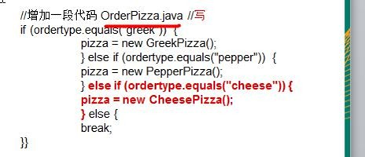
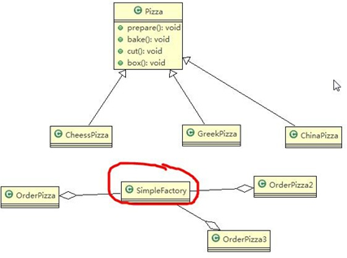
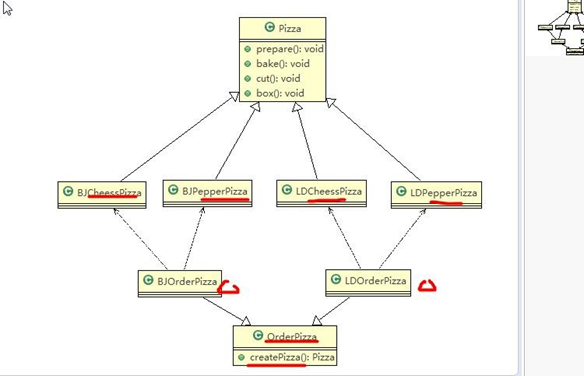

# factory model

## 目录

- [以下时尚硅谷例子](#以下时尚硅谷例子)
- [传统的方式的优缺点](#传统的方式的优缺点)
- [基本介绍](#基本介绍)
- [使用简单工厂模式](#使用简单工厂模式)
- [工厂方法模式](#工厂方法模式)
  - [看一个新的需求](#看一个新的需求)
  - [思路 1](#思路-1)
  - [思路 2](#思路-2)
  - [工厂方法模式介绍](#工厂方法模式介绍)
  - [工厂方法模式应用案例](#工厂方法模式应用案例)

[菜鸟教程](https://www.runoob.com/design-pattern/factory-pattern.html "菜鸟教程")

**意图**定义一个创建对象的接口，让其子类自己决定实例化哪一个工厂类，工厂模式使其创建过程延迟到子类进行。

**主要解决**主要解决接口选择的问题。

**何时使用**我们明确地计划不同条件下创建不同实例时。

**如何解决**让其子类实现工厂接口，返回的也是一个抽象的产品。

**关键代码**创建过程在其子类执行。

**应用实例：** 1、您需要一辆汽车，可以直接从工厂里面提货，而不用去管这辆汽车是怎么做出来的，以及这个汽车里面的具体实现。 2、Hibernate 换数据库只需换方言和驱动就可以。

**优点：** 1、一个调用者想创建一个对象，只要知道其名称就可以了。 2、扩展性高，如果想增加一个产品，只要扩展一个工厂类就可以。 3、屏蔽产品的具体实现，调用者只关心产品的接口。

**缺点**每次增加一个产品时，都需要增加一个具体类和对象实现工厂，使得系统中类的个数成倍增加，在一定程度上增加了系统的复杂度，同时也增加了系统具体类的依赖。这并不是什么好事。

**使用场景**&#x20;

1、日志记录器：记录可能记录到本地硬盘、系统事件、远程服务器等，用户可以选择记录日志到什么地方。&#x20;

2、数据库访问，当用户不知道最后系统采用哪一类数据库，以及数据库可能有变化时。&#x20;

3、设计一个连接服务器的框架，需要三个协议，"POP3"、"IMAP"、"HTTP"，可以把这三个作为产品类，共同实现一个接口。

**注意事项**作为一种创建类模式，在任何需要生成复杂对象的地方，都可以使用工厂方法模式。有一点需要注意的地方就是复杂对象适合使用工厂模式，而简单对象，特别是只需要通过 new 就可以完成创建的对象，无需使用工厂模式。如果使用工厂模式，就需要引入一个工厂类，会增加系统的复杂度。

---

回答：

其实使用反射是一种不错的办法，但反射也是从类名反射而不能从类反射！

先看一下工厂模式是用来干什么的——属于创建模式，解决子类创建问题的。换句话来说，调用者并不知道运行时真正的类名，只知道从"Circle"可以创建出一个 shape 接口的类，至于类的名称是否叫'Circle"，调用者并不知情。所以真正的对工厂进行扩展的方式（防止程序员调用出错）可以考虑使用一个枚举类（防止传入参数时，把 circle 拼写错误）。

如果调用者参肯定类型是 Circle 的话，那么其工厂没有存在的意义了！

比如 IShape shape = new Circle();这样不是更好？也就是说调用者有了 Circle 这个知识是可以直接调用的，根据 DP（迪米特法则）其实调用者并不知道有一个 Circle 类的存在，他只需要知道这个 IShape 接口可以计算圆面积，而不需要知道；圆这个类到底是什么类名——他只知道给定一个”circle"字符串的参数,IShape 接口可以自动计算圆的面积就可以了！

其实在.net 类库中存在这个模式的的一个典型的。但他引入的另一个概念"可插入编程协议”。

那个就是 WebRequest req = WebRequest.Create("[http://ccc......](http://ccc...... "http://ccc......")");可以自动创建一个 HttpWebRequest 的对象，当然，如果你给定的是一个 ftp 地址，他会自动创建一个 FtpWebRequest 对象。工厂模式中着重介绍的是这种通过某个特定的参数，让你一个接口去干对应不同的事而已！而不是调用者知道了类！

比如如果圆的那个类名叫"CircleShape"呢？不管是反射还是泛型都干扰了你们具体类的生成！其实这个要说明的问题就是这个，调用者（clinet)只知道 IShape 的存在，在创建时给 IShape 一个参数"Circle",它可以计算圆的面积之类的工作，但是为什么会执行这些工作，根据迪米特法则，client 是不用知道的。

我想问一下那些写笔记的哥们，如果你们知道了泛型，那么为什么不直接使用呢？干吗还需要经过工厂这个类呢？不觉得多余了吗？

如果，我只是说如果，如果所有从 IShape 继承的类都是 Internal 类型的呢？而 client 肯定不会与 IShape 一个空间！这时，你会了现你根本无法拿到这个类名！

Create 时使用注册机制是一种简单的办法，比如使用一个枚举类，把功能总结到一处。而反射也是一种最简单的办法，调用者输入的名称恰是类名称或某种规则时使用，比如调用者输入的是 Circle，而类恰是 CircleShape，那么可以通过输入+”Shape"字符串形成新的类名，然后从字符串将运行类反射出来！

工厂的创建行为，就这些作用，还被你们用反射或泛型转嫁给了调用者（clinet)，那么，这种情况下，要工厂类何用？！

---

#### 以下时尚硅谷例子

[factory_model.pdf](file/factory_model_5fDmYXdYkb.pdf " factory_model.pdf")

使用者 ← 被使用的原料

使用者 ← 中间处理提供方 ← 被使用的原料

### 传统的方式的优缺点

1\) 优点是比较好理解，简单易操作。

2\) 缺点是违反了设计模式的 **ocp** 原则，即对扩展开放，对修改关闭。即当我们给类增加新功能的时候，尽量不修改代码，或者尽可能少修改代码.

3\)比如我们这时要新增加一个 **Pizza** 的种类(Pepper 披萨)，我们需要做如下修改. 如果我们增加一个 Pizza 类，只要是订购 Pizza 的代码都需要修改

1\) 改进的思路分析

分析：修改代码可以接受，但是如果我们在其它的地方也有创建 Pizza 的代码，就意味着，也需要修改，而创建 Pizza 的代码，往往有多处。

思路：把创建 **Pizza** 对象封装到一个类中，这样我们有新的 **Pizza** 种类时，只需要修改该类就可，其它有创建到 Pizza

对象的代码就不需要修改了.-> 简单工厂模式

### 基本介绍

1\) 简单工厂模式是属于创建型模式，是工厂模式的一种。简单工厂模式是由一个工厂对象决定创建出哪一种产品类的实例。简单工厂模式是工厂模式家族中最简单实用的模式

2\) 简单工厂模式：定义了一个创建对象的类，由这个类来封装实例化对象的行为(代码)

3\) 在软件开发中，当我们会用到大量的创建某种、某类或者某批对象时，就会使用到工厂模式.

### 使用简单工厂模式

1\) 简单工厂模式的设计方案: 定义一个可以实例化 Pizaa 对象的类，封装创建对象的代码。

## 工厂方法模式

### 看一个新的需求

披萨项目新的需求：客户在点披萨时，可以点不同口味的披萨，比如 北京的奶酪 pizza、北京的胡椒 pizza 或者是伦敦的奶酪 pizza、伦敦的胡椒 pizza。

### 思路 1

使用简单工厂模式，创建不同的简单工厂类，比如 BJPizzaSimpleFactory、LDPizzaSimpleFactory 等等.从当前这个案例来说，也是可以的，但是考虑到项目的规模，以及软件的可维护性、可扩展性并不是特别好

### 思路 2

使用工厂方法模式

### 工厂方法模式介绍

1\) 工厂方法模式设计方案：将披萨项目的实例化功能抽象成抽象方法，在不同的口味点餐子类中具体实现。

2\) 工厂方法模式：定义了一个创建对象的抽象方法，由子类决定要实例化的类。工厂方法模式将对象的实例化推迟到子类。

### 工厂方法模式应用案例

1\) 披萨项目新的需求：客户在点披萨时，可以点不同口味的披萨，比如 北京的奶酪 pizza、北京的胡椒 pizza 或者是伦敦的奶酪 pizza、伦敦的胡椒 pizza

思路分析图解

