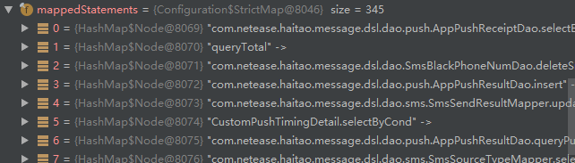
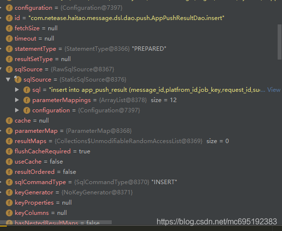

# 动态代理在Mybatis中的应用

//todo sqlSession中如果将参数与sql语句结合，组装成完整的sql语句，以及如何将数据库字段与java对象映射

MyBatis 是一种应用非常广泛的持久层框架，它 避免了几乎所有的 JDBC 代码和手动设置参数以及获取结果集。MyBatis 可以使用简单的 XML 或注解来配置和映射原生类型、接口和 Java 的 POJO（Plain Old Java Objects，普通老式 Java 对象）为数据库中的记录。

如果使用过Mybatis，我们就会发现Mybatis的使用非常简单，首先定义一个dao接口，然后编写一个与dao接口的对应的配置文件，java对象与数据库字段的映射关系和dao接口对应的sql语句都是以配置的形式写在配置文件中，非常的简单清晰。但是笔者在使用的过程中就曾经有过这样的疑问，dao接口是怎么和mapper文件映射起来的呢？只有一个dao接口又是怎么以对象的形式来实现数据库的读写操作呢？相信有疑问的肯定不止我一个人，当然，在看了上面两节之后，应该很容易猜到可以通过代理模式来动态的创建dao接口的代理对象，并通过这个代理对象来实现数据库的操作。

我们首先来看一下MapperProxyFactory这个类

```java
public class MapperProxyFactory<T> {
 
  private final Class<T> mapperInterface;
  private Map<Method, MapperMethod> methodCache = new ConcurrentHashMap<Method, MapperMethod>();
 
  public MapperProxyFactory(Class<T> mapperInterface) {
    this.mapperInterface = mapperInterface;
  }
 
  public Class<T> getMapperInterface() {
    return mapperInterface;
  }
 
  public Map<Method, MapperMethod> getMethodCache() {
    return methodCache;
  }
 
  @SuppressWarnings("unchecked")
  protected T newInstance(MapperProxy<T> mapperProxy) {
    return (T) Proxy.newProxyInstance(mapperInterface.getClassLoader(), new Class[] { mapperInterface }, mapperProxy);
  }
 
  public T newInstance(SqlSession sqlSession) {
    final MapperProxy<T> mapperProxy = new MapperProxy<T>(sqlSession, mapperInterface, methodCache);
    return newInstance(mapperProxy);
  }
 
}
```


这个类的代码不多，主要看它的构造函数和newInstance方法就可以了，构造方法传入了一个Class类，通过名字mapperInterface我们可以很容易地猜到这个类就是dao接口。而newInstance先创建了一个MapperProxy类，然后通过Proxy.newProxyInstance方法创建了一个对象并返回。诶！看到了熟悉的东西，在2.2节中我们曾通过这个方法来动态创建代理对象，这里显然也是通过同样的方法返回了mapperInterface接口的代理对象，而上面提到的MapperProxy类显然是InvocationHandler接口的实现。所以MapperProxyFactory类就是一个创建代理对象的工厂类，它通过构造函数传入我们自定义的dao接口，并通过newInstance方法返回dao接口的代理对象。

看到这里有了一种豁然开朗的感觉，但同时新的疑问又来了，我们定义的dao接口的方法并没有实现啊，那这个代理对象又是如何来实现增删改查的呢？带着这个疑问，我们来看一下MapperProxy类，看看它是怎么来改造增强我们的接口方法的

```java
public class MapperProxy<T> implements InvocationHandler, Serializable {
 
  private static final long serialVersionUID = -6424540398559729838L;
  private final SqlSession sqlSession;
  private final Class<T> mapperInterface;
  private final Map<Method, MapperMethod> methodCache;
 
//...忽略构造函数
  public Object invoke(Object proxy, Method method, Object[] args) throws Throwable {
    if (Object.class.equals(method.getDeclaringClass())) {
      try {
        return method.invoke(this, args);
      } catch (Throwable t) {
        throw ExceptionUtil.unwrapThrowable(t);
      }
    }
    final MapperMethod mapperMethod = cachedMapperMethod(method);
    return mapperMethod.execute(sqlSession, args);
  }
 
  private MapperMethod cachedMapperMethod(Method method) {
    MapperMethod mapperMethod = methodCache.get(method);
    if (mapperMethod == null) {
      mapperMethod = new MapperMethod(mapperInterface, method, sqlSession.getConfiguration());
      methodCache.put(method, mapperMethod);
    }
    return mapperMethod;
  }
 
}
```


这个类主要重写了invoke方法，来实现接口方法的增强，这个方法我们只要看最后两行就可以了，前面的Object.class.equals(method.getDeclaringClass())主要是为了让代理对象可以实现一些Object类的公共方法，所有我们自定义的接口方法都只会执行invoke方法的最后两行。

首先我们来看一下MapperProxy的三个成员变量：

第一个成员变量是SqlSession，这个变量通过名字可以猜出它是一个定义了执行sql的接口，我们简单看一下它的接口定义

```java
public interface SqlSession extends Closeable {
 
  <T> T selectOne(String statement);
 
  <T> T selectOne(String statement, Object parameter);
 
  //下面省略.....
}
```


这个接口方法的入参是statement和参数，返回值是数据对象，这里的statement有些人可能会误解为是sql语句（笔者最初也是这么认为的），但其实这里的statement是指dao接口方法的名称，我们自定义的sql语句都缓存在Configuration对象中，在sqlSession中可以通过dao接口的方法名称找到对应的sql语句。因此我们可以想到代理对象本质上就是将要执行的方法名称和参数传入SqlSession的对应方法中，根据方法名找到对应的sql语句并替换参数，最后得到返回的结果。

第二个成员变量是mapperInterface，它的作用要结合第三个成员变量来说明。

第三个成员变量是methodCache，它是一个map型的结构，key是Method，value是MapperMethod。

接下来我们回到invoke方法的最后两行，它首先通过cachedMapperMethod方法找到与要执行的dao接口方法对应的MapperMethod，然后调用MapperMethod的execute方法来实现数据库的操作，这里显然是将sqlSession传入到MapperMethod内部，并在MapperMethod的内部将要执行的方法名和参数再传入sqlSession对应的方法中去执行。

最后我们来看一下MapperMethod类的内部，看看它具体是怎么完成sql的执行的

```java
public class MapperMethod {
 
  private final SqlCommand command;
  private final MethodSignature method;
 
}
```


这个类有两个成员变量，分别是SqlCommand和MethodSignature，虽然这两个类代码看起来很多，但实际上这两个内部类非常简单，SqlCommand主要解析了接口的方法名称和方法类型，方法名称类似于com.nju.dao.smsResultDao.insert这种形式,而方法类型是一个枚举类，主要定义了诸如INSERT、SELECT、DELETE等数据库操作的类型。MethodSignature则是解析了接口方法的签名，即接口方法的参数名称和参数值的映射关系，即通过MethodSignature类可以将入参的值转换成参数名称和参数值的映射，这里就不具体分析SqlCommand和MethodSignature的具体实现了，感兴趣的同学可以自行阅读。

最后我们来看一下MapperMethod类中最重要的execute方法

```java
public Object execute(SqlSession sqlSession, Object[] args) {
    Object result;
    if (SqlCommandType.INSERT == command.getType()) {
      Object param = method.convertArgsToSqlCommandParam(args);
      result = rowCountResult(sqlSession.insert(command.getName(), param));
    } else if (SqlCommandType.UPDATE == command.getType()) {
      Object param = method.convertArgsToSqlCommandParam(args);
      result = rowCountResult(sqlSession.update(command.getName(), param));
    } else if (SqlCommandType.DELETE == command.getType()) {
      Object param = method.convertArgsToSqlCommandParam(args);
      result = rowCountResult(sqlSession.delete(command.getName(), param));
    } else if (SqlCommandType.SELECT == command.getType()) {
      if (method.returnsVoid() && method.hasResultHandler()) {
        executeWithResultHandler(sqlSession, args);
        result = null;
      } else if (method.returnsMany()) {
        result = executeForMany(sqlSession, args);
      } else if (method.returnsMap()) {
        result = executeForMap(sqlSession, args);
      } else {
        Object param = method.convertArgsToSqlCommandParam(args);
        result = sqlSession.selectOne(command.getName(), param);
      }
    } else {
      throw new BindingException("Unknown execution method for: " + command.getName());
    }
    if (result == null && method.getReturnType().isPrimitive() && !method.returnsVoid()) {
      throw new BindingException("Mapper method '" + command.getName() 
          + " attempted to return null from a method with a primitive return type (" + method.getReturnType() + ").");
    }
    return result;
  }
```


通过上面对SqlCommand和MethodSignature的简单分析，我们很容易理解这段代码，首先它根据SqlCommand中解析出来的方法类型来选择对应的SqlSession中的方法，即如果是INSERT类型的，就选择SqlSession.insert方法来执行数据库操作。其次，它通过MethodSignature将参数值转换为Map\<Key,Value>的映射，Key是方法的参数名称，Value是参数的值，最后将方法名和方法参数传入对应的SqlSession的方法中执行。至于我们在配置文件中定义的sql语句，则是缓存在了SqlSession的成员变量Configuration中



在Configuration中有着非常多的参数，其中有一个参数是mappedStatements，这里面保存了我们在配置文件中定义的所有方法，我们可以点开其中的一个方法，查看mappedStatement的内部结构



里面保存了我们在配置文件中定义的各种参数，包括sql语句。到这里，我们应该对mybatis中如何通过将配置与dao接口映射起来，如何通过代理模式生成代理对象来执行数据库读写操作有了较为宏观的认识.
