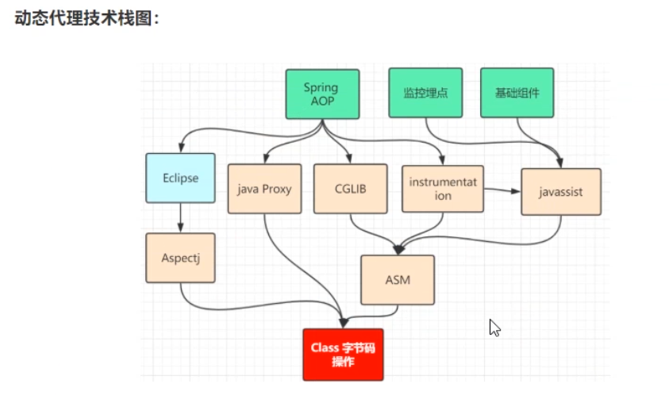
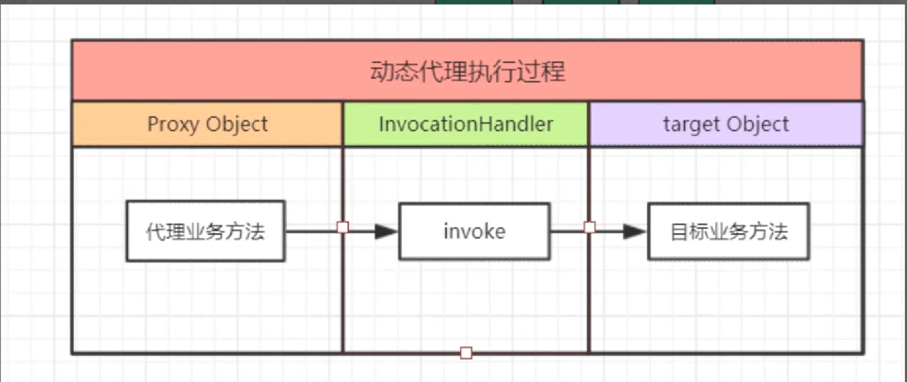
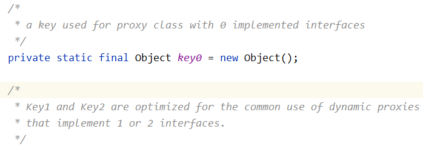

# 理解 dynamic proxy



从 jvm 的角度来看：

把需要代理类方法的字节码前后插入前置和后置代码，增强代理类方法。==>>字节码上的改动

其中 java proxy 和 cglib 生成新的字节码文件必须用到反射

Aspectj 和 javaagent 修改原文件的字节码前后插入前置和后置代码，不需要反射

---

步骤：

1. 组装一个 proxyClass 的字节码数据到 byte 数组
2. ClassLoader 装载
3. 反射得到一份代理实例



源码分析

先进行数量判断，被代理类的接口数量大于 65535 抛出 IllegalArgumentException("interface limit exceeded")异常；

再把被代理类的加载器和接口放到一个过引用的 map 当作缓存

```java
      /** parameter types of a proxy class constructor */
    private static final Class<?>[] constructorParams =
        { InvocationHandler.class };//后面的cons即是形参为InvocationHandler类型的构造方法
     /**
     * a cache of proxy classes
     */
     //信息都放在这里
    private static final WeakCache<ClassLoader, Class<?>[], Class<?>>
        proxyClassCache = new WeakCache<>(new KeyFactory(), new ProxyClassFactory());
    /**
     * Generate a proxy class.  Must call the checkProxyAccess method
     * to perform permission checks before calling this.
     */
    private static Class<?> getProxyClass0(ClassLoader loader,
                                           Class<?>... interfaces) {
        if (interfaces.length > 65535) {
            throw new IllegalArgumentException("interface limit exceeded");
        }

        // If the proxy class defined by the given loader implementing
        // the given interfaces exists, this will simply return the cached copy;
        // otherwise, it will create the proxy class via the ProxyClassFactory
        return proxyClassCache.get(loader, interfaces);
    }
```

在 proxy 中有两个内部类：

1. KeyFactory 把接口的数量做区分，分为 4 类有 1、2、0、更多接口

   ```java
   /**
        * A function that maps an array of interfaces to an optimal key where
        * Class objects representing interfaces are weakly referenced.
        */
       private static final class KeyFactory
           implements BiFunction<ClassLoader, Class<?>[], Object>
       {
           @Override
           public Object apply(ClassLoader classLoader, Class<?>[] interfaces) {
               switch (interfaces.length) {
                   case 1: return new Key1(interfaces[0]); // the most frequent
                   case 2: return new Key2(interfaces[0], interfaces[1]);
                   case 0: return key0;
                   default: return new KeyX(interfaces);
               }
           }
       }
   ```

   

2. ProxyClassFactory[解析](https://www.cnblogs.com/liuyun1995/p/8144706.html "解析")

   ```java
       /**
        * A factory function that generates, defines and returns the proxy class given
        * the ClassLoader and array of interfaces.
        */
       private static final class ProxyClassFactory
           implements BiFunction<ClassLoader, Class<?>[], Class<?>>
       {
           // prefix for all proxy class names前缀
           private static final String proxyClassNamePrefix = "$Proxy";

           // next number to use for generation of unique proxy class names
           private static final AtomicLong nextUniqueNumber = new AtomicLong();

           @Override
           public Class<?> apply(ClassLoader loader, Class<?>[] interfaces) {

               Map<Class<?>, Boolean> interfaceSet = new IdentityHashMap<>(interfaces.length);
               for (Class<?> intf : interfaces) {//验证interfaces这个map里的key是否合法即:能否加载、是否时接口、是否有重复
                   /*
                    * Verify that the class loader resolves the name of this
                    * interface to the same Class object.
                    */
                   Class<?> interfaceClass = null;
                   try {
                       interfaceClass = Class.forName(intf.getName(), false, loader);//判断intf这个接口能否被loader加载
                   } catch (ClassNotFoundException e) {
                   }
                   if (interfaceClass != intf) {
                       throw new IllegalArgumentException(
                           intf + " is not visible from class loader");
                   }//找不到或加载的接口不同报接口不被classloader看见
                   /*
                    * Verify that the Class object actually represents an
                    * interface.
                    */
                   if (!interfaceClass.isInterface()) {
                       throw new IllegalArgumentException(
                           interfaceClass.getName() + " is not an interface");
                   }//判断是否是接口
                   /*
                    * Verify that this interface is not a duplicate.
                    */
                   if (interfaceSet.put(interfaceClass, Boolean.TRUE) != null) {
                       throw new IllegalArgumentException(
                           "repeated interface: " + interfaceClass.getName());
                   }//如果put方法返回了非空值就说明interfaceClass重复了，报重复错误
               }

               String proxyPkg = null;     // package to define proxy class in
               int accessFlags = Modifier.PUBLIC | Modifier.FINAL;

               /*
                * Record the package of a non-public proxy interface so that the
                * proxy class will be defined in the same package.  Verify that
                * all non-public proxy interfaces are in the same package.
                */
               for (Class<?> intf : interfaces) {
                   int flags = intf.getModifiers();
                   if (!Modifier.isPublic(flags)) {
                       accessFlags = Modifier.FINAL;
                       String name = intf.getName();
                       int n = name.lastIndexOf('.');
                       String pkg = ((n == -1) ? "" : name.substring(0, n + 1));
                       if (proxyPkg == null) {
                           proxyPkg = pkg;
                       } else if (!pkg.equals(proxyPkg)) {
                           throw new IllegalArgumentException(
                               "non-public interfaces from different packages");
                       }
                   }
               }

               if (proxyPkg == null) {
                   // if no non-public proxy interfaces, use com.sun.proxy package
                   proxyPkg = ReflectUtil.PROXY_PACKAGE + ".";
               }
               /*
                * Choose a name for the proxy class to generate.
                */
               long num = nextUniqueNumber.getAndIncrement();
               String proxyName = proxyPkg + proxyClassNamePrefix + num;
               //作字符串拼接，生成对应的代理类名
               /*
                * Generate the specified proxy class.
                */
               byte[] proxyClassFile = ProxyGenerator.generateProxyClass(
                   proxyName, interfaces, accessFlags);//组装一个proxyClass的字节码数据到byte数组
               try {
                   return defineClass0(loader, proxyName,
                                       proxyClassFile, 0, proxyClassFile.length);
                                       //调用本地方法
               } catch (ClassFormatError e) {
                   /*
                    * A ClassFormatError here means that (barring bugs in the
                    * proxy class generation code) there was some other
                    * invalid aspect of the arguments supplied to the proxy
                    * class creation (such as virtual machine limitations
                    * exceeded).
                    */
                   throw new IllegalArgumentException(e.toString());
               }
           }
       }
   ```

使用代理类的构造器创建实例

```java
public static Object newProxyInstance(ClassLoader loader,
                                          Class<?>[] interfaces,
                                          InvocationHandler h)
        Objects.requireNonNull(h);
        final Class<?>[] intfs = interfaces.clone();
        final SecurityManager sm = System.getSecurityManager();
        if (sm != null) {
            checkProxyAccess(Reflection.getCallerClass(), loader, intfs);
        }

        /*
         * Look up or generate the designated proxy class.
         */
         //调用proxyClassCache里面包含代理类字节码
        Class<?> cl = getProxyClass0(loader, intfs);

        /*
         * Invoke its constructor with the designated invocation handler.
         */
            if (sm != null) {
            //装填字节码的byte数组
                checkNewProxyPermission(Reflection.getCallerClass(), cl);
            }

            final Constructor<?> cons = cl.getConstructor(constructorParams);
            final InvocationHandler ih = h;
            //设置可访问
            if (!Modifier.isPublic(cl.getModifiers())) {
                AccessController.doPrivileged(new PrivilegedAction<Void>() {
                    public Void run() {
                        cons.setAccessible(true);
                        return null;
                    }
                });
            }
            return cons.newInstance(new Object[]{h});//获取实例
            //以下省略

```

InvocationHandler 在构造器中传入的。且每个一代理类都与一个 InvocationHandler 关联

根据参数 loader 和 interfaces 调用方法 getProxyClass(loader, interfaces)创建代理类$Proxy0.$Proxy0 类 实现了 interfaces 的接口,并继承了 Proxy 类.  &#x20;

实例化$Proxy0并在构造方法中把DynamicSubject传过去,接着$Proxy0 调用父类 Proxy 的构造器,为 h 赋值,如下：

```java
class Proxy{
    InvocationHandler h=null;
    protected Proxy(InvocationHandler h) {
        this.h = h;
    }
    ...
}
```

1、需要说明的一点是，Proxy 类中 getProxyClass 方法返回的是 Proxy 的 Class 类。之所以说明，是因为我一开始犯了个低级错误，以为返回的是"被代理类的 Class 类”- -！推荐看一下 getProxyClass 的源码，很长=。=  &#x20;

2、从\$Proxy0 的源码可以看出，动态代理类不仅代理了显示定义的接口中的方法，而且还代理了 java 的根类 Object 中的继承而来的 equals()、hashcode()、toString()这三个方法，并且仅此三个方法。[例子](https://www.cnblogs.com/vinozly/p/4925062.html "例子")

```java
import design_pattern.poxry_model.static_poxry.PhoneSeller;
import java.lang.reflect.InvocationHandler;
import java.lang.reflect.Method;
import java.lang.reflect.Proxy;
import java.lang.reflect.UndeclaredThrowableException;

public final class proxy0 extends Proxy implements PhoneSeller {
    private static Method m1;
    private static Method m2;
    private static Method m3;
    private static Method m0;

    public proxy0(InvocationHandler var1) throws  {
        super(var1);
    }

    public final boolean equals(Object var1) throws  {
        try {
            return (Boolean)super.h.invoke(this, m1, new Object[]{var1});
        } catch (RuntimeException | Error var3) {
            throw var3;
        } catch (Throwable var4) {
            throw new UndeclaredThrowableException(var4);
        }
    }

    public final String toString() throws  {
        try {
            return (String)super.h.invoke(this, m2, (Object[])null);
        } catch (RuntimeException | Error var2) {
            throw var2;
        } catch (Throwable var3) {
            throw new UndeclaredThrowableException(var3);
        }
    }

    public final boolean sell(String var1, int var2) throws  {
        try {
            return (Boolean)super.h.invoke(this, m3, new Object[]{var1, var2});
        } catch (RuntimeException | Error var4) {
            throw var4;
        } catch (Throwable var5) {
            throw new UndeclaredThrowableException(var5);
        }
    }

    public final int hashCode() throws  {
        try {
            return (Integer)super.h.invoke(this, m0, (Object[])null);
        } catch (RuntimeException | Error var2) {
            throw var2;
        } catch (Throwable var3) {
            throw new UndeclaredThrowableException(var3);
        }
    }

    static {
        try {
            m1 = Class.forName("java.lang.Object").getMethod("equals", Class.forName("java.lang.Object"));
            m2 = Class.forName("java.lang.Object").getMethod("toString");
            m3 = Class.forName("design_pattern.poxry_model.static_poxry.PhoneSeller").getMethod("sell", Class.forName("java.lang.String"), Integer.TYPE);
            m0 = Class.forName("java.lang.Object").getMethod("hashCode");
        } catch (NoSuchMethodException var2) {
            throw new NoSuchMethodError(var2.getMessage());
        } catch (ClassNotFoundException var3) {
            throw new NoClassDefFoundError(var3.getMessage());
        }
    }
}
```
