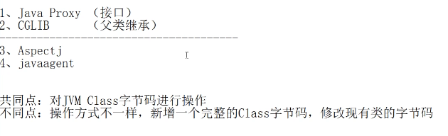

# proxy model

## 目录

- [When to use a proxy?tosee](#When-to-use-a-proxytosee)
- [The use of proxy mode](#The-use-of-proxy-mode)
- [Applicability](#Applicability)
- [Typical Use Case](#Typical-Use-Case)

### When to use a proxy?[tosee](https://blog.csdn.net/riemann_/article/details/86777505 "tosee")

a.设计模式中有一个设计原则是开闭原则，是说对修改关闭对扩展开放，我们在工作中有时会接手很多前人的代码，里面代码逻辑让人摸不着头脑(sometimes the code is really like shit)，这时就很难去下手修改代码，那么这时我们就可以通过代理对类进行增强。

b.我们在使用RPC框架的时候，框架本身并不能提前知道各个业务方要调用哪些接口的哪些方法 。那么这个时候，就可用通过动态代理的方式来建立一个中间人给客户端使用，也方便框架进行搭建逻辑，某种程度上也是客户端代码和框架松耦合的一种表现。

c.Spring的AOP机制就是采用动态代理的机制来实现切面编程。

### The use of proxy mode

在某些情况下，一个客户不想或者不能直接引用一个对象，代理对象就再客户端和被代理对象之间起到中介的作用。就好比你在北京租房，初来乍到，人生地不熟，找房子遍地都是中介，想找房东可没那么容易（基本算得上是找不到房东直租的）。问题来了，找不到房东直租，但房子又是一切的基础，so....走中介，房东能租房，中介也能租房，不过是你通过中介去将房东的房子租给自己。OK，这就是一个活生生的代理模式的例子，相必在外漂泊的小年轻们都感同身受吧。

代理模式的分类，代理模式主要分为两类：静态代理（Static Proxy）、动态代理（Dynamic Proxy）。

静态代理：一个被代理的真实对象对应一个代理，相当于一个租房中介只代理一个房东。弊端很明显，这样下去中介早饿死了！！！并且中介公司管理这么庞大的中介团队早晚逗得垮掉。反应到代码里面就是：代理类急剧增加，灵活性降低，增加了代码的复杂度。

[static proxy](<static proxy/static proxy.md> "static proxy")

动态代理：动态代理主要是去解决静态代理存在的问题（及一个代理对应一个被代理对象），现实中也是这样，不可能有中介只做一个房东的生意，一个中介手里n多房子供你选择，3人间、6人间、隔断、小两居等各种房源。反应到代码里面：代理类只有一个，根据客户需求动态的去改变代理的真实对象，增加了代码的灵活性，降低了代码的复杂性。

以下四种都是动态代理的实现方式

[dynamic proxy](<dynamic proxy/dynamic proxy.md> "dynamic proxy")

[cglib代理](cglib代理/cglib代理.md "cglib代理")

[Aspectj](Aspectj/Aspectj.md "Aspectj")

[javaagent](javaagent/javaagent.md "javaagent")

## Applicability

Proxy is applicable whenever there is a need for a more versatile or sophisticated reference to an object than a simple pointer. Here are several common situations in which the Proxy pattern is applicable

- Remote proxy provides a local representative for an object in a different address space.
- Virtual proxy creates expensive objects on demand.
- Protection proxy controls access to the original object. Protection proxies are useful when objects should have different access rights.

## Typical Use Case

- Control access to another object
- Lazy initialization
- Implement logging
- Facilitate network connection
- Count references to an object

注意：[见于B站](https://www.bilibili.com/video/av71977067?p=2 "见于B站")

